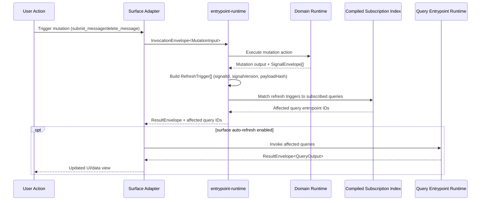

# RFC-0002: Entrypoint Execution Pipeline

## Metadata

- RFC: `RFC-0002`
- Title: `Entrypoint Execution Pipeline`
- Status: `Draft`
- Owners: `Platform`
- Reviewers: `TBD`
- Created: `2026-02-26`
- Updated: `2026-02-26`
- Target release: `Execution Milestone M2`
- Related:
  - Spec: [demo.yml](/Users/ngalluzzo/repos/gooi/docs/demo.yml)
  - Standards: [commit-and-tsdoc-standards.md](/Users/ngalluzzo/repos/gooi/docs/engineering/commit-and-tsdoc-standards.md)
  - RFC process: [README.md](/Users/ngalluzzo/repos/gooi/docs/engineering/rfcs/README.md)
  - Foundation: [RFC-0001-capability-contract-and-provider-runtime-interface.md](/Users/ngalluzzo/repos/gooi/docs/engineering/rfcs/RFC-0001-capability-contract-and-provider-runtime-interface.md)

## Problem and context

RFC-0001 establishes capability contracts and provider runtime interfaces, but the
platform still lacks the first end-to-end execution feature that users interact
with directly: query and mutation entrypoints invoked from wired surfaces.

Today, `docs/demo.yml` defines:

1. Public query contracts (`queries`).
2. Public mutation contracts (`mutations`).
3. Surface mappings (`wiring.surfaces.*`).
4. Signal-driven refresh intent (`refresh_on_signals` in views).

Without a formal execution pipeline, these declarations cannot be executed
deterministically across runtimes, and product behavior remains ambiguous at the
most important boundary: user-request to typed outcome.

## Goals

1. Define deterministic runtime semantics for query and mutation entrypoints.
2. Define deterministic surface binding semantics for wired HTTP/web/CLI inputs.
3. Enforce typed validation and access checks before domain execution.
4. Define mutation signal emission semantics and refresh trigger propagation.
5. Deliver one vertical production-grade slice that passes smoke scenarios from
   `demo.yml` without bypassing boundaries.
6. Define deterministic capability reachability behavior across mixed execution hosts.

## Non-goals

1. Full flow runtime execution (`domain.flows`) in this RFC.
2. Full route rendering runtime (`routes` and view node renderer) in this RFC.
3. Full expression language standardization for every operator and optimizer.
4. Provider marketplace ranking, billing, or trust policy.
5. Cross-process provider transport protocol details (in-process remains default; delegation contract is covered here).

## Product outcomes and success metrics

Product outcomes:

1. A caller can invoke `submit_message` and `list_messages` through a wired
   surface and observe deterministic typed behavior.
2. Product semantics in `demo.yml` map directly to runtime behavior without
   hidden coupling.

Success metrics:

1. `100%` of query/mutation invocations validate IO against boundary schemas.
2. `100%` of entrypoint invocations enforce declared access rules before run.
3. `100%` of mutation-emitted signals are recorded in execution output envelopes.
4. `happy_submit_smoke` and `rejection_submit_smoke` pass in integration tests.
5. Coverage for affected packages meets repo thresholds in `bunfig.toml`.
6. Runtime SLO target (M2): `>=99.5%` successful platform execution excluding
   caller-caused `validation_error` and `access_denied_error`.
7. Runtime latency SLO target (M2): `p95 <= 250ms` for query entrypoints and
   `p95 <= 400ms` for mutation entrypoints in the reference Bun runtime.

## Proposal

Implement an entrypoint execution feature that compiles and runs query/mutation
contracts from the spec with explicit boundaries.

Execution model:

1. Resolve wired surface handler -> entrypoint id (`query` or `mutation`).
2. Bind native surface input (`path`, `query`, `body`, `flags`, `args`) into
   entrypoint input shape.
3. Apply entrypoint defaults.
4. Validate normalized input with boundary Zod contract and normalized JSON Schema.
5. Enforce access policy (`access.default_policy`, role derivation, entrypoint roles).
6. Resolve required capability reachability from `deployment-binding-plan` + `deployment-lockfile`.
7. Execute query projection or mutation action contract using:
   - local capability invocation when reachable on current host.
   - delegated capability invocation when route is explicit and local reachability is unavailable.
8. For mutations, emit declared signals and include them in execution envelope.
9. Return typed output envelope with trace id, outcome, and typed error variant.

Query behavior:

1. Query execution is read-only and must not report write/session/emit effects.
2. Query result includes stable `rows` payload and optional metadata envelope.
3. Query runtime supports entrypoint `where`, `in`, and `defaults`.

Mutation behavior:

1. Mutation execution delegates to declared domain action (`run.actionId`).
2. Action step failures map to typed failure outcomes per action failure policy.
3. Mutation returns typed action return payload and emitted signal list.

Signal refresh behavior:

1. Mutation outputs include emitted signal ids and payload hashes.
2. Runtime exposes a canonical refresh trigger set as
   `{ signalId, signalVersion, payloadHash }`.
3. Canonical refresh invalidation contract does not require full signal payload.
4. Full signal payload is optional and allowed only for observability/debug paths.
5. Query refresh subscriptions use explicit signal ids declared in spec usage
   sites (for example, view query bindings).

Deterministic execution semantics:

1. Binding extraction runs before defaults and validation.
2. Binding precedence is: explicit bound value -> default value -> validation
   failure when required input remains unset.
3. `null` is treated as explicit caller input and must not be replaced by defaults.
4. Unknown input keys after binding are rejected with `binding_error`.
5. Signal emission order in output envelopes follows mutation `emits` declaration
   order after `when` evaluation.
6. `observedEffects` in output envelopes are deduplicated and sorted
   lexicographically for deterministic comparison.
7. Error code mapping is deterministic and centralized in runtime, never adapter-local.
8. Scalar coercion from string sources is explicit and deterministic:
   `int`, `number`, `bool`, and `timestamp` only.
9. Coercion failures are rejected with `binding_error`.
10. Capability reachability resolution order is deterministic:
   local binding -> explicit delegated route -> `capability_unreachable_error`.

Idempotency and replay semantics:

1. Mutation invocation metadata may include `idempotencyKey`.
2. When provided, runtime deduplicates by
   `(entrypointId, principal.subject, idempotencyKey, inputHash)`.
3. Replay returns the previously persisted `ResultEnvelope` with
   `meta.replayed = true`.
4. Idempotency record TTL and storage provider are host policy inputs and must
   be explicit in deployment config.
5. Reusing an idempotency key with a different input hash fails with
   `idempotency_conflict_error`.

M2 expression profile (compiler-enforced allowlist):

1. Required operators/functions for the M2 vertical slice:
   `var`, `cat`, `if`, `and`, `==`, `!=`, `!==`, `!`, `trim`, `to_lower`,
   `!contains`.
2. Operators outside this allowlist fail compile with
   `unsupported_expression_error`.
3. Expression semantics are pure and deterministic; no runtime-specific side effects.

## Ubiquitous language

1. `Entrypoint`: Public query or mutation contract callable by surfaces.
2. `Surface binding`: Mapping from native surface inputs to entrypoint inputs.
3. `Entrypoint execution envelope`: Typed runtime outcome for every invocation.
4. `Refresh trigger`: Signal-based indication that read models may be stale.
5. `Policy gate`: Access + validation checks required before domain execution.
6. `Invocation host`: Host where the current runtime is executing.
7. `Capability reachability`: Local/delegated/unreachable resolution result for required capability calls.

## Boundaries and ownership

1. Surface adapters own input extraction and response transport only.
2. Entrypoint runtime owns binding normalization, validation, access checks, and
   orchestration of query/mutation execution.
3. Domain runtime owns action/projection semantics.
4. Capability adapters own external side effects behind declared ports.
5. Host adapters own trace/time/auth/session infrastructure dependencies.
6. Entrypoint/provider runtime own capability reachability enforcement from deployment artifacts.

Boundary constraints:

1. Surface adapters must not invoke capabilities directly.
2. Entrypoint runtime must not depend on vendor SDKs.
3. Domain runtime must not inspect HTTP/CLI transport details.
4. Capability adapters must not read surface-specific payloads.
5. Runtime must not silently downgrade unreachable capability calls to implicit fallbacks.

## Contracts and typing

Boundary contract policy from RFC-0001 remains in force:

1. Boundary IO contracts are authored in Zod.
2. Canonical interchange artifacts are normalized JSON Schema generated from Zod.
3. Lossy or unsupported boundary constructs fail CI.

Required typed envelopes:

```ts
export type EnvelopeVersion = "1.0.0";

export type InvocationEnvelope<Input> = {
  readonly envelopeVersion: EnvelopeVersion;
  readonly traceId: string;
  readonly invocationId: string;
  readonly entrypointId: string;
  readonly entrypointKind: "query" | "mutation";
  readonly principal: PrincipalContext;
  readonly invocationHost: "browser" | "node" | "edge" | "worker";
  readonly input: Input;
  readonly meta: {
    readonly idempotencyKey?: string;
    readonly requestReceivedAt: string;
  };
};

export type ResultEnvelope<Output, TypedError> = {
  readonly envelopeVersion: EnvelopeVersion;
  readonly traceId: string;
  readonly invocationId: string;
  readonly ok: boolean;
  readonly output?: Output;
  readonly error?: TypedErrorEnvelope<TypedError>;
  readonly emittedSignals: readonly SignalEnvelope[];
  readonly observedEffects: readonly EffectKind[];
  readonly timings: {
    readonly startedAt: string;
    readonly completedAt: string;
    readonly durationMs: number;
  };
  readonly meta: {
    readonly replayed: boolean;
    readonly artifactHash: string;
  };
};

export type TypedErrorEnvelope<TypedError> = {
  readonly envelopeVersion: EnvelopeVersion;
  readonly code: string;
  readonly message: string;
  readonly retryable: boolean;
  readonly details?: Readonly<Record<string, unknown>>;
  readonly typed?: TypedError;
};

export type SignalEnvelope = {
  readonly envelopeVersion: EnvelopeVersion;
  readonly signalId: string;
  readonly signalVersion: number;
  readonly payload?: Readonly<Record<string, unknown>>;
  readonly payloadHash: string;
  readonly emittedAt: string;
};

export type RefreshTrigger = {
  readonly signalId: string;
  readonly signalVersion: number;
  readonly payloadHash: string;
};

export type DiagnosticsEnvelope = {
  readonly envelopeVersion: EnvelopeVersion;
  readonly ok: boolean;
  readonly diagnostics: readonly {
    readonly severity: "error" | "warning" | "info";
    readonly code: string;
    readonly path: string;
    readonly message: string;
    readonly hint?: string;
  }[];
};
```

Error taxonomy additions:

1. `access_denied_error`
2. `binding_error`
3. `entrypoint_not_found_error`
4. `idempotency_conflict_error`
5. `unsupported_expression_error`
6. `capability_unreachable_error`
7. `capability_delegation_error`

Canonical compiled artifact contract:

```ts
export type ArtifactVersion = "1.0.0";

export type CompiledEntrypointBundle = {
  readonly artifactVersion: ArtifactVersion;
  readonly compilerVersion: string;
  readonly sourceSpecHash: string;
  readonly artifactHash: string;
  readonly entrypoints: Readonly<Record<string, CompiledEntrypoint>>;
  readonly bindings: Readonly<Record<string, CompiledSurfaceBinding>>;
  readonly accessPlan: CompiledAccessPlan;
  readonly schemaArtifacts: Readonly<Record<string, JsonSchemaArtifact>>;
};
```

Artifact determinism and hashing rules:

1. Artifact JSON serialization uses stable key ordering across all objects.
2. Order-sensitive lists preserve author-declared order from source spec.
3. Order-insensitive sets are serialized as lexicographically sorted arrays.
4. `sourceSpecHash` is SHA-256 of normalized spec JSON.
5. `artifactHash` is SHA-256 of normalized artifact JSON with `artifactHash`
   field omitted during hash calculation.
6. Runtime activation fails on artifact hash mismatch.

Principal/auth context contract and policy gate order:

1. Principal context schema is explicit: `subject`, `claims`, `tags`.
2. Role derivation runs from `access.roles.*.derive` before entrypoint checks.
3. Entrypoint allow check evaluates against derived role set.
4. If no entrypoint access exists, `access.default_policy` is enforced.
5. Missing/invalid principal context fails with `access_denied_error`.

```ts
export type PrincipalContext = {
  readonly subject: string | null;
  readonly claims: Readonly<Record<string, unknown>>;
  readonly tags: readonly string[];
};
```

Compatibility policy:

1. Changing query/mutation input or output contract is a breaking boundary change.
2. Adding optional input fields with defaults is non-breaking.
3. Changing emitted signal payload schema follows signal version migration rules.
4. Changing artifact or envelope version requires explicit migration policy and
   conformance coverage for previous supported versions.

## Architecture interface diagram

```mermaid
flowchart LR
  Spec["Authoring Spec (demo.yml)"] --> Compiler["spec-compiler"]
  Compiler --> Bundle["CompiledEntrypointBundle (artifactVersion, artifactHash)"]
  Deploy["Deployment Resolver"] --> BindingPlan["deployment-binding-plan"]
  Deploy --> Lockfile["deployment-lockfile"]

  Surface["Surface Adapter (HTTP/Web/CLI)"] --> Binding["surface-bindings"]
  Binding --> Invocation["InvocationEnvelope<Input>"]
  Invocation --> Runtime["entrypoint-runtime"]
  Bundle --> Runtime
  BindingPlan --> Runtime
  Lockfile --> Runtime

  Runtime --> Access["Compiled Access Plan"]
  Runtime --> QueryExec["Query Execution (projection path)"]
  Runtime --> MutationExec["Mutation Execution (action path)"]

  MutationExec --> ProviderRuntime["provider-runtime SPI"]
  ProviderRuntime --> Capability["Capability Adapter(s)"]
  ProviderRuntime --> Host["Host Adapter(s): auth/clock/trace/session"]

  MutationExec --> Signals["SignalEnvelope[] + RefreshTrigger[]"]
  QueryExec --> Result["ResultEnvelope<Output, TypedError>"]
  Signals --> Result
  Result --> Surface
```



Interfaces locked by this RFC:

1. `CompiledEntrypointBundle`
2. `InvocationEnvelope`
3. `ResultEnvelope`
4. `TypedErrorEnvelope`
5. `SignalEnvelope`
6. `RefreshTrigger`
7. `PrincipalContext`
8. `deployment-binding-plan` (activation input)
9. `deployment-lockfile` (activation input)

## API and module plan

Feature-oriented package additions:

1. `packages/entrypoint-runtime`: query/mutation invocation orchestration.
2. `packages/surface-bindings`: wired surface input-to-contract normalization.
3. `packages/entrypoint-conformance`: reusable fixtures and execution assertions.
4. `packages/spec-compiler`: spec-to-compiled-artifact pipeline for entrypoint runtime.

Public API rules:

1. Expose stable APIs via `package.json` `exports`.
2. Each export map includes at least `types`, `bun`, and `default`.
3. No barrel files.
4. Internal modules stay private.

## Sequence diagram

```mermaid
sequenceDiagram
  participant C as Caller
  participant S as Surface Adapter
  participant B as surface-bindings
  participant R as entrypoint-runtime
  participant A as Access Gate
  participant D as Domain Runtime
  participant P as provider-runtime
  participant K as Capability Adapter
  participant DR as "Delegation Route"

  C->>S: Request (HTTP/CLI/Web event)
  S->>B: Extract native inputs
  B->>R: InvocationEnvelope<Input>
  R->>R: Load CompiledEntrypointBundle
  R->>R: Load deployment-binding-plan + deployment-lockfile
  R->>A: Evaluate principal + roles + policy
  A-->>R: allow | access_denied_error

  alt mutation path
    R->>P: Verify provider activation against plan+lockfile
    P-->>R: activation ok | compatibility/activation error
    R->>D: Execute action graph
    D->>P: invokeCapability(call)
    alt local reachability
      P->>K: invoke(call)
      K-->>P: CapabilityResult
    else delegated reachability
      P->>DR: invoke delegated capability(call, routeId)
      DR-->>P: CapabilityResult | capability_delegation_error
    else unreachable
      P-->>D: capability_unreachable_error
    end
    P-->>D: validated result/effects
    D-->>R: action output + emitted signals
    R->>R: Build RefreshTrigger[] + ResultEnvelope
  else query path
    R->>D: Execute projection plan
    D-->>R: rows/output
    R->>R: Build ResultEnvelope
  end

  R-->>S: ResultEnvelope<Output, TypedError>
  S-->>C: Transport response
```



## Refresh sequence diagram



## Delivery plan and rollout

Phase 1: Entrypoint contracts and binding compiler

1. Compile `queries`, `mutations`, and `wiring.surfaces` into runtime artifacts.
2. Implement deterministic binding normalization and default application.
3. Implement contract validation and typed binding errors.
4. Emit canonical `CompiledEntrypointBundle` with deterministic hashing.
5. Compile view-level query `refresh_on_signals` declarations into an indexed
   subscription artifact consumed by runtime refresh triggering.

Phase 2: Query and mutation runtime path

1. Implement entrypoint dispatcher and access gate.
2. Execute query -> projection path for `list_messages`.
3. Execute mutation -> action path for `submit_message`.
4. Include emitted signals in typed execution envelopes.
5. Enforce idempotency-key replay path for mutation entrypoints.

Phase 3: Vertical acceptance and CI hardening

1. Add integration fixtures for `happy_submit_smoke` and `rejection_submit_smoke`.
2. Add conformance assertions for binding/access/validation failure paths.
3. Enforce coverage and typed error contract assertions in CI.
4. Add golden artifact determinism tests in CI (same input -> identical hash).
5. Add conformance tests proving compiled refresh subscriptions react to emitted
   mutation refresh triggers.

## Test strategy and acceptance criteria

Required tests:

1. Unit tests for binding rules (`path`, `query`, `body`, `args`, `flags`).
2. Unit tests for access evaluation and entrypoint default handling.
3. Unit tests for artifact determinism and hash stability.
4. Integration tests for query and mutation execution envelopes.
5. Integration tests for mutation idempotent replay behavior.
6. Conformance tests for typed error mapping and emitted signal recording.
7. Compiler tests for M2 expression allowlist acceptance/rejection behavior.
8. Conformance tests for refresh trigger to compiled-subscription matching.

Definition of done:

1. `submit_message` executes through entrypoint runtime and returns typed outcome.
2. `list_messages` executes through entrypoint runtime with deterministic defaults.
3. Unauthorized invocations fail with `access_denied_error`.
4. Invalid bound payloads fail with `binding_error` or `validation_error`.
5. Smoke scenarios pass without test-only shortcuts.
6. Compiled artifacts are byte-for-byte stable for identical input spec.
7. Envelope version and artifact version are present on all runtime outputs.

## Operational readiness

1. Every invocation emits structured logs containing entrypoint id and trace id.
2. Runtime metrics include invocation count, latency, and typed error counts.
3. Timeouts and retries remain enforced at action step/capability boundaries.
4. Security baseline includes input validation, auth context verification, and
   deny-by-default when access is omitted.
5. Query latency alert triggers at `p95 > 250ms` for 15 minutes.
6. Mutation latency alert triggers at `p95 > 400ms` for 15 minutes.
7. Platform execution success alert triggers at `<99.5%` over rolling 1 hour.

## Risks and mitigations

1. Risk: binding ambiguity across surfaces causes non-portable behavior.
   Mitigation: one normalization spec, golden fixtures, and conformance tests.
2. Risk: query runtime accidentally permits side effects.
   Mitigation: effect assertions that fail on write/session/emit for queries.
3. Risk: access logic drifts between surfaces.
   Mitigation: central policy gate in entrypoint runtime, not in adapters.
4. Risk: signal refresh behavior is inconsistently interpreted.
   Mitigation: typed refresh trigger envelope and deterministic subscription matching.
5. Risk: artifact hash instability causes noisy deploy failures.
   Mitigation: stable serializer, golden hash tests, and pinned compiler version.

## Alternatives considered

1. Surface-specific execution paths (HTTP runtime separate from CLI runtime).
   Rejected because semantics must stay uniform across surfaces.
2. Ad-hoc JSON Schema authoring for entrypoint IO.
   Rejected because boundary source of truth is Zod across the platform.
3. Running mutations without typed output envelopes.
   Rejected because production debugging and conformance need deterministic outcomes.

## Open questions

None.

## Decision log

- `2026-02-26` - RFC created for first end-to-end query/mutation execution slice.
- `2026-02-26` - Entry point runtime includes access and binding as hard gates.
- `2026-02-26` - Signal emission is included in mutation outcomes for refresh.
- `2026-02-26` - Canonical artifact + envelope versions are mandatory contracts.
- `2026-02-26` - Mutation idempotency-key replay semantics are required in M2.
- `2026-02-26` - Canonical refresh invalidation contract is `signalId+version+payloadHash`; payload is optional for observability.
- `2026-02-26` - M2 expression profile is compiler-enforced with an explicit allowlist.
- `2026-02-26` - View-level `refresh_on_signals` is compiled to subscription artifacts in M2.
- `2026-02-26` - Resolved mixed-host invocation behavior: required capabilities must resolve to explicit `local` or `delegated` reachability from deployment artifacts; implicit fallback is disallowed.
