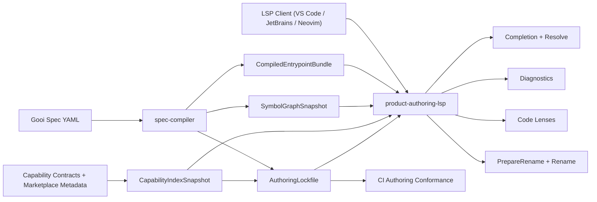
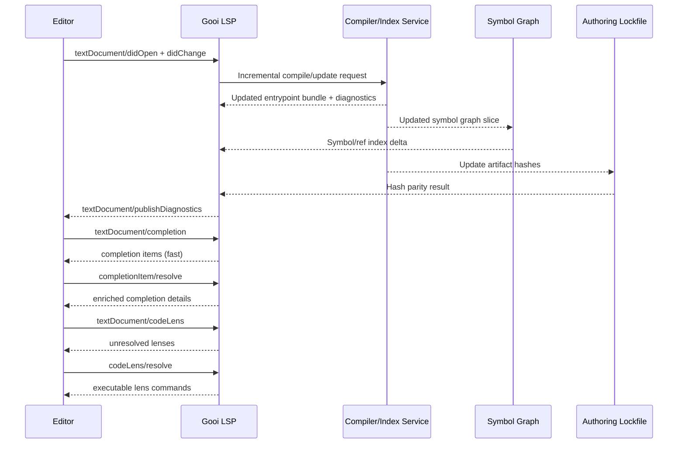

# RFC-0003: Product Authoring Intelligence (LSP + Capability Index + Code Lenses)

## Metadata

- RFC: `RFC-0003`
- Title: `Product Authoring Intelligence (LSP + Capability Index + Code Lenses)`
- Status: `Proposed`
- Owners: `Product Platform`
- Reviewers: `Product`, `Developer Experience`, `Runtime Platform`
- Created: `2026-02-26`
- Updated: `2026-02-26`
- Target release: `Authoring Milestone M3`
- Related:
  - Spec: [demo.yml](/Users/ngalluzzo/repos/gooi/docs/demo.yml)
  - Foundation: [RFC-0001-capability-contract-and-provider-runtime-interface.md](/Users/ngalluzzo/repos/gooi/docs/engineering/rfcs/RFC-0001-capability-contract-and-provider-runtime-interface.md)
  - Execution: [RFC-0002-entrypoint-execution-pipeline.md](/Users/ngalluzzo/repos/gooi/docs/engineering/rfcs/RFC-0002-entrypoint-execution-pipeline.md)
  - Standards: [commit-and-tsdoc-standards.md](/Users/ngalluzzo/repos/gooi/docs/engineering/commit-and-tsdoc-standards.md)

## Problem and context

RFC-0001 and RFC-0002 establish contracts and execution semantics. They do not yet
prove the core product question: can Gooi become the daily authoring surface for
product teams, not just a runtime?

Current authoring pain:

1. Capability discovery is manual and error-prone.
2. YAML contract authoring lacks deep symbol-aware feedback.
3. Refactors across entrypoints/signals/bindings are not safely assisted.
4. Fast feedback loops are not guaranteed under large specs.

Gooi needs an opinionated authoring intelligence system that is deterministic,
typed, and fast enough to be used continuously in IDE workflows.

## Goals

1. Ship a first-party Gooi language server implementing LSP 3.17 core authoring workflows.
2. Provide capability-aware autocomplete, hover, diagnostics, code lenses, and symbol navigation.
3. Provide rename-safe reference updates across entrypoints, signals, and bindings.
4. Provide deterministic low-latency feedback using incremental compile/index strategies.
5. Make local and CI diagnostics equivalent when using the same catalog snapshot.
6. Standardize CLI and LSP IO envelopes so editor and automation paths share one contract language.

## Non-goals

1. Replacing the runtime or execution semantics from RFC-0002.
2. Building a generalized AI copilot for arbitrary code generation.
3. Designing provider marketplace ranking, pricing, or policy UX.
4. Building custom editor UIs outside LSP-compatible clients in this RFC.
5. Executing semantic guard rules (for example `confidence: low` policy logic) inside baseline LSP diagnostics.

## Product outcomes and success metrics

Product outcomes:

1. Product engineers can author Gooi specs with IDE-native speed and confidence.
2. Capability usage becomes discoverable and correct by construction at author time.

Success metrics:

1. Completion p95 latency `< 50ms` in active-file authoring paths.
2. Diagnostic update p95 latency `< 200ms` after single-file edits.
3. Rename-safe reference updates succeed for `100%` of supported symbol kinds in conformance fixtures.
4. Capability completion correctness `>= 99%` against compiled capability contracts.
5. Local and CI diagnostic parity `100%` when artifact hash and catalog snapshot hash match.
6. Workspace symbol query p95 `< 120ms` for medium monorepo fixture size.

## Proposal

Introduce a product-authoring feature set composed of:

1. `Gooi Language Server` (LSP 3.17 compliant for selected methods).
2. `Capability Index` (typed unified local+catalog snapshot for completion/hover/validation).
3. `Symbol Graph` (compiled cross-reference model for navigation, rename, lenses).
4. `Incremental Authoring Engine` (durability-aware invalidation and partial recompute).
5. `Authoring Lockfile` (workspace pinning for artifact hashes and parity).

### LSP feature set (M3 scope)

1. Completion: `textDocument/completion`, `completionItem/resolve`.
2. Diagnostics: `textDocument/publishDiagnostics` plus pull diagnostics compatibility.
3. Code lenses: `textDocument/codeLens`, `codeLens/resolve`.
4. Navigation: `textDocument/definition`, `textDocument/references`, `workspace/symbol`.
5. Rename safety: `textDocument/prepareRename`, `textDocument/rename`.
6. Document symbols: `textDocument/documentSymbol`.
7. Hover: `textDocument/hover`.

### Authoring behavior

1. Completions include capabilities, entrypoints, signals, access roles, and binding source paths.
2. Completion details are lazily resolved to keep base completion fast.
3. Code lenses provide actionable product context:
   - `Run query/mutation`
   - `Show providers for capability`
   - `Show affected queries for signal`
4. Diagnostics classify contract, binding, compatibility, and expression errors with stable codes.
5. Rename performs graph-backed reference edits across queries, mutations, routes, wiring, and views.

### Capability index

A pinned snapshot artifact consumed by language server and CI:

1. Canonical capability id/version.
2. IO schema references.
3. Declared effects.
4. Deprecation and replacement metadata.
5. Example payload snippets.
6. Provider availability metadata.
7. Capability deprecation timelines and removal windows.
8. Capability provenance (`local-spec` or `catalog` source).

Capability resolution model:

1. The compiler must fold both local spec-authored capabilities and catalog capabilities into one `CapabilityIndexSnapshot`.
2. Completion and diagnostics must resolve capabilities from this unified index only.
3. Collisions on the same canonical capability id across sources are compile errors (no shadowing precedence).
4. Provider suitability remains source-agnostic after canonical capability identity is resolved.

### Symbol graph

A compiled artifact derived from the same compiler pipeline as runtime artifacts:

1. Symbol table:
   - entrypoints, signals, capabilities, projections, actions, routes.
   - expression-local symbols (`as:` step bindings, expression variable references).
   - ambient expression symbols (`payload.*`, `ctx.*`) as first-class resolvable symbol kinds.
2. Reference graph edges (definition -> usages).
3. Lens derivations:
   - affected-query derivation requires multi-hop edges:
     `action emits -> signal -> refresh_on_signals subscription -> query`.
   - provider visibility derivation resolves canonical capability -> provider availability.
4. Rename constraints per symbol kind.

### Authoring lockfile

A deterministic workspace artifact consumed by LSP and CI parity checks:

1. Required artifact hashes for `CompiledEntrypointBundle`, `CapabilityIndexSnapshot`, `SymbolGraphSnapshot`.
2. Capability catalog snapshot identity (`catalogSource`, `catalogVersion`, `catalogHash`).
3. Schema contract version set used for envelope validation.
4. Hash mismatch policy:
   - authoring diagnostics become `catalog_mismatch_error`/`artifact_mismatch_error`.
   - read-only authoring features remain available in degraded mode using last-known-good artifacts.
   - runtime-backed commands are blocked until the lockfile is reconciled.
5. Forward-compatible source metadata:
   - `sourceKind` (`workspace-local` for M3).
   - optional `remoteSource` field reserved for M4 shared snapshot distribution.

## Deterministic authoring semantics

1. Diagnostics are emitted in stable order: `path`, then `code`, then `message`.
2. Completion base list is deterministic for identical document state and cursor position.
3. Completion resolve may add details but must not mutate insertion semantics.
4. Rename preflight must reject unsafe operations before edits are produced.
5. `didChange` version order is authoritative for server state.
6. Request handling must be cancellation-aware for completion/diagnostics/lenses/rename.
7. Response ordering follows LSP guidance: process in arrival order where possible and never violate document version semantics.
8. Diagnostics default policy is `push-first` (`publishDiagnostics`) with optional pull compatibility where clients request it.
9. Incremental recompute is scoped by durability classes (`volatile`, `normal`, `durable`).
10. Lockfile hash mismatch always emits deterministic diagnostic codes before any runtime-backed lens is enabled.
11. Lockfile mismatch degraded mode keeps completion/hover/definition/references/documentSymbol active with explicit stale-artifact diagnostics.

## Ubiquitous language

1. `Authoring intelligence`: typed IDE feedback loop for Gooi specs.
2. `Capability index`: versioned snapshot of capability metadata used for authoring.
3. `Symbol graph`: deterministic definition/reference graph for spec symbols.
4. `Lens action`: contextual executable command shown inline in editor.
5. `Rename-safe`: symbol rename that updates all legal references or fails preflight.

## Boundaries and ownership

- Surface adapters:
  - Own transport between editor client and language server only.
- Kernel/domain runtime:
  - Not invoked during authoring analysis, except optional simulation hooks through explicit commands.
- Capability adapters:
  - Not directly loaded by language server; consumed via index artifacts only.
- Host/platform adapters:
  - Own file watching, process, telemetry, cache storage integration.

Must-not-cross constraints:

1. LSP server must not depend on vendor SDKs or provider runtime internals.
2. Runtime execution state must not be required for baseline diagnostics.
3. Capability index ingestion must remain artifact-driven and deterministic.

## Contracts and typing

- Boundary schema authority:
  - Zod-authored contracts remain canonical; JSON Schema artifacts remain interchange format.
- Authoring format:
  - Gooi YAML plus typed compiler model.
- Generated runtime artifact format:
  - Existing `CompiledEntrypointBundle` plus new `CapabilityIndexSnapshot`, `SymbolGraphSnapshot`, and `AuthoringLockfile`.
- Canonical compiled artifact schema (required):
  - `CapabilityIndexSnapshot@1.0.0`
  - `SymbolGraphSnapshot@1.0.0`
  - `AuthoringLockfile@1.0.0`
- Artifact version field and hash policy:
  - Each snapshot includes `artifactVersion`, `sourceHash`, `artifactHash`.
- Deterministic serialization rules:
  - Stable key ordering; lexical ordering for sets.
- Allowed/disallowed schema features:
  - Same boundary profile as RFC-0001.
- Public contract shape:
  - LSP method payloads + typed diagnostics/catalog/symbol snapshot contracts.
- Invocation/result/error/signal/diagnostics envelope schemas:
  - RFC-0002 envelopes remain authoritative for runtime.
  - This RFC defines authoring envelopes:
    - `AuthoringRequestEnvelope@1.0.0`
    - `AuthoringResultEnvelope@1.0.0`
    - `AuthoringErrorEnvelope@1.0.0`
    - `AuthoringDiagnosticsEnvelope@1.0.0`
- Envelope versioning strategy:
  - `1.0.0` for M3 authoring payloads.
- Principal/auth context schema:
  - Required only for authenticated code-lens actions that execute runtime commands.
- Access evaluation order:
  - LSP authoring features are read-only; runtime-backed actions enforce RFC-0002 policy gates.
- Error taxonomy:
  - Add: `authoring_parse_error`, `authoring_symbol_error`, `rename_conflict_error`, `catalog_mismatch_error`, `artifact_mismatch_error`, `unsupported_client_capability_error`.
- Compatibility policy:
  - CI and CLI conformance paths hard-fail on snapshot version/hash mismatches.
  - Interactive LSP read paths degrade with explicit mismatch diagnostics.
- Deprecation policy:
  - Deprecated capabilities must expose replacement suggestions in completion and diagnostics.

## API and module plan

Feature-oriented package plan:

1. `packages/authoring-contracts`
2. `packages/capability-index`
3. `packages/symbol-graph`
4. `packages/product-authoring-lsp`
5. `packages/conformance` (`src/authoring-conformance` feature modules)

Public APIs via `package.json` exports:

1. Explicit `types`, `bun`, and `default` entries.
2. Explicit subpath exports per feature.

No barrel files:

1. Public modules are exported via package `exports` only.

### CLI and LSP command contract surface

Authoring features must be callable through explicit CLI contracts as well as LSP methods.
This keeps automation, CI, and editor behavior aligned.

1. `gooi authoring index build --spec <path> --catalog <path> --out <path>`
   - input contract: `BuildAuthoringIndexRequest`.
   - output contract: `BuildAuthoringIndexResult` with artifact hashes.
2. `gooi authoring diagnose --spec <path> --lockfile <path>`
   - input contract: `AuthoringDiagnoseRequest`.
   - output contract: `AuthoringDiagnosticsEnvelope`.
3. `gooi authoring complete --spec <path> --position <line:col> --lockfile <path>`
   - input contract: `AuthoringCompletionRequest`.
   - output contract: `AuthoringResultEnvelope<CompletionItems>`.
4. `gooi authoring rename --spec <path> --uri <file> --position <line:col> --to <value> --lockfile <path>`
   - input contract: `AuthoringRenameRequest` with canonical selector `uri + position`.
   - optional selector: `symbolRef` only when emitted by `workspace/symbol` or symbol graph queries.
   - output contract: `AuthoringResultEnvelope<WorkspaceEdit>`.

## Architecture interface diagram

## Sequence diagram

## Delivery plan and rollout

Phase 1: Authoring contracts and lockfile schemas

- Entry criteria:
  - RFC-0002 compiler artifacts available.
- Exit criteria:
  - Envelope and lockfile schemas implemented with deterministic fixtures.
- Deliverables:
  - `AuthoringRequestEnvelope@1.0.0`
  - `AuthoringResultEnvelope@1.0.0`
  - `AuthoringErrorEnvelope@1.0.0`
  - `AuthoringDiagnosticsEnvelope@1.0.0`
  - `AuthoringLockfile@1.0.0`
  - deterministic fixtures.

Phase 2: Capability index and symbol graph artifacts

- Entry criteria:
  - Authoring contracts and lockfile schemas are merged.
- Exit criteria:
  - Snapshot schemas and hash rules implemented.
- Deliverables:
  - `CapabilityIndexSnapshot@1.0.0`
  - `SymbolGraphSnapshot@1.0.0`
  - deterministic fixtures.

Phase 3: LSP read path

- Entry criteria:
  - Snapshot production and loading stable.
- Exit criteria:
  - Completion/hover/diagnostics/symbol navigation working on fixtures.
- Deliverables:
  - LSP methods for completion, diagnostics, symbols, references, hover.

Phase 4: LSP action and rename path

- Entry criteria:
  - Read path conformance green.
- Exit criteria:
  - Code lenses and rename-safe flows pass conformance suite.
- Deliverables:
  - code lens commands, prepareRename/rename, conflict diagnostics.

## Test strategy and acceptance criteria

- Unit, integration, and end-to-end coverage expectations:
  - Unit tests for index/symbol builders and LSP handlers.
  - Integration tests for didChange -> diagnostics -> completion loop.
  - E2E editor protocol tests against fixture workspaces.
- Conformance tests:
  - rename safety, completion correctness, diagnostics parity, lens correctness.
  - expression symbol resolution (`as:` bindings, `var:` references, ambient symbols).
  - signal impact chain correctness (`emits -> signal -> refresh_on_signals -> query`).
- Determinism/golden tests for artifacts and envelopes:
  - golden tests for capability index, symbol graph, and completion ordering.
- Definition of done:
  - Metrics and latency targets met in CI perf suite.

## Operational readiness

- Observability and tracing:
  - Request-level timings for completion/diagnostics/lens/rename.
- Failure handling and retries:
  - Cancel-aware handlers using cancellation tokens.
- Security requirements:
  - No untrusted command execution from lens payloads.
- Runbooks and incident readiness:
  - fallback mode when catalog snapshot is unavailable.
- Alert thresholds tied to service-level targets:
  - Completion p95 > 50ms for 15 min.
  - Diagnostics p95 > 200ms for 15 min.
  - Crash rate > 0.5% of LSP requests over 1h.

## Risks and mitigations

1. Risk: stale capability metadata causes wrong completions.
   Mitigation: snapshot hash pinning and mismatch diagnostics.
2. Risk: rename introduces unsafe edits.
   Mitigation: mandatory `prepareRename` graph preflight and conflict rejection.
3. Risk: latency regressions with larger workspaces.
   Mitigation: durability-aware incremental recompute and resolve-lazy patterns.
4. Risk: client-specific behavior drift.
   Mitigation: conformance suite against LSP wire contracts and golden fixtures.

## Alternatives considered

1. JSON-Schema-only authoring without symbol graph.
   Rejected due to weak rename/reference/lens support.
2. Editor-specific extension APIs without LSP.
   Rejected because multi-editor portability is a product requirement.
3. AI-only authoring assistance without deterministic contracts.
   Rejected because correctness and CI parity require typed deterministic outputs.

## Research grounding

1. LSP 3.17 methods/capabilities for completion, code lens, diagnostics, rename, workspace symbols.
   - [LSP 3.17 specification](https://microsoft.github.io/language-server-protocol/specifications/lsp/3.17/specification/)
2. VS Code guidance for language server architecture and feature surface.
   - [Language Server Extension Guide](https://code.visualstudio.com/api/language-extensions/language-server-extension-guide)
   - [Programmatic Language Features](https://code.visualstudio.com/api/language-extensions/programmatic-language-features)
   - [VS Code API CodeLens semantics](https://code.visualstudio.com/api/references/vscode-api#CodeLensProvider)
3. Schema-driven completion/validation model and offline schema behavior.
   - [Editing JSON in VS Code](https://code.visualstudio.com/Docs/languages/json)
4. Production YAML language server patterns for schema association/custom tags/performance limits.
   - [yaml-language-server](https://github.com/redhat-developer/yaml-language-server)
5. Incremental analysis architecture patterns and durability-based invalidation.
   - [rust-analyzer architecture](https://rust-analyzer.github.io/book/contributing/architecture.html)
   - [Three Architectures for a Responsive IDE](https://rust-analyzer.github.io/blog/2020/07/20/three-architectures-for-responsive-ide.html)
   - [Durable Incrementality](https://rust-analyzer.github.io/blog/2023/07/24/durable-incrementality.html)
6. Language-agnostic offline symbol graph/index protocol concepts.
   - [LSP and LSIF overview](https://microsoft.github.io/language-server-protocol/)
   - [SCIP protocol repository](https://github.com/sourcegraph/scip)
7. Adjacent production authoring products validate this direction.
   - [HashiCorp Terraform extension feature set](https://github.com/hashicorp/vscode-terraform)

Protocol constraints adopted from research:

1. Use `completionItem/resolve` to defer expensive completion details.
2. Respect document version progression from `didOpen`/`didChange` for correctness.
3. Keep request handling ordered by arrival where practical, while preserving version safety.
4. Support `codeLens/resolve` and optional refresh semantics for low-latency editor UX.

## Open questions

1. Non-blocking: Should we expose remote snapshot cache distribution in M4 or keep M3 strictly workspace-local?
   Owner: `Product Platform`.
   Due: `2026-03-18`.

## Decision log

- `2026-02-26` - RFC created to validate Gooi as product authoring cursor.
- `2026-02-26` - Chosen architecture includes capability index + symbol graph + LSP service.
- `2026-02-26` - Rename-safe and latency targets are first-class acceptance gates.
- `2026-02-26` - Authoring lockfile adopted as required parity boundary between editor and CI.
- `2026-02-26` - Diagnostics mode set to push-first with optional pull compatibility.
- `2026-02-26` - Default lens set fixed for M3: `Run query/mutation`, `Show providers`, `Show affected queries`.
- `2026-02-26` - Capability index scope fixed to unified local + catalog capabilities with collision hard-fail policy.
- `2026-02-26` - Symbol graph scope expanded to include expression-local and ambient symbols.
- `2026-02-26` - Lockfile mismatch policy clarified: degraded read path allowed, runtime-backed commands blocked.
- `2026-02-26` - Rename CLI selector standardized to `uri + position` with optional `symbolRef`.
- `2026-02-26` - Authoring conformance suite placement fixed to `@gooi/conformance` (`src/authoring-conformance`), not a separate package.
