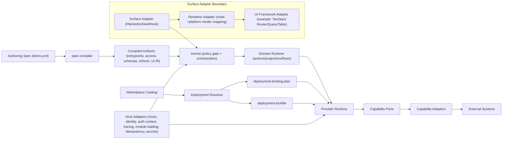
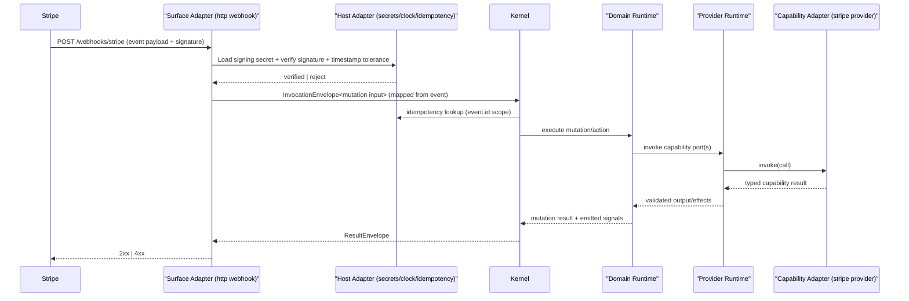

# RFC-0005: Host Adapter Contracts and Runtime Boundary Hardening

## Metadata

- RFC: `RFC-0005`
- Title: `Host Adapter Contracts and Runtime Boundary Hardening`
- Status: `Draft`
- Owners: `Platform`
- Reviewers: `Runtime Platform`, `Developer Experience`, `Product Platform`
- Created: `2026-02-26`
- Updated: `2026-02-26`
- Target release: `Host Runtime Milestone M5`
- Related:
  - Spec: [demo.yml](/Users/ngalluzzo/repos/gooi/docs/demo.yml)
  - Foundation: [RFC-0001-capability-contract-and-provider-runtime-interface.md](/Users/ngalluzzo/repos/gooi/docs/engineering/rfcs/RFC-0001-capability-contract-and-provider-runtime-interface.md)
  - Execution: [RFC-0002-entrypoint-execution-pipeline.md](/Users/ngalluzzo/repos/gooi/docs/engineering/rfcs/RFC-0002-entrypoint-execution-pipeline.md)
  - Authoring: [RFC-0003-product-authoring-intelligence-lsp-and-capability-index.md](/Users/ngalluzzo/repos/gooi/docs/engineering/rfcs/RFC-0003-product-authoring-intelligence-lsp-and-capability-index.md)
  - Surface: [RFC-0004-vscode-extension-first-party-authoring-surface.md](/Users/ngalluzzo/repos/gooi/docs/engineering/rfcs/RFC-0004-vscode-extension-first-party-authoring-surface.md)

## Problem and context

RFC-0001 and RFC-0002 define `Host adapter` as a first-class boundary, but the
current implementation still leaves critical host behavior implicit.

Current gaps:

1. Runtime packages rely on ambient globals (`Date`, `crypto.randomUUID`) in
   execution paths.
2. Access gate trusts caller-provided role tags instead of deriving roles from
   declarative policy.
3. Entrypoint runtime does not hard-enforce compiled input schema before domain
   execution.
4. Compiler/runtime do not hard-fail on duplicate canonical entrypoint ids.
5. Provider activation does not enforce runtime host API alignment with
   deployment binding artifacts.

This breaks boundary ownership and weakens trust in the architecture.

## Goals

1. Define explicit typed `Host adapter` contracts required to run `demo.yml`.
2. Remove ambient global dependencies from runtime orchestration paths.
3. Make access decisions deterministic and kernel-owned from declarative policy.
4. Enforce typed invocation boundary validation before domain execution.
5. Enforce deterministic activation alignment across host API, binding plan, and lockfile.
6. Add conformance gates that fail fast when boundary rules drift.
7. Define host-level delegation port contracts for cross-host capability invocation.

## Non-goals

1. Redesigning domain action/projection semantics.
2. Shipping new external capability providers.
3. Defining provider transport protocol implementations (only boundary contracts are in scope).
4. Replacing existing RFC-0003/RFC-0004 authoring surfaces.

## Product outcomes and success metrics

Product outcomes:

1. Platform behavior is trustworthy because runtime boundaries are explicit and enforced.
2. Adapter integration is repeatable across runtimes with no hidden host behavior.

Success metrics:

1. `0` ambient global time/id generation calls in runtime orchestration packages.
2. `100%` of access decisions derive from declarative role rules and principal claims.
3. `100%` of entrypoint invocations validate input against compiled schemas before domain execution.
4. `100%` of provider activations enforce host version alignment with binding artifacts.
5. `100%` of duplicate canonical entrypoint ids fail compile with deterministic diagnostics.

## Proposal

Introduce a canonical `HostPortSet@1.0.0` contract consumed by kernel runtimes.

### Architecture interface diagram



### Boundary placement matrix

| Concern | Boundary | Why |
| --- | --- | --- |
| HTTP/Web/CLI/Webhook transport mapping | `Surface adapter` | Native transport anti-corruption only |
| UI node rendering and client cache integration | `Renderer adapter` inside `Surface adapter` | Presentation/runtime ergonomics, not policy |
| TanStack Router/Query/Table integration | `Renderer adapter` inside `Surface adapter` | UI runtime library, not kernel/domain |
| Access policy gate and role derivation | `Kernel` with `Host adapter` inputs | Centralized deterministic authorization |
| Domain action/projection/flow semantics | `Domain runtime` | Product behavior ownership |
| Vendor API/database calls | `Capability adapter` | External side effects behind typed capability ports |
| Time, ids, idempotency storage, tracing, secrets | `Host adapter` | Environment infrastructure only |

### Architectural guidelines (hard rules)

1. Runtime orchestration code must not call ambient host globals directly.
2. Surface adapters are untrusted for authorization decisions.
3. `Policy gate` derivation and access checks are kernel-owned, deterministic, and centralized.
4. Boundary IO is validated at invocation boundaries before domain/capability execution.
5. Deployment artifacts are authoritative and must align with runtime host API.
6. Duplicate canonical identifiers are compile-time errors.
7. Parse functions for untrusted boundary artifacts must validate, not pass through.
8. Host adapters must not implement business policy.

### Host ports

```ts
export interface HostClockPort {
  nowIso: () => string;
}

export interface HostIdentityPort {
  newTraceId: () => string;
  newInvocationId: () => string;
}

export interface HostPrincipalPort {
  validatePrincipal: (value: unknown) => RuntimeResult<PrincipalContext>;
  deriveRoles: (input: {
    principal: PrincipalContext;
    accessPlan: CompiledAccessPlan;
  }) => RuntimeResult<readonly string[]>;
}

export interface HostIdempotencyPort {
  load: (scopeKey: string) => Promise<IdempotencyRecord | null>;
  save: (scopeKey: string, record: IdempotencyRecord, ttlSeconds: number) => Promise<void>;
}

export interface HostActivationPolicyPort {
  assertHostVersionAligned: (input: {
    runtimeHostApiVersion: string;
    bindingPlanHostApiVersion: string;
    lockfileHostApiVersion: string;
  }) => RuntimeResult<void>;
}

export interface HostCapabilityDelegationPort {
  invokeDelegated: (input: {
    routeId: string;
    traceId: string;
    invocationId: string;
    capabilityCall: CapabilityCall;
  }) => Promise<CapabilityResult>;
}

export interface HostPortSet {
  clock: HostClockPort;
  identity: HostIdentityPort;
  principal: HostPrincipalPort;
  idempotency: HostIdempotencyPort;
  activationPolicy: HostActivationPolicyPort;
  capabilityDelegation: HostCapabilityDelegationPort;
  moduleLoader: HostModuleLoaderPort;
  moduleIntegrity: HostModuleIntegrityPort;
}
```

Provider runtime activation must flow through `moduleLoader` and
`moduleIntegrity`. Missing ports or failed checks are hard activation failures.

### Deterministic runtime behavior updates

1. Entrypoint invocation order:
   - validate principal shape
   - derive roles from access rules
   - evaluate access policy
   - bind input
   - apply defaults
   - validate against compiled input schema
   - execute domain runtime
2. `traceId`, `invocationId`, and timestamps are host-port generated.
3. Idempotency TTL is required host policy input.
4. Activation fails when runtime host API version disagrees with binding artifacts.
5. Capability invocation resolution order is deterministic:
   - local binding on current host
   - explicit delegation route in deployment artifacts
   - hard failure (`capability_unreachable_error`)

### Webhook integration pattern (Stripe example)

`Stripe webhook` is an inbound surface concern; `Stripe API calls` are outbound capability concerns.



Inbound/outbound invariants:

1. Inbound webhooks always enter through `Surface adapters`.
2. Outbound vendor calls always flow through `Capability adapters`.
3. `Kernel` remains the only policy/orchestration authority.
4. `Host adapters` may provide crypto/secrets/time/idempotency primitives, never business outcomes.

## Ubiquitous language

1. `Host adapter`: Runtime environment dependency port.
2. `HostPortSet`: Canonical set of host contracts required by runtime orchestration.
3. `Policy gate`: Deterministic principal derivation + access check boundary.
4. `Activation alignment`: Host API equivalence across runtime, binding plan, and lockfile.
5. `Boundary hardening`: Contract and ownership enforcement that prevents boundary drift.
6. `Kernel`: Policy + orchestration runtime that composes host and capability adapters.
7. `Renderer adapter`: Surface-local renderer mapping view artifacts to platform/runtime UI.
8. `Webhook surface`: Surface adapter route that maps inbound event payloads to typed entrypoint contracts.
9. `Delegation route`: Activation-time route used by host delegation port for cross-host capability invocation.

## Boundaries and ownership

- Surface adapters:
  - Own transport extraction and response mapping only.
  - Own webhook ingress mapping and renderer wiring.
  - May host UI framework adapters (for example TanStack) through renderer adapters.
  - Must not provide authoritative role outcomes.
- Kernel/domain runtime:
  - Own policy gate orchestration and boundary validation sequencing.
  - Must consume `HostPortSet` for environment concerns.
  - Must not import UI framework libraries.
- Capability adapters:
  - Own external side effects behind declared capability ports.
  - Own outbound Stripe/third-party API calls.
- Host/platform adapters:
  - Own time/id/auth derivation/idempotency persistence/activation policy implementations.
  - Own cryptographic primitives and secret retrieval used by ingress verification.
  - Own delegated capability transport execution behind `HostCapabilityDelegationPort`.

Must-not-cross constraints:

1. Kernel runtime must not call ambient host globals in orchestration paths.
2. Host adapters must not embed domain/business policy.
3. Capability adapters must not bypass activation alignment rules.
4. Surface adapters must not bypass centralized policy gate.
5. Renderer adapters must not call capability adapters directly.
6. Webhook signature verification must complete in surface+host boundary before kernel dispatch.
7. Delegation routing decisions must come from deployment artifacts, never from surface adapters.

## Contracts and typing

- Boundary schema authority:
  - Zod-authored contracts remain canonical.
- Authoring format:
  - Authoring spec remains YAML with typed compiler model.
- Generated runtime artifact format:
  - `CompiledEntrypointBundle@1.0.0` remains canonical; adds stricter enforcement semantics.
- Canonical compiled artifact schema (required):
  - Duplicate `query.id`/`mutation.id` are compile errors.
  - Input schema artifacts are mandatory and referenced by every entrypoint.
- Artifact version field and hash policy:
  - Existing hash semantics remain; behavior changes require explicit migration notes.
- Deterministic serialization rules:
  - Stable keys, lexical set ordering, deterministic diagnostics ordering.
- Allowed/disallowed schema features:
  - Existing RFC-0001 boundary profile remains in force.
- Public contract shape:
  - New `HostPortSet` and host-policy contract exports.
- Invocation/result/error/signal/diagnostics envelopes:
  - RFC-0002 envelopes remain authoritative.
- Envelope versioning strategy:
  - remains `1.0.0` for M5 unless shape changes are introduced.
- Principal/auth context schema:
  - unchanged shape; derivation authority moves to host principal port.
- Access evaluation order:
  - principal validate -> derive roles -> enforce entrypoint/default policy.
- Error taxonomy additions:
  - `principal_derivation_error`
  - `artifact_alignment_error`
  - `entrypoint_contract_error`
  - `capability_unreachable_error`
  - `capability_delegation_error`
- Compatibility policy:
  - Activation hard-fails on host-version misalignment.
- Deprecation policy:
  - Legacy implicit role derivation and global runtime defaults are deprecated in M5 and removed in M6.

## API and module plan

Feature-oriented modules:

1. `products/contracts/host-contracts`
2. `packages/entrypoint-runtime/src/host-ports.ts`
3. `packages/provider-runtime/src/host-ports.ts`
4. `packages/conformance/src/host-conformance`
5. `packages/provider-runtime/src/capability-reachability.ts`

Public APIs via `package.json` exports:

1. Explicit subpath exports for host contracts and conformance helpers.
2. No barrel files.

## Delivery plan and rollout

Phase 1: Red tests and guardrails

1. Entry criteria:
   - RFC-0005 approved for implementation.
2. Exit criteria:
   - Red tests merged for boundary failures.
3. Deliverables:
   - failing tests for role-tag trust, input-schema bypass, duplicate ids, host-version misalignment.

Phase 2: Host contract introduction

1. Entry criteria:
   - Phase 1 merged.
2. Exit criteria:
   - runtime orchestration paths compile against `HostPortSet`.
3. Deliverables:
   - host contract package and runtime integration.

Phase 3: Enforcement migration

1. Entry criteria:
   - Host contracts wired end-to-end.
2. Exit criteria:
   - all red tests green; conformance suite green.
3. Deliverables:
   - centralized policy gate, schema enforcement, alignment enforcement, duplicate-id compiler checks.

## Test strategy and acceptance criteria

Required tests:

1. Unit tests: policy gate role derivation from declarative rules only.
2. Unit tests: entrypoint input schema validation rejects non-conforming payloads.
3. Unit tests: duplicate entrypoint ids fail compiler with deterministic diagnostic code.
4. Unit tests: provider activation fails on host-version mismatch with binding artifacts.
5. Conformance tests: host contract determinism across time/id generation and idempotency replay.
6. Mixed-host conformance tests: local vs delegated invocation produce equivalent typed outcomes.

Definition of done:

1. All Phase 1 red tests pass with production code changes.
2. Runtime packages no longer use ambient globals for time/id in orchestration paths.
3. Access decisions are reproducible from principal claims + compiled access rules.
4. Activation/version alignment is enforced in conformance and runtime tests.

## Operational readiness

1. Observability and tracing:
   - host-generated `traceId` and invocation timings on every invocation.
2. Failure handling and retries:
   - explicit typed failures for principal derivation and artifact alignment.
3. Security requirements:
   - deny-by-default on invalid or missing principal context.
4. Runbooks and incident readiness:
   - host-port misconfiguration and artifact mismatch troubleshooting runbook.
5. Alert thresholds:
   - `artifact_alignment_error` > 0.1% over 15 minutes.
   - `principal_derivation_error` > 0.1% over 15 minutes.

## Risks and mitigations

1. Risk: migration churn across runtime packages.
   Mitigation: phase rollout with adapter shims and conformance lockstep.
2. Risk: adapter maintainers regress to convenience globals.
   Mitigation: lint/AST guardrail in CI for restricted runtime modules.
3. Risk: access behavior changes break existing integrations.
   Mitigation: explicit migration docs and staged rollout flags.

## Alternatives considered

1. Keep implicit host behavior and patch ad hoc defects.
   Rejected because boundary drift will recur.
2. Move policy gate logic to surface adapters.
   Rejected because policy becomes transport-dependent and non-deterministic.
3. Treat host contracts as documentation-only.
   Rejected because contract guarantees require executable conformance.

## Open questions

None.

## Decision log

- `2026-02-26` - RFC created to harden host boundaries and restore architectural trust.
- `2026-02-26` - Chosen approach: explicit `HostPortSet` contracts + conformance enforcement.
- `2026-02-26` - Architectural rule adopted: no ambient host globals in runtime orchestration paths.
- `2026-02-26` - Resolved module loading/integrity contract timing: defer to M6 host-provider implementation track.
- `2026-02-27` - Promoted module loading/integrity host ports (`moduleLoader`, `moduleIntegrity`) to enforced provider activation boundary with fail-hard behavior.
- `2026-02-26` - Resolved host delegation boundary: cross-host capability calls execute through `HostCapabilityDelegationPort` with routes sourced from deployment artifacts.
- `2026-02-26` - Resolved principal derivation scope for M5: keep current `derive` primitives only; custom predicates defer to a later RFC.
