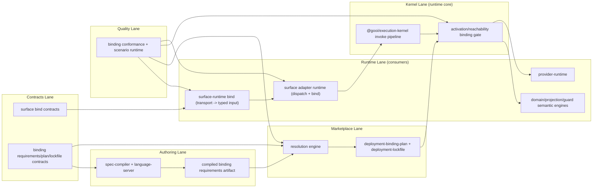
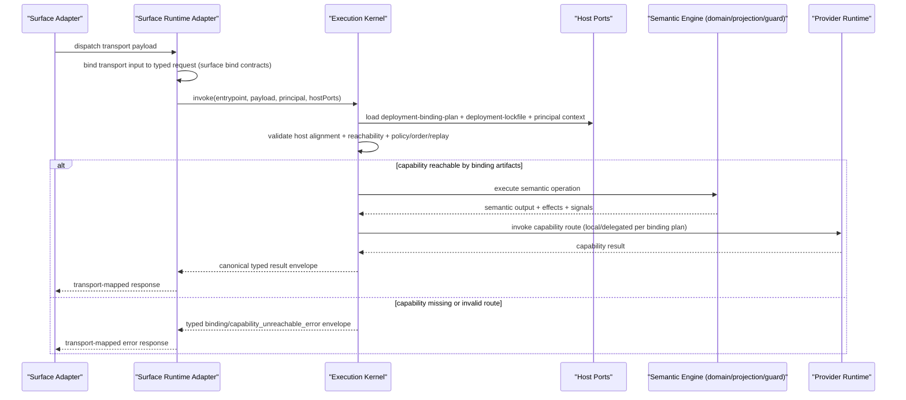
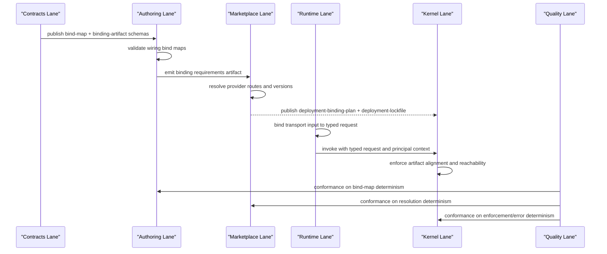
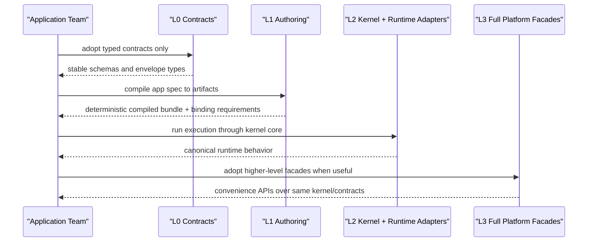

# RFC-0007: North-Star Platform Shape and Progressive DX API

## Metadata

- RFC: `RFC-0007`
- Title: `North-Star Platform Shape and Progressive DX API`
- Status: `Draft`
- Owners: `Platform`, `Product Platform`
- Reviewers: `Runtime Platform`, `Developer Experience`, `Marketplace`
- Created: `2026-02-26`
- Updated: `2026-02-27`
- Target release: `North-Star Definition`
- Related:
  - Spec: [demo.yml](/Users/ngalluzzo/repos/gooi/docs/demo.yml)
  - Foundation: [RFC-0001-capability-contract-and-provider-runtime-interface.md](/Users/ngalluzzo/repos/gooi/docs/engineering/rfcs/RFC-0001-capability-contract-and-provider-runtime-interface.md)
  - Execution: [RFC-0002-entrypoint-execution-pipeline.md](/Users/ngalluzzo/repos/gooi/docs/engineering/rfcs/RFC-0002-entrypoint-execution-pipeline.md)
  - Authoring: [RFC-0003-product-authoring-intelligence-lsp-and-capability-index.md](/Users/ngalluzzo/repos/gooi/docs/engineering/rfcs/RFC-0003-product-authoring-intelligence-lsp-and-capability-index.md)
  - VS Code surface: [RFC-0004-vscode-extension-first-party-authoring-surface.md](/Users/ngalluzzo/repos/gooi/docs/engineering/rfcs/RFC-0004-vscode-extension-first-party-authoring-surface.md)
  - Host boundary: [RFC-0005-host-adapter-contracts-and-runtime-boundary-hardening.md](/Users/ngalluzzo/repos/gooi/docs/engineering/rfcs/RFC-0005-host-adapter-contracts-and-runtime-boundary-hardening.md)
  - Foundational host-provider model: [RFC-0006-marketplace-host-adapter-provider-model-and-memory-reference.md](/Users/ngalluzzo/repos/gooi/docs/engineering/rfcs/RFC-0006-marketplace-host-adapter-provider-model-and-memory-reference.md)
  - Marketplace architecture: [RFC-0016-marketplace-product-architecture-control-plane-and-consumer-experience.md](/Users/ngalluzzo/repos/gooi/docs/engineering/rfcs/RFC-0016-marketplace-product-architecture-control-plane-and-consumer-experience.md)
  - Marketplace resolution: [RFC-0017-marketplace-resolution-and-ranking-engine-at-10k-plus-scale.md](/Users/ngalluzzo/repos/gooi/docs/engineering/rfcs/RFC-0017-marketplace-resolution-and-ranking-engine-at-10k-plus-scale.md)
  - Marketplace trust: [RFC-0018-marketplace-trust-certification-and-supply-chain-security.md](/Users/ngalluzzo/repos/gooi/docs/engineering/rfcs/RFC-0018-marketplace-trust-certification-and-supply-chain-security.md)
  - Guard and invariant contracts: [RFC-0019-guard-and-invariant-runtime-contracts.md](/Users/ngalluzzo/repos/gooi/docs/engineering/rfcs/RFC-0019-guard-and-invariant-runtime-contracts.md)
  - Scenario runtime contracts: [RFC-0020-scenario-runtime-and-persona-simulation-contracts.md](/Users/ngalluzzo/repos/gooi/docs/engineering/rfcs/RFC-0020-scenario-runtime-and-persona-simulation-contracts.md)
  - Standards: [commit-and-tsdoc-standards.md](/Users/ngalluzzo/repos/gooi/docs/engineering/commit-and-tsdoc-standards.md)

## Problem and context

Current RFCs define strong slices, but not the complete end-state shape developers
will experience when the platform is fully realized.

What is missing today:

1. One canonical description of the final product lineup and package topology.
2. One canonical description of the final developer-facing API model.
3. A clear statement of progressive adoption so teams can use only what they need.

Without this, we risk converging on a technically correct platform that still
feels heavy to adopt, because the "smallest useful bite" is ambiguous.

## Goals

1. Define the end-state product architecture across contracts, authoring, kernel, runtime, quality, and marketplace.
2. Define the end-state package architecture with explicit boundaries and ownership.
3. Define one progressive DX API model where developers can adopt at multiple depths.
4. Preserve contract and artifact determinism across all adoption modes.
5. Ensure developers are never forced to adopt a full runtime to gain incremental value.
6. Ensure one authored app logic can execute across mixed surfaces/hosts via explicit reachability and delegation contracts.
7. State kernel as the runtime-core product line and require runtime packages to consume kernel orchestration.

## Non-goals

1. No implementation sequencing or phase planning in this RFC.
2. No staffing or schedule commitments.
3. No provider/vendor selection decisions.
4. No migration mechanics for individual apps.
5. No detailed design of each future package internals.

## Product outcomes and success metrics

North-star outcomes:

1. Teams can start at contract-only usage and graduate to full runtime without rewrites.
2. All product surfaces consume the same contracts and artifacts.
3. Runtime behavior remains deterministic and portable across surfaces and hosts through one kernel orchestration core.
4. Capability bindings remain portable across execution hosts without domain logic rewrites.

Metrics:

- Product metric(s):
  - `>= 80%` of new apps onboard through progressive mode `L0` or `L1` before using full runtime.
  - `>= 90%` of apps that adopt `L0/L1` can move to `L2/L3` without contract-breaking rewrites.
- Reliability metric(s):
  - `100%` runtime invocations validated at boundary contracts before domain execution.
  - `0` accepted artifact-hash mismatches during activation.
- Developer experience metric(s):
  - Time to first typed contract: `<= 5 minutes`.
  - Time to first compiled query/mutation callable from one surface: `<= 30 minutes`.
  - Time to first end-to-end deployed app on full runtime: `<= 1 day`.
- Explicit latency/availability target(s) with numeric thresholds:
  - Authoring completion p95 `< 50ms`.
  - Authoring diagnostics p95 `< 200ms`.
  - Query runtime p95 `<= 250ms` and mutation runtime p95 `<= 400ms` in reference runtime.

## Proposal

Define the end-state platform as six product lanes backed by a progressive API ladder.

### End-state product lanes

1. `Contracts`:
   - Shared typed contracts and schema authorities used by all other lanes.
   - Defines canonical binding schemas for:
     - surface input bind maps and bound-request envelopes.
     - deployment binding requirements, resolution plans, and lockfiles.
   - No runtime orchestration behavior.
2. `Authoring`:
   - Spec authoring, diagnostics, completion, navigation, rename, lenses.
   - Outputs deterministic artifacts (`CompiledEntrypointBundle`, `CapabilityIndexSnapshot`, `SymbolGraphSnapshot`, lockfiles).
   - Compiles and validates surface bind maps into deterministic binding-requirements artifacts.
3. `Kernel`:
   - Runtime-core orchestration lane.
   - Owns invocation normalization, policy/order, replay/idempotency gating, and canonical envelope assembly.
   - Enforces deployment binding artifacts (host alignment + capability reachability + local/delegated routing).
4. `Runtime`:
   - Domain/projection/guard semantic engines and transport-facing adapters.
   - Consumes kernel orchestration; does not reimplement orchestration policy/order/envelope behavior.
   - Owns transport payload extraction and surface input binding only.
5. `Marketplace`:
   - First-class control-plane product for listings, catalog snapshots, certification workflows, and governance metadata.
   - Deterministic resolution/ranking and trust/revocation metadata consumed by authoring, runtime, and deployment surfaces.
   - Resolves binding requirements into deployment binding plans and lockfiles.
6. `Quality`:
   - Conformance suites for provider, runtime, host, replay-store, authoring semantics.
   - Owns cross-lane conformance for binding determinism and enforcement.

### Architecture interface diagram

The following diagram highlights binding ownership across lanes (not a full call graph).



### Canonical runtime invocation sequence



### Cross-lane binding lifecycle sequence



### Progressive adoption sequence (no rewrite path)



### Progressive DX API ladder

Developers choose one mode per use case, and can mix modes in the same repo.

1. `L0 Contract-first` (smallest bite):
   - Use only contracts and schemas.
   - No compiler, no runtime required.
2. `L1 Compile-first`:
   - Compile spec to deterministic artifacts.
   - Use artifacts with custom app runtimes/adapters.
3. `L2 Embedded runtime`:
   - Use Gooi entrypoint/provider runtimes inside an existing app service.
   - Keep host/surface adapters local to the app.
4. `L3 Full platform`:
   - Use full Gooi app model (domain/session/views/routes/queries/mutations/wiring/access)
   - Deploy with binding plans and lockfiles.
   - Support mixed-host topology where capabilities may execute locally or through explicit delegation routes.

No mode supersedes another. Modes are composable, not mandatory steps.

### IR-first execution rule

Cross-lane executable semantics must be compiler-emitted IR artifacts and must
be consumed from compiled artifacts at runtime.

Rules:

1. If behavior is executed in runtime/kernel and consumed by more than one lane,
   it must have a versioned compiled IR contract (`artifactVersion` + hash).
2. Runtime/kernel must consume compiled IR and must not execute from raw spec
   section payloads or injected handler maps as canonical behavior.
3. Raw-spec section snapshots remain useful for authoring visibility, but are
   not executable contracts.
4. Any exception must be explicitly temporary, documented, and tracked as a
   migration gap with deletion criteria.

Current IR treatment matrix:

1. Landed:
   - `dispatchPlans` (`CompiledSurfaceDispatchPlanSet`)
   - `viewRenderIR` (`CompiledViewRenderIR`)
   - `projectionIR` (`CompiledProjectionIR`)
   - `domainRuntimeIR` (compiled actions/flows/session outcome semantics)
   - `sessionIR` (compiled session field/default semantic contract)
   - `scenarioIR` (`CompiledScenarioPlanSet` emitted by compiler, not fixture-only)

### Ultimate DX API shape

The end-state API must be "thin where possible, deep when needed."

Contract-first:

```ts
import { defineCapabilityPort } from "@gooi/capability-contracts/capability-port";
import { parseProviderManifest } from "@gooi/capability-contracts/provider-manifest";
```

Compile-first:

```ts
import { compileEntrypointBundle } from "@gooi/spec-compiler";

const compile = compileEntrypointBundle({
  spec,
  compilerVersion: "1.0.0",
});
```

Embedded runtime:

```ts
import { createKernelRuntime } from "@gooi/execution-kernel";
import { bindSurfaceInput } from "@gooi/surface-runtime";
import { createProviderRuntime } from "@gooi/provider-runtime";

const kernel = createKernelRuntime({...});
const bound = bindSurfaceInput({ request, entrypoint, binding });
```

Full platform facade:

```ts
import { defineApp } from "@gooi/app";

const app = defineApp({
  app,
  domain,
  session,
  views,
  queries,
  mutations,
  routes,
  wiring,
  access,
});
```

Facade packages must compose existing feature packages; they must not hide
or replace stable lower-level APIs.

### Deterministic runtime behavior rules

- Input normalization order:
  - Surface bind -> defaults -> validation -> policy gate -> domain execution.
- Capability binding enforcement order:
  - load plan/lockfile -> verify host alignment -> resolve local/delegated route -> invoke or fail with typed error.
- Default precedence:
  - explicit caller value > default > validation failure.
- Unknown/null handling:
  - unknown keys are rejected at boundaries.
  - `null` is explicit caller input, not replaced by defaults.
- Stable ordering requirements:
  - deterministic ordering for diagnostics, effects, refresh triggers, and artifact serialization.
- Idempotency/replay behavior (for write paths):
  - unchanged canonical behavior via replay-store host port and typed result replay.

## Ubiquitous language

1. `Progressive mode`: A selectable depth of Gooi adoption (`L0`-`L3`).
2. `Composable adoption`: Mixing progressive modes without forced rewrites.
3. `Full platform`: Complete app-model execution with deployment artifacts.
4. `Facade package`: Convenience package that composes lower-level stable APIs.
5. `Contract stability`: Backward-compatible behavior of typed boundaries and envelopes.
6. `Host portability`: ability to move capability implementations across execution hosts without changing domain logic.

## Boundaries and ownership

### Binding responsibility matrix

| Lane | Owns | Must not own |
| --- | --- | --- |
| `Contracts` | Canonical schemas for surface bind maps, binding requirements, binding plans, and lockfiles. | Runtime orchestration, route fallback behavior, transport parsing logic. |
| `Authoring` | Static bind-map validation and deterministic binding-requirements artifact emission. | Provider selection, runtime capability routing, adapter-local policy fallbacks. |
| `Marketplace` | Deterministic resolution of requirements into deployment binding plans/lockfiles. | Runtime invocation policy/order, transport input binding, semantic execution. |
| `Runtime` | Transport extraction and surface input binding (`transport -> typed request`) before kernel invocation. | Capability reachability authority, deployment artifact mutation, kernel policy sequencing. |
| `Kernel` | Runtime enforcement of binding artifacts (alignment, reachability, local/delegated routing) and typed failure envelopes. | Transport-specific parsing, marketplace listing/ranking logic, lane-local fallback rewrites. |
| `Quality` | Cross-lane binding conformance (compile, resolve, enforce, and error determinism). | Redefining binding semantics outside canonical contracts. |

### Other ownership boundaries

- Surface adapters:
  - Own transport mapping and renderer integration only.
  - May be custom by adopters in all progressive modes.
- Kernel/domain runtime:
  - Kernel owns policy gate and entrypoint orchestration semantics.
  - Runtime packages consume kernel orchestration and remain host/provider/surface agnostic at the orchestration layer.
  - Must consume artifact-declared reachability/delegation plans rather than adapter-local fallback logic.
- Capability adapters:
  - Own external side effects behind capability ports only.
- Host/platform adapters:
  - Own environment concerns (clock, identity, principal, replay, activation policy, module loading).

Must-not-cross constraints:

1. Facade APIs must not collapse contract boundaries.
2. Lower-level packages must remain directly usable without facade packages.
3. Surface adapters must not become policy authorities.
4. Runtime must not require marketplace packages at compile time.
5. Marketplace implementations must not depend on runtime internals.
6. No lane may redefine binding semantics that conflict with canonical contracts.

## Contracts and typing

- Boundary schema authority:
  - Zod-authored contracts remain canonical.
- Authoring format:
  - YAML app spec plus typed API models.
- Generated runtime artifact format:
  - Deterministic JSON artifacts with stable hash semantics.
- Canonical compiled artifact schema (required):
  - `CompiledEntrypointBundle@1.0.0`
  - `CapabilityIndexSnapshot@1.0.0`
  - `SymbolGraphSnapshot@1.0.0`
  - `AuthoringLockfile@1.0.0`
  - `CapabilityBindingResolutionPlan@1.0.0` (deployment artifact contract).
  - Executable IR artifacts in runtime lane:
    - `CompiledSurfaceDispatchPlanSet@1.0.0`
    - `CompiledViewRenderIR@1.0.0`
    - `CompiledProjectionIR@1.0.0`
    - `CompiledDomainRuntimeIR@1.0.0`
    - `CompiledSessionIR@1.0.0`
    - `CompiledScenarioPlanSet@1.0.0`
  - Future full-platform compiled artifacts must follow the same version/hash policy.
- Artifact version field and hash policy:
  - artifact hash is computed from normalized artifact payload excluding hash field itself.
- Deterministic serialization rules:
  - stable key ordering and lexical ordering for set-like collections.
- Allowed/disallowed schema features:
  - boundary profile from RFC-0001 remains authoritative.
- Public contract shape:
  - small, explicit feature entrypoints via `package.json` exports.
- Invocation/result/error/signal/diagnostics envelope schemas:
  - runtime envelopes and authoring envelopes remain canonical and versioned.
- Envelope versioning strategy:
  - semver version literals in schema.
- Principal/auth context schema:
  - host-contract principal context is canonical.
- Access evaluation order:
  - principal validate -> derive roles -> evaluate entrypoint/default policy.
- Error taxonomy:
  - stable typed error codes by feature lane; no adapter-local ad hoc codes.
- Compatibility policy:
  - activation and runtime host API alignment enforced through artifacts.
- Deprecation policy:
  - deprecate via additive compatibility windows and explicit replacement guidance.

## API and module plan

### End-state package model

`packages/*` (public non-contract primitives and facades):

1. `@gooi/app` (future facade)
2. `@gooi/app-runtime` (future facade)
3. `@gooi/app-testing` (future facade)
4. `@gooi/app-marketplace` (future facade)

`products/contracts/*` (shared contract packages):

1. `@gooi/capability-contracts`
2. `@gooi/host-contracts`
3. `@gooi/surface-contracts`
4. `@gooi/authoring-contracts`
5. `@gooi/app-spec-contracts`
6. `@gooi/conformance-contracts`
7. `@gooi/marketplace-contracts`
8. `@gooi/marketplace-resolution-contracts`
9. `@gooi/marketplace-trust-contracts`

Provider-manifest layering:

1. `@gooi/marketplace-contracts/provider-manifest/base` provides base manifest primitives.
2. `@gooi/capability-contracts/provider-manifest` provides capability-facing manifest parsing/validation.

`products/authoring/*`:

1. `@gooi/spec-compiler`
2. `@gooi/capability-index`
3. `@gooi/symbol-graph`
4. `@gooi/language-server`

`products/runtime/*`:

1. `@gooi/surface-runtime`
2. `@gooi/surface-dispatch-runtime` (planned in Track 04)
3. `@gooi/provider-runtime`
4. `@gooi/domain-runtime`
5. `@gooi/projection-runtime`
6. `@gooi/guard-runtime`
7. runtime packages consume `@gooi/execution-kernel` for orchestration.

`products/kernel/*`:

1. `@gooi/execution-kernel`

`products/quality/*`:

1. `@gooi/conformance`
2. `@gooi/scenario-runtime`

`products/marketplace/*`:

1. `marketplace/control-plane`
2. `marketplace/catalog-plane`
3. `marketplace/certification`
4. `marketplace/resolution-engine`
5. `marketplace/trust-plane`

`products/marketplace/*`:

1. `@gooi-marketplace/*` provider and adapter implementations.

### Public APIs via `package.json` exports

1. Every package exports stable feature subpaths.
2. Facade packages compose lower-level packages and re-expose only stable contracts.
3. No hidden required transitive dependencies across progressive modes.

### No barrel files

1. Preserve direct, explicit export maps.
2. Keep feature discoverability in package exports, not index re-export chains.

### Single entry per feature

1. Each capability surface has one canonical import path.
2. Contract and runtime entrypoints remain separate to preserve progressive adoption.

## Package boundary classification

- Proposed location(s):
  - Keep reusable non-contract primitives and facades in `packages/*`.
  - Keep shared contracts in `products/contracts/*` and lane-specific product behavior in `products/<lane>/*`.
  - Keep concrete providers in `products/marketplace/*`.
- Lane (if `products/*`):
  - `contracts`, `authoring`, `runtime`, `kernel`, `quality`, `marketplace`.
- Why this boundary is correct:
  - It maps ownership and upgrade cadence to real product concerns.
- Primary consumers (internal/external):
  - internal app teams, platform engineers, external provider contributors.
- Coupling expectations:
  - contracts are independent.
  - runtimes depend on contracts, not marketplace.
  - marketplace product services depend on marketplace contracts and shared contracts, not runtime internals.
  - authoring/runtime/deployment consume marketplace snapshots/contracts, not marketplace service internals.
- Why this is not a better fit in another boundary:
  - a monolithic SDK would erase progressive adoption and boundary clarity.
- Promotion/demotion plan:
  - future shared contracts are promoted into `products/contracts/*`; non-contract shared primitives stay in `packages/*` when proven product-agnostic.

## Delivery plan and rollout

Implementation planning is intentionally out of scope for this RFC.

Follow-up RFCs must define:

1. Concrete phased delivery plans.
2. Migration strategy per lane.
3. Acceptance gates per milestone.

## Test strategy and acceptance criteria

North-star acceptance expectations:

1. Every progressive mode has contract tests and integration examples.
2. Moving from `L0` -> `L1` -> `L2` -> `L3` requires no boundary-breaking rewrites.
3. Artifact and envelope determinism is proven with golden tests.
4. Cross-lane conformance verifies consistent behavior for shared contracts, including marketplace control-plane, resolution, and trust contracts.
5. Facade packages are covered by compatibility tests against lower-level APIs.

Definition of done for this RFC:

1. End-state model is explicit enough for follow-up RFCs to implement independently.
2. Progressive mode semantics and boundaries are unambiguous.
3. Product/package topology is explicit and defensible.

## Operational readiness

1. Observability:
   - traceable invocation lifecycles and stable error-code metrics across lanes.
2. Failure handling:
   - typed error envelopes and deterministic retry/replay semantics.
3. Security:
   - principal validation and policy gate centralization remain mandatory.
4. Runbooks:
   - mode-specific runbooks for `L1` compile failures, `L2` runtime failures, and `L3` activation mismatches.
5. Alerts:
   - thresholds bound to authoring and runtime SLOs.

## Risks and mitigations

1. Risk: Facade APIs become a hidden monolith.
   - Mitigation: Require conformance tests and direct lower-level API equivalence.
2. Risk: Progressive modes diverge semantically.
   - Mitigation: Shared contract artifacts and conformance coverage across modes.
3. Risk: Package sprawl and unclear ownership.
   - Mitigation: Strict lane boundaries and single-entry export policy.
4. Risk: Over-abstracted DX API obscures runtime behavior.
   - Mitigation: Preserve explicit advanced APIs and avoid opaque automation defaults.

## Alternatives considered

1. Monolithic "one package does everything" SDK.
   - Rejected: Forces full-runtime mental model and blocks incremental adoption.
2. Runtime-first platform without contract-first path.
   - Rejected: High onboarding friction for teams with existing runtimes.
3. Authoring-only focus without runtime/package north-star.
   - Rejected: Leaves architecture drift risk and unclear long-term developer story.

## Open questions

None.

## Decision log

- `2026-02-26` - Established north-star architecture RFC focused on end-state shape and progressive DX API, with implementation planning explicitly deferred.
- `2026-02-26` - Resolved `@gooi/app` scope: keep `@gooi/app` declarative-first; place execution helpers in a separate package boundary.
- `2026-02-26` - Resolved full-platform artifact shape: canonical model is lane-specific artifacts plus a manifest; optional packaged bundle may exist for deployment convenience.
- `2026-02-26` - Resolved facade compatibility policy: facade packages are semantic aliases to underlying stable APIs, must remain source-compatible within a major, and require explicit migration guidance for major changes.
- `2026-02-26` - Resolved facade package family in north-star package map: include `@gooi/app-runtime`, `@gooi/app-testing`, and `@gooi/app-marketplace` as first-class progressive DX surfaces.
- `2026-02-26` - Resolved provider-manifest layering: base manifest primitives are owned by `@gooi/marketplace-contracts/provider-manifest/base`; capability-facing parsing stays in `@gooi/capability-contracts/provider-manifest`.
- `2026-02-26` - Resolved portability contract: mixed-host deployments are first-class; capability execution may be `local` or `delegated` without domain logic rewrites.
- `2026-02-27` - Updated north-star package model: shared contracts are centralized under `products/contracts/*`; `packages/*` is reserved for non-contract primitives and facades.
- `2026-02-27` - Added `kernel` as a dedicated product lane in the north-star architecture map.
- `2026-02-27` - Clarified kernel as runtime-core product line; runtime packages consume kernel orchestration without old/new coexistence paths.
- `2026-02-27` - Clarified cross-lane binding ownership: runtime adapters own transport input binding, marketplace resolves deployment bindings, kernel enforces binding artifacts, and quality verifies deterministic behavior end-to-end.
- `2026-02-28` - Adopted IR-first execution rule: cross-lane executable semantics must be emitted as versioned compiled IR artifacts and consumed from artifact contracts at runtime.
