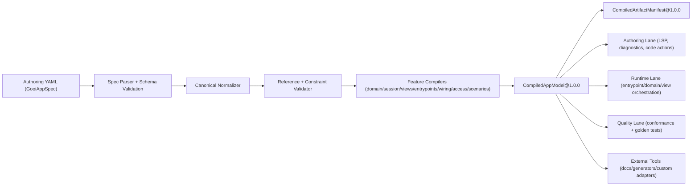
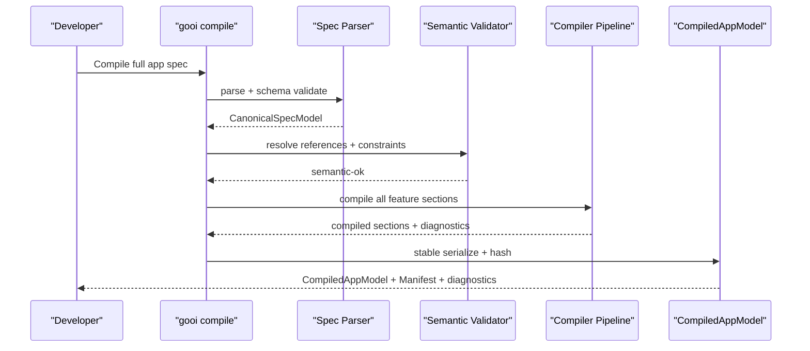
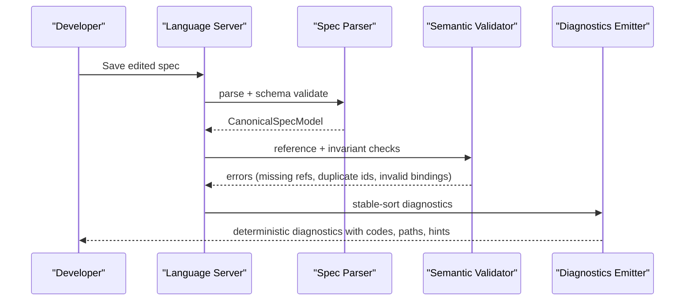

# RFC-0008: Full App Spec Contract and Canonical Compiler Model

## Metadata

- RFC: `RFC-0008`
- Title: `Full App Spec Contract and Canonical Compiler Model`
- Status: `Draft`
- Owners: `Product Platform`, `Runtime Platform`
- Reviewers: `Developer Experience`, `Quality`, `Marketplace`
- Created: `2026-02-26`
- Updated: `2026-02-26`
- Target release: `Spec Milestone S1`
- Related:
  - North star: [RFC-0007-north-star-platform-shape-and-progressive-dx-api.md](/Users/ngalluzzo/repos/gooi/docs/engineering/rfcs/RFC-0007-north-star-platform-shape-and-progressive-dx-api.md)
  - Execution slice: [RFC-0002-entrypoint-execution-pipeline.md](/Users/ngalluzzo/repos/gooi/docs/engineering/rfcs/RFC-0002-entrypoint-execution-pipeline.md)
  - Authoring: [RFC-0003-product-authoring-intelligence-lsp-and-capability-index.md](/Users/ngalluzzo/repos/gooi/docs/engineering/rfcs/RFC-0003-product-authoring-intelligence-lsp-and-capability-index.md)
  - Guard and invariant contracts: [RFC-0019-guard-and-invariant-runtime-contracts.md](/Users/ngalluzzo/repos/gooi/docs/engineering/rfcs/RFC-0019-guard-and-invariant-runtime-contracts.md)
  - Scenario runtime contracts: [RFC-0020-scenario-runtime-and-persona-simulation-contracts.md](/Users/ngalluzzo/repos/gooi/docs/engineering/rfcs/RFC-0020-scenario-runtime-and-persona-simulation-contracts.md)
  - Spec source: [demo.yml](/Users/ngalluzzo/repos/gooi/docs/demo.yml)
  - Standards: [commit-and-tsdoc-standards.md](/Users/ngalluzzo/repos/gooi/docs/engineering/commit-and-tsdoc-standards.md)

## Problem and context

Gooi currently compiles and executes a constrained query/mutation subset of the
spec model. That was the correct foundation step, but it is not the product we
ultimately promised.

Product gap:

1. Teams can author the full model in `demo.yml`, but only parts are canonically compiled.
2. Different lanes implicitly infer missing semantics instead of consuming one compiled model.
3. We lack one authoritative contract for what a valid full app spec is.

This creates practical risk:

1. Authoring and runtime can drift on interpretation.
2. Provider and surface integrations cannot rely on one stable compilation target.
3. Partial adoption users lose trust if "valid spec" differs by tool.

## Goals

1. Define `GooiAppSpec@1.0.0` as the canonical full authoring contract.
2. Define `CompiledAppModel@1.0.0` as the canonical full compiler output.
3. Compile all first-class top-level sections present in [demo.yml](/Users/ngalluzzo/repos/gooi/docs/demo.yml):
   - `app`, `domain`, `session`, `views`, `queries`, `mutations`, `routes`, `personas`, `scenarios`, `wiring`, `access`.
4. Guarantee deterministic compile outputs and deterministic diagnostics ordering.
5. Make the compiled model consumable by authoring, runtime, quality, and external tooling.

## Non-goals

1. Defining runtime execution semantics for actions/flows/projections/guards/scenarios (covered in follow-up RFCs).
2. Defining renderer-specific behavior for view nodes (covered in follow-up RFCs).
3. Defining deployment resolver/provider selection policies.
4. Defining migration tooling implementation details.

## Product outcomes and success metrics

Outcomes:

1. A team can validate and compile a complete app spec without lane-specific fallbacks.
2. All product lanes consume one compiled model contract.
3. Compiler diagnostics become the single source of truth for spec correctness.

Metrics:

- Product metric(s):
  - `100%` of top-level sections in `demo.yml` are represented in `GooiAppSpec@1.0.0`.
  - `100%` of those sections are present in `CompiledAppModel@1.0.0`.
- Reliability metric(s):
  - `100%` compile determinism on identical source inputs (`artifactHash` stable).
  - `0` accepted unknown top-level keys outside extension namespace policy.
- Developer experience metric(s):
  - Full-spec compile+validate p95 `< 400ms` on medium monorepo fixture.
  - Diagnostics are stable-ordered with `100%` parity across CLI and LSP.
- Explicit latency/availability target(s) with numeric thresholds:
  - Parser+normalizer p95 `< 120ms`.
  - Semantic checks p95 `< 180ms`.
  - Artifact emission p95 `< 120ms`.

## Proposal

Introduce a full-spec compiler architecture with explicit contract layers:

1. `GooiAppSpec` (authoring contract input).
2. `CanonicalSpecModel` (normalized in-memory model).
3. `CompiledAppModel` (stable artifact output consumed across lanes).

### Architecture interface diagram



### Canonical section coverage

The compiler must produce explicit compiled sections for:

1. `app`:
   - identity, timezone, history policy.
2. `domain`:
   - collections, invariants, signals, capabilities, actions, flows, projections.
3. `session`:
   - schema + defaults.
4. `views`:
   - nodes, screens, data bindings, interaction intents.
5. `entrypoints`:
   - queries, mutations, routes.
6. `wiring`:
   - surface declarations, bind maps, and deployment reachability requirements.
7. `access`:
   - role model and derivation rules.
8. `personas` and `scenarios`:
   - executable scenario contracts and assertions.

### Success sequence diagram



### Failure sequence diagram



### Deterministic behavior rules

- Input normalization order:
  - parse YAML -> apply schema defaults -> canonical key normalization -> semantic checks -> compile.
- Default precedence:
  - explicit author value > schema default > compile error for required missing values.
- Unknown/null handling:
  - unknown keys are compile errors, except extension keys beginning with `x-`.
  - `null` is explicit and preserved unless forbidden by section schema.
- Stable ordering requirements:
  - diagnostics sorted by `path`, then `code`, then `message`.
  - order-insensitive sets emitted lexicographically.
  - author-order is preserved for order-sensitive arrays.
- Idempotency/replay behavior (for write paths):
  - not applicable at compile time; compiler is pure and side-effect free.

## Ubiquitous language

1. `GooiAppSpec`: canonical authoring input contract.
2. `CanonicalSpecModel`: normalized semantic model before artifact emission.
3. `CompiledAppModel`: canonical compiled artifact consumed across product lanes.
4. `CompiledArtifactManifest`: deterministic index of compiled artifacts and hashes.
5. `Section compiler`: feature-local compiler pass for one top-level section.
6. `Reachability requirement`: declarative constraint describing where a capability must be executable (`local` or `delegated`).

## Boundaries and ownership

- Surface adapters:
  - consume compiled wiring and route/query/mutation contracts.
  - must not reinterpret raw authoring YAML.
- Kernel/domain runtime:
  - consume compiled domain/session/entrypoint contracts.
  - must not infer semantics absent from `CompiledAppModel`.
- Capability adapters:
  - consume only compiled capability contracts and manifests.
- Host/platform adapters:
  - consume compiled access/principal/invocation contracts as runtime inputs.

Must-not-cross constraints:

1. No lane may compile its own private interpretation of raw spec sections.
2. Compiler passes may not depend on runtime or marketplace implementations.
3. Section compilers must communicate through typed compile contracts only.
4. Validation and compile diagnostics must use centralized code taxonomy.

## Contracts and typing

- Boundary schema authority:
  - Zod is canonical for `GooiAppSpec` and `CompiledAppModel` contracts.
- Authoring format:
  - YAML parsed into typed section contracts.
- Generated runtime artifact format:
  - normalized JSON with deterministic hashes.
- Canonical compiled artifact schema (required):
  - `GooiAppSpec@1.0.0`
  - `CanonicalSpecModel@1.0.0` (internal but typed)
  - `CompiledAppModel@1.0.0`
  - `CompiledArtifactManifest@1.0.0`
  - `CompiledBindingRequirements@1.0.0` (deployment reachability inputs)
- Artifact version field and hash policy:
  - `artifactHash = sha256(stable_json(artifact_without_hash_field))`.
  - manifest includes section-level hashes and aggregate hash.
- Deterministic serialization rules:
  - stable key sort.
  - lexical order for set-like arrays.
  - preserve author order for ordered lists (e.g., action steps, flow steps, node children).
- Allowed/disallowed schema features:
  - unsupported scalar/operation/section features fail compile with explicit diagnostic codes.
  - lossy transformations are not permitted.
- Public contract shape:
  - `parseGooiAppSpec(value) -> GooiAppSpec`
  - `compileGooiAppModel(input) -> CompileGooiAppModelResult`
  - `parseCompiledAppModel(value) -> CompiledAppModel`
  - `parseCompiledArtifactManifest(value) -> CompiledArtifactManifest`
- Invocation/result/error/signal/diagnostics envelope schemas:
  - runtime and authoring envelope contracts remain authoritative and reference compiled section hashes.
- Envelope versioning strategy:
  - unchanged in this RFC; compiler emits envelope-version compatibility metadata.
- Principal/auth context schema:
  - compiler validates references to principal fields used by access derivation and where clauses.
- Access evaluation order:
  - compiler guarantees plan order metadata for downstream runtime enforcement.
- Error taxonomy:
  - add compile-time codes:
    - `spec_unknown_key_error`
    - `spec_duplicate_id_error`
    - `spec_reference_not_found_error`
    - `spec_contract_conflict_error`
    - `spec_section_unsupported_error`
    - `spec_invariant_invalid_error`
    - `spec_binding_conflict_error`
- Compatibility policy:
  - breaking changes to `GooiAppSpec` or `CompiledAppModel` require major version.
  - additive optional fields are non-breaking.
- Deprecation policy:
  - section fields may be deprecated with explicit replacement metadata and removal window.

### Contract sketch

```ts
export type CompiledAppModel = {
  readonly artifactVersion: "1.0.0";
  readonly compilerVersion: string;
  readonly sourceSpecHash: string;
  readonly artifactHash: string;
  readonly app: CompiledAppSection;
  readonly domain: CompiledDomainSection;
  readonly session: CompiledSessionSection;
  readonly views: CompiledViewsSection;
  readonly entrypoints: CompiledEntrypointsSection;
  readonly wiring: CompiledWiringSection;
  readonly access: CompiledAccessSection;
  readonly scenarios: CompiledScenariosSection;
  readonly diagnostics: readonly CompileDiagnostic[];
};

export type CompiledArtifactManifest = {
  readonly artifactVersion: "1.0.0";
  readonly aggregateHash: string;
  readonly sectionHashes: Readonly<Record<string, string>>;
};
```

## API and module plan

Feature-oriented module layout:

1. `packages/app-spec-contracts`
   - `src/spec/spec.ts`
   - `src/compiled/compiled-app-model.ts`
   - `src/diagnostics/diagnostics.ts`
2. `products/authoring/spec-compiler`
   - `src/parse/*`
   - `src/normalize/*`
   - `src/validate/*`
   - `src/compile-sections/{app,domain,session,views,entrypoints,wiring,access,scenarios}.ts`
   - `src/compile-app-model.ts`

Public APIs via `package.json` exports:

1. `@gooi/app-spec-contracts/{spec,compiled,diagnostics}`
2. `@gooi/spec-compiler/{compile,parse,contracts}`

No barrel files:

1. Use explicit subpath exports only.

Single entry per feature:

1. Exactly one parse entrypoint and one compile entrypoint for full app model.

## Package boundary classification

- Proposed location(s):
  - `packages/app-spec-contracts`
  - `products/authoring/spec-compiler`
- Lane (if `products/*`):
  - `authoring`
- Why this boundary is correct:
  - spec contracts are reusable primitives; compiler behavior is authoring-lane product logic.
- Primary consumers (internal/external):
  - authoring tools, runtime lane, quality lane, and external automation consumers.
- Coupling expectations:
  - `app-spec-contracts` depends on schema utilities only.
  - `spec-compiler` depends on contracts, not runtime or marketplace.
- Why this is not a better fit in another boundary:
  - placing compiler logic in `packages/*` would blur product-lane boundaries.
- Promotion/demotion plan:
  - additional cross-lane compile contracts can move into `packages/app-spec-contracts` once stable.

## Delivery plan and rollout

Phase 1: Full spec contract coverage

- Entry criteria:
  - RFC-0008 approved.
- Exit criteria:
  - `GooiAppSpec@1.0.0` validates full demo surface.
- Deliverables:
  - section schemas, parse APIs, diagnostic taxonomy.

Phase 2: Canonical model and section compilers

- Entry criteria:
  - Phase 1 complete.
- Exit criteria:
  - compiler emits `CompiledAppModel@1.0.0` with deterministic hashes.
- Deliverables:
  - normalization + semantic validation + section compilers.

Phase 3: Consumer integration

- Entry criteria:
  - Phase 2 complete.
- Exit criteria:
  - authoring/runtime/quality consumers read compiled model without raw-spec fallback.
- Deliverables:
  - integration updates and compatibility gates.

## Test strategy and acceptance criteria

Coverage expectations:

1. Unit tests:
   - each section schema parser, normalizer, and validator.
2. Integration tests:
   - full `demo.yml` compile to `CompiledAppModel`.
3. Golden tests:
   - artifact and diagnostics determinism.
4. Property tests:
   - stable hash invariance across map ordering and equivalent inputs.
5. Conformance:
   - compile parity between CLI and LSP pipelines.

Definition of done:

1. Full demo spec compiles through canonical full model path.
2. No lane requires raw-spec interpretation for supported sections.
3. Determinism and diagnostics ordering gates pass in CI.

## Operational readiness

1. Observability:
   - compile stage timings and diagnostics counts by code.
2. Failure handling and retries:
   - compile is pure; no retry semantics required beyond caller-level retries.
3. Security requirements:
   - parse and validation treat all author input as untrusted.
4. Runbooks and incident readiness:
   - runbooks for schema regressions, hash drift, and parser compatibility failures.
5. Alert thresholds tied to service-level targets:
   - alert when compile p95 exceeds section targets for 3 consecutive intervals.

## Risks and mitigations

1. Risk: Schema overfitting to current demo and blocking future model evolution.
   - Mitigation: extension namespace policy plus semver-governed additive evolution.
2. Risk: Compiler complexity grows into an opaque monolith.
   - Mitigation: feature-local section compiler modules with strict compile contracts.
3. Risk: Diagnostic code churn hurts DX.
   - Mitigation: stable diagnostic taxonomy and compatibility policy.
4. Risk: Determinism regressions across environments.
   - Mitigation: golden artifacts and cross-platform CI checks.

## Alternatives considered

1. Keep partial compiler and let each lane interpret missing sections.
   - Rejected: guarantees drift and inconsistent behavior.
2. Compile directly from YAML to lane-specific artifacts without canonical model.
   - Rejected: weakens boundary consistency and diagnostics quality.
3. Encode only JSON Schema and avoid typed compiler contracts.
   - Rejected: insufficient for semantic graph validation and typed consumers.

## Open questions

None.

## Decision log

- `2026-02-26` - Introduced full app spec contract and canonical compiler model as the first implementation RFC under the north-star architecture.
- `2026-02-26` - Resolved extension namespace policy for `1.0.0`: extension keys must use `x-*` prefix only.
- `2026-02-26` - Resolved compiled model packaging: canonical shape is section artifacts referenced by hash through manifest; packaged materialization is optional convenience.
- `2026-02-26` - Resolved wiring coverage for portability: canonical wiring contracts include deployment reachability requirements used by resolver/binding artifacts.
