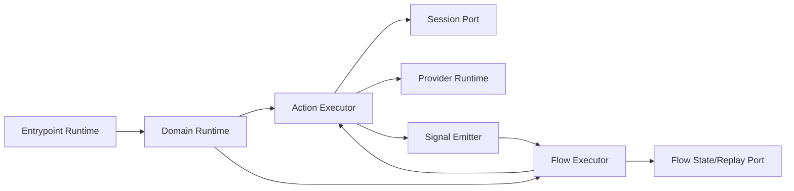
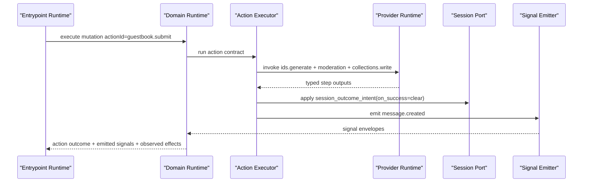
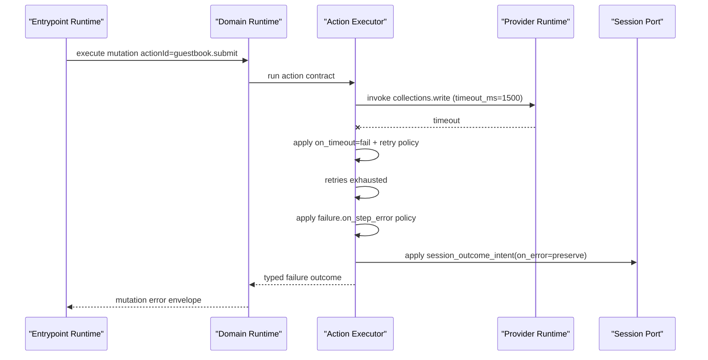

# RFC-0009: Domain Runtime Semantics (Actions, Capabilities, Flows, and Session Outcomes)

## Metadata

- RFC: `RFC-0009`
- Title: `Domain Runtime Semantics (Actions, Capabilities, Flows, and Session Outcomes)`
- Status: `Draft`
- Owners: `Runtime Platform`, `Product Platform`
- Reviewers: `Developer Experience`, `Quality`, `Marketplace`
- Created: `2026-02-26`
- Updated: `2026-02-26`
- Target release: `Runtime Milestone R1`
- Related:
  - North star: [RFC-0007-north-star-platform-shape-and-progressive-dx-api.md](/Users/ngalluzzo/repos/gooi/docs/engineering/rfcs/RFC-0007-north-star-platform-shape-and-progressive-dx-api.md)
  - Full spec model: [RFC-0008-full-app-spec-contract-and-canonical-compiler-model.md](/Users/ngalluzzo/repos/gooi/docs/engineering/rfcs/RFC-0008-full-app-spec-contract-and-canonical-compiler-model.md)
  - Entrypoint pipeline: [RFC-0002-entrypoint-execution-pipeline.md](/Users/ngalluzzo/repos/gooi/docs/engineering/rfcs/RFC-0002-entrypoint-execution-pipeline.md)
  - Host boundaries: [RFC-0005-host-adapter-contracts-and-runtime-boundary-hardening.md](/Users/ngalluzzo/repos/gooi/docs/engineering/rfcs/RFC-0005-host-adapter-contracts-and-runtime-boundary-hardening.md)
  - Guard and invariant contracts: [RFC-0019-guard-and-invariant-runtime-contracts.md](/Users/ngalluzzo/repos/gooi/docs/engineering/rfcs/RFC-0019-guard-and-invariant-runtime-contracts.md)
  - Scenario runtime contracts: [RFC-0020-scenario-runtime-and-persona-simulation-contracts.md](/Users/ngalluzzo/repos/gooi/docs/engineering/rfcs/RFC-0020-scenario-runtime-and-persona-simulation-contracts.md)
  - Spec source: [demo.yml](/Users/ngalluzzo/repos/gooi/docs/demo.yml)

## Problem and context

Users want domain behavior authored once and executed consistently across HTTP,
web, CLI, and future surfaces. Today, entrypoint orchestration exists, but the
full domain semantics layer (action steps, failure policy, flow lifecycle, and
session outcome intent) is not formalized as one runtime contract.

Product impact:

1. Same action definition can behave differently by adapter/runtime path.
2. Failure handling and retries are not guaranteed to be deterministic.
3. Flow orchestration and session outcomes are not first-class, contract-tested behavior.

## Goals

1. Define canonical runtime semantics for action execution from compiled contracts.
2. Define deterministic behavior for step-level failure, retry, timeout, and rollback policy.
3. Define flow runtime semantics (`on`, `correlate_by`, `state`, `lifecycle`, `idempotency`, `steps`).
4. Define session outcome semantics as explicit domain policy, not UI/adapter behavior.
5. Guarantee typed execution envelopes for action and flow outcomes.

## Non-goals

1. Defining projection execution semantics (covered by RFC-0010).
2. Defining route/surface dispatch contracts (covered by RFC-0011).
3. Defining UI render behavior (covered by RFC-0012).
4. Defining provider resolution/deployment policy.
5. Defining the full cross-primitive guard policy matrix (`collection/action/signal/flow/projection`) and semantic-judge economics (covered by RFC-0019).
6. Defining full scenario runtime orchestration, persona generation, and lockfile-backed generated-input replay policy (covered by RFC-0020).

## Product outcomes and success metrics

Outcomes:

1. Domain authors can reason about behavior without runtime-specific caveats.
2. Rejection/success/error session outcomes are deterministic and testable.
3. Flow behavior is durable, idempotent, and replay-safe by contract.

Metrics:

- Product metric(s):
  - `100%` action runs map to typed action outcome envelopes.
  - `100%` flow runs map to typed flow outcome envelopes.
- Reliability metric(s):
  - `100%` step timeouts enforce declared `on_timeout` behavior.
  - `100%` retries follow declared max attempts and backoff policy.
  - `0` non-deterministic ordering regressions in emitted signals/effects.
- Developer experience metric(s):
  - Action/flow simulation command p95 `< 250ms` on fixture app.
  - Deterministic diagnostics for invalid action/flow contracts across CLI/LSP parity.
- Explicit latency/availability target(s) with numeric thresholds:
  - Action execution orchestration overhead p95 `< 30ms` excluding provider I/O.
  - Flow dispatch-to-first-step p95 `< 60ms`.

## Proposal

Introduce `domain-runtime` as a dedicated runtime lane module consuming
compiled domain contracts.

### Architecture interface diagram

### Runtime behavior model

1. `Action runtime`:
   - Executes `do` graph in declared order with explicit step semantics.
2. `Flow runtime`:
   - Reacts to emitted signals.
   - Resolves correlation scope and durable state.
   - Applies dedupe/idempotency policy per flow key.
3. `Session outcome engine`:
   - Applies `session_outcome_intent` after action result classification.
4. `Policy invariants`:
   - Guard evaluation (`pre`, `post`, structural/semantic) is explicit and deterministic.

### Success sequence diagram (submit + accepted)

### Failure sequence diagram (step timeout + rollback policy)

### Deterministic runtime behavior rules

- Input normalization order:
  - compile-bound input -> guard preconditions -> step execution -> guard postconditions -> session outcome -> signals.
- Default precedence:
  - action input defaults from compiled contracts apply before guard evaluation.
- Unknown/null handling:
  - unknown step outputs are rejected by step contract.
  - `null` is explicit and may be used in expressions where allowed.
- Stable ordering requirements:
  - step execution order follows authored `do` order.
  - emitted signal order follows authored `emits` order after `when` filtering.
  - observed effects are deduped and lexically sorted.
- Idempotency/replay behavior (for write paths):
  - action-level idempotency uses entrypoint replay semantics from RFC-0002.
  - flow-level idempotency uses flow key policy and durable correlation state.

### Authoring impact

Authoring intelligence requirements introduced by this RFC:

1. LSP diagnostics must include domain-runtime semantic validations for:
   - invalid step policy combinations (`retry` + `on_timeout`/`on_error` conflicts).
   - unreachable `emits.when` branches and invalid guard references.
   - invalid `session_outcome_intent` combinations by action outcome path.
2. Completion must expose valid step policy fields and allowed enum values at each action/flow location.
3. Rename/navigation must treat action ids, flow ids, and step bindings as first-class symbols in the symbol graph.
4. Authoring conformance must add fixtures for success/rejection/error session outcome behavior and flow idempotency semantics.

## Ubiquitous language

1. `Action outcome`: typed success/failure result for one action run.
2. `Flow run`: one deterministic orchestration attempt for one correlation key.
3. `Session outcome intent`: declarative policy for preserving/clearing session state.
4. `Step policy`: timeout/error/retry/rollback behavior for one action step.
5. `Correlation scope`: flow state bucket keyed by `correlate_by` evaluation.

## Boundaries and ownership

- Surface adapters:
  - no ownership of domain semantics.
- Kernel/entrypoint runtime:
  - owns policy gate and invocation lifecycle.
  - delegates domain behavior to domain runtime contracts.
- Domain runtime:
  - authoritative execution semantics for actions and flows.
- Capability adapters:
  - external side effects only through provider runtime.
- Host/platform adapters:
  - durable flow state, replay stores, clock, identity, principal.

Must-not-cross constraints:

1. Domain runtime must not read transport-specific payloads.
2. Domain runtime must not call vendor SDKs directly.
3. Flow runtime must not rely on in-memory-only semantics unless explicitly configured.
4. Session outcome behavior must not be overridden by adapters.

## Contracts and typing

- Boundary schema authority:
  - Zod for compiled domain runtime contracts and envelopes.
- Authoring format:
  - compiled domain section from `CompiledAppModel`.
- Generated runtime artifact format:
  - `CompiledDomainRuntimePlan@1.0.0`.
- Canonical compiled artifact schema (required):
  - `CompiledActionPlan`
  - `CompiledFlowPlan`
  - `CompiledSessionOutcomePlan`
  - `CompiledDomainRuntimePlan`
- Artifact version field and hash policy:
  - domain plan includes section hash and aggregate artifact reference hash.
- Deterministic serialization rules:
  - preserve author-order for `do`, `emits`, and `flow.steps`.
- Allowed/disallowed schema features:
  - unsupported expressions/operators fail compile with deterministic codes.
- Public contract shape:
  - `executeAction(input) -> ActionResultEnvelope`
  - `dispatchSignal(input) -> FlowDispatchResult`
  - `resumeFlowRun(input) -> FlowResultEnvelope`
- Invocation/result/error/signal/diagnostics envelope schemas:
  - adds:
    - `ActionResultEnvelope@1.0.0`
    - `FlowResultEnvelope@1.0.0`
    - `FlowDispatchEnvelope@1.0.0`
- Envelope versioning strategy:
  - `1.0.0` initial release; forward-compatible additive fields only in minors.
- Principal/auth context schema:
  - inherited from host principal contract.
- Access evaluation order:
  - unchanged from entrypoint runtime; domain runtime receives validated principal context.
- Error taxonomy:
  - `action_guard_error`
  - `action_step_timeout_error`
  - `action_step_retry_exhausted_error`
  - `action_rollback_error`
  - `flow_correlation_error`
  - `flow_idempotency_error`
  - `session_outcome_error`
- Compatibility policy:
  - breaking domain plan changes require major.
- Deprecation policy:
  - step policy field deprecations require replacement metadata.

## API and module plan

Feature-oriented module layout:

1. `products/runtime/domain-runtime`
   - `src/actions/execute-action.ts`
   - `src/actions/step-policy.ts`
   - `src/flows/dispatch-flow.ts`
   - `src/flows/flow-state.ts`
   - `src/session/apply-session-outcome.ts`
   - `src/contracts/domain-runtime-contracts.ts`
2. `packages/domain-runtime-contracts`
   - typed envelopes, plans, and error code schemas.

Public APIs via `package.json` exports:

1. `@gooi/domain-runtime`
2. `@gooi/domain-runtime-contracts/{plans,envelopes,errors}`

No barrel files:

1. explicit subpath exports only.

Single entry per feature:

1. one action execution entrypoint.
2. one flow dispatch entrypoint.

## Package boundary classification

- Proposed location(s):
  - `products/runtime/domain-runtime`
  - `packages/domain-runtime-contracts`
- Lane (if `products/*`):
  - `runtime`
- Why this boundary is correct:
  - domain runtime is product runtime behavior; contracts are reusable lane-agnostic primitives.
- Primary consumers (internal/external):
  - entrypoint runtime, conformance suite, advanced embedded adopters.
- Coupling expectations:
  - depends on contracts, provider-runtime interfaces, and host contracts.
  - no dependency on surface adapters or marketplace implementations.
- Why this is not a better fit in another boundary:
  - embedding execution semantics in entrypoint runtime would recreate a monolith.
- Promotion/demotion plan:
  - stable domain execution contracts can be promoted from `products/*` to `packages/*` once adoption stabilizes.

## Delivery plan and rollout

Phase 1: Contracts and simulation semantics

- Entry criteria:
  - RFC approved.
- Exit criteria:
  - action/flow/session contracts published and validated by tests.
- Deliverables:
  - contract package + simulation fixtures.

Phase 2: Runtime integration

- Entry criteria:
  - Phase 1 complete.
- Exit criteria:
  - entrypoint runtime delegates action/flow behavior to domain runtime.
- Deliverables:
  - integration path + envelope propagation.

Phase 3: Hardening and parity

- Entry criteria:
  - Phase 2 complete.
- Exit criteria:
  - conformance + determinism + failure-path coverage green.
- Deliverables:
  - conformance expansion and observability hooks.

## Test strategy and acceptance criteria

1. Unit:
   - guard evaluation, retry policy, timeout behavior, rollback policy, session outcomes.
2. Integration:
   - mutation -> action -> signals -> flow dispatch.
3. Golden:
   - stable envelopes for success/failure paths.
4. Conformance:
   - deterministic equivalence across embedded runtime and full platform runtime.
5. Fault injection:
   - provider timeout, provider error, replay conflict, flow dedupe collision.

Definition of done:

1. `demo.yml` action/flow semantics execute with deterministic outcomes.
2. session outcome intent applied for success/rejection/error paths.
3. all conformance and determinism gates pass.

## Operational readiness

1. Observability:
   - per-step timings, retry counts, guard failure metrics, flow queue depth.
2. Failure handling and retries:
   - explicit retry budgets and dead-letter policy for irrecoverable flow failures.
3. Security requirements:
   - principal context immutable through action/flow lifecycle.
4. Runbooks and incident readiness:
   - step-timeout storms, replay-store degradation, flow backlog incidents.
5. Alert thresholds:
   - action failure rate > `2%` over 15m.
   - flow backlog delay p95 > `30s`.

## Risks and mitigations

1. Risk: Runtime complexity impacts latency.
   - Mitigation: explicit orchestration overhead SLO and profiling gates.
2. Risk: Retry policy abuse amplifies downstream failures.
   - Mitigation: bounded retries, exponential backoff, and circuit-breaker compatibility.
3. Risk: Flow state corruption on host failures.
   - Mitigation: durable state contracts and idempotent resume semantics.

## Alternatives considered

1. Keep action semantics embedded in entrypoint runtime.
   - Rejected: tight coupling and weak reusability.
2. Treat flows as adapter-side job orchestration.
   - Rejected: breaks domain-owned behavior model.
3. Session outcome as UI-only concern.
   - Rejected: produces non-portable behavior and policy drift.

## Open questions

None.

## Decision log

- `2026-02-26` - Established domain runtime as a dedicated runtime lane with explicit action, flow, and session-outcome semantics.
- `2026-02-26` - Resolved flow execution model for `1.0.0`: flow step execution is strictly sequential.
- `2026-02-26` - Resolved rollback scope for `1.0.0`: rollback policy remains declarative-only; provider-specific compensation hooks are deferred.
