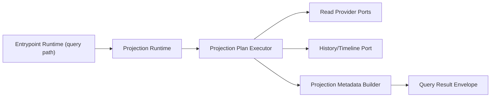
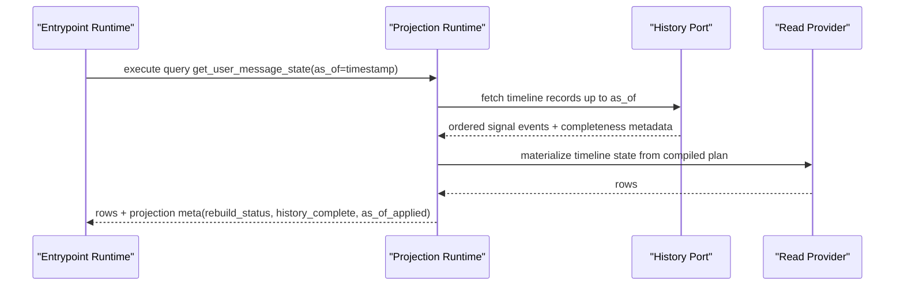
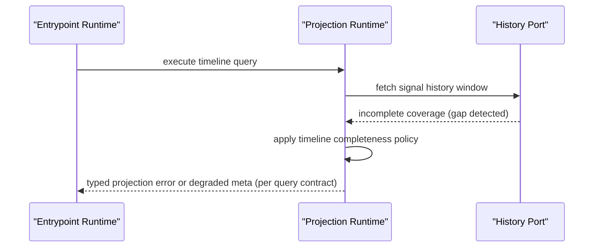
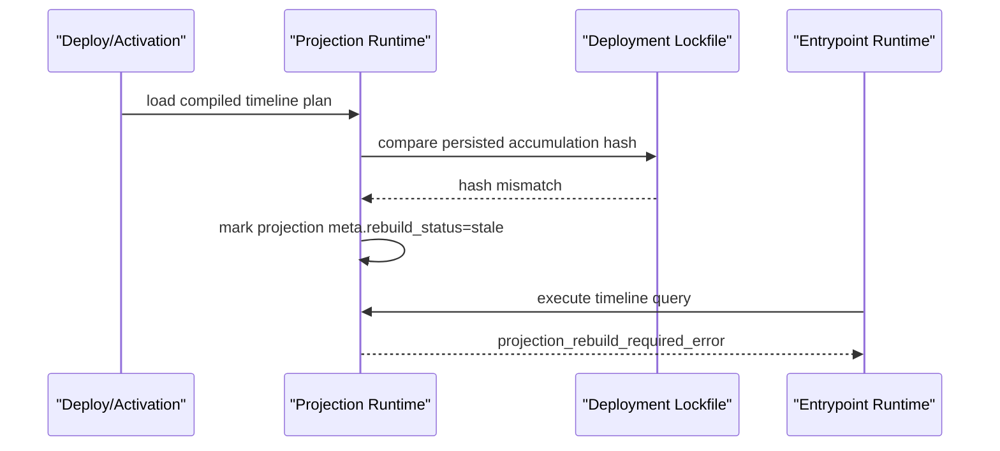

# RFC-0010: Projection Runtime Semantics (Join, Aggregate, Timeline, and History)

## Metadata

- RFC: `RFC-0010`
- Title: `Projection Runtime Semantics (Join, Aggregate, Timeline, and History)`
- Status: `Proposed`
- Owners: `Runtime Platform`, `Product Platform`
- Reviewers: `Developer Experience`, `Quality`, `Marketplace`
- Created: `2026-02-26`
- Updated: `2026-02-26`
- Target release: `Runtime Milestone R2`
- Related:
  - North star: [RFC-0007-north-star-platform-shape-and-progressive-dx-api.md](/Users/ngalluzzo/repos/gooi/docs/engineering/rfcs/RFC-0007-north-star-platform-shape-and-progressive-dx-api.md)
  - Full spec model: [RFC-0008-full-app-spec-contract-and-canonical-compiler-model.md](/Users/ngalluzzo/repos/gooi/docs/engineering/rfcs/RFC-0008-full-app-spec-contract-and-canonical-compiler-model.md)
  - Domain runtime semantics: [RFC-0009-domain-runtime-semantics-actions-capabilities-flows-and-session-outcomes.md](/Users/ngalluzzo/repos/gooi/docs/engineering/rfcs/RFC-0009-domain-runtime-semantics-actions-capabilities-flows-and-session-outcomes.md)
  - Guard and invariant contracts: [RFC-0019-guard-and-invariant-runtime-contracts.md](/Users/ngalluzzo/repos/gooi/docs/engineering/rfcs/RFC-0019-guard-and-invariant-runtime-contracts.md)
  - Entrypoint runtime: [RFC-0002-entrypoint-execution-pipeline.md](/Users/ngalluzzo/repos/gooi/docs/engineering/rfcs/RFC-0002-entrypoint-execution-pipeline.md)
  - Spec source: [demo.yml](/Users/ngalluzzo/repos/gooi/docs/demo.yml)

## Problem and context

The product promise for read behavior is strategy-authored projections that are
portable and deterministic. Today, runtime contracts treat queries as typed
entrypoints but not as a full projection semantics engine.

Product gap:

1. Projection strategies (`from_collection`, `join`, `aggregate`, `timeline`) are not fully runtime-canonical.
2. Time travel (`as_of`) and history completeness semantics are not standardized.
3. Query behavior can diverge by provider implementation.

## Goals

1. Define canonical runtime semantics for all projection strategies used in `demo.yml`.
2. Define deterministic `as_of`, timeline rebuild, and history completeness behavior.
3. Define explicit history-provider operations and capability gating for timeline queries.
4. Define event-key dedupe semantics as the correctness contract for historical replay.
5. Define signal-schema migration rules for timeline replay across retained history.
6. Define projection output envelopes with stable metadata and paging semantics.
7. Preserve provider pluggability while enforcing strategy-level correctness.
8. Ensure refresh and invalidation semantics stay signal-driven and deterministic.

## Non-goals

1. Defining write/action behavior (RFC-0009).
2. Defining route/surface dispatch behavior (RFC-0011).
3. Defining render/view node behavior (RFC-0012).
4. Defining storage engine internals per provider.
5. Defining full projection-guard policy matrix and violation signal semantics (RFC-0019).
6. Defining cross-projection dependency graphs and dependency-driven invalidation.

## Product outcomes and success metrics

Outcomes:

1. Query authors get predictable results regardless of surface or host.
2. Timeline projections become first-class, production-safe read models.
3. Historical reads are explicit, explainable, and auditable.

Metrics:

- Product metric(s):
  - `100%` strategy-authored projections compile to `CompiledProjectionPlan`.
  - `100%` query responses include consistent projection metadata shape.
- Reliability metric(s):
  - `100%` deterministic ordering for identical inputs and source state.
  - `0` accepted timeline-state reads with ambiguous history completeness.
- Developer experience metric(s):
  - Query simulation p95 `< 200ms` on fixture dataset.
  - Time-travel query diagnostics are deterministic and actionable.
- Explicit latency/availability target(s) with numeric thresholds:
  - projection orchestration overhead p95 `< 25ms` excluding provider scan/join cost.
  - timeline-state rebuild status checks p95 `< 40ms`.

## Proposal

Introduce `projection-runtime` as strategy-aware read executor consuming
compiled projection plans.

### Architecture interface diagram



### Strategy execution model

1. `from_collection`:
   - scan -> filter -> search -> sort -> page.
2. `join`:
   - primary scan -> join scan(s) -> projection -> search -> sort -> page.
3. `aggregate`:
   - scan/join -> group -> metrics -> sort -> page.
4. `timeline`:
   - signal history scan -> order -> accumulate -> optional persist/rebuild -> page.

### History and timeline source-of-truth contract

When `app.history.enabled: true`, every emitted signal is appended as an immutable
history record. Timeline projections must treat this history as the source of
truth for accumulation and rebuild behavior.

Required record shape:

```ts
export type HistoryRecord = {
  readonly signalName: string;
  readonly signalVersion: number;
  readonly eventKey: string;
  readonly emittedAt: string;
  readonly traceId: string;
  readonly payload: Readonly<Record<string, unknown>>;
};
```

### Event-key and dedupe contract

1. `eventKey` is mandatory for all persisted signal emissions.
2. Default event key derivation is `payload.id` when the payload defines `id`.
3. Signals without `payload.id` must declare explicit event-key derivation in spec.
4. `history.append` must be idempotent on `eventKey`.
5. Timeline replay must be deterministic with tie-break order:
   - authored `order_by`.
   - `emittedAt`.
   - `eventKey`.

### History provider operations (normative)

History-capable providers must expose capability ids consumed by projection
runtime. This contract is provider-agnostic and enforced by conformance.

| Capability id | Required | Operation contract |
| --- | --- | --- |
| `history.append` | Yes | Append one immutable history record; idempotent by `eventKey`. |
| `history.scan` | Yes | Scan ordered history for signal set with cursor + limit support. |
| `history.scan_as_of` | No | Scan ordered history up to `as_of` cutoff; required for non-null `as_of` queries. |
| `history.rebuild` | Yes | Replay history over compiled accumulation handlers by group key. |
| `history.persist` | Yes | Persist timeline materialized state and lifecycle metadata. |

Normative operation envelopes:

```ts
export type HistoryAppendInput = HistoryRecord;

export type HistoryScanInput = {
  readonly signals: readonly string[];
  readonly orderBy: { readonly field: string; readonly direction: "asc" | "desc" };
  readonly groupBy?: string | null;
  readonly afterEventKey?: string;
  readonly limit?: number;
};

export type HistoryScanAsOfInput = HistoryScanInput & {
  readonly asOf: string;
};

export type HistoryRebuildInput = {
  readonly signals: readonly string[];
  readonly groupBy: string | null;
  readonly orderBy: { readonly field: string; readonly direction: "asc" | "desc" };
  readonly fromTimestamp?: string;
  readonly start: Readonly<Record<string, unknown>> | null;
  readonly handlers: Readonly<Record<string, unknown>> | null;
};
```

### Time-travel capability gating

1. `as_of: null` returns current timeline state.
2. `as_of: <timestamp>` requires a bound provider with `history.scan_as_of`.
3. If a query can pass non-null `as_of` without `history.scan_as_of`, compile must fail with a typed diagnostic.
4. Runtime must never silently fall back to current-state reads for `as_of` requests.

### Timeline rebuild lifecycle contract

Rebuild modes:

1. `full`: replay retained history from earliest retained record.
2. `from_timestamp`: replay retained history from explicit timestamp.
3. `none`: do not backfill; accumulate from new signals only.

Query metadata for timeline projections must include:

1. `meta.rebuild_status` (`in_progress` | `complete` | `failed` | `stale`).
2. `meta.rebuild_progress` (nullable numeric `0..1`).
3. `meta.rebuild_started_at` (nullable timestamp).
4. `meta.history_complete` (boolean).
5. `meta.as_of_applied` (nullable timestamp).

During rebuild:

1. Projection remains queryable unless `stale` lockfile gate is active.
2. Responses are explicitly partial when `meta.rebuild_status=in_progress`.
3. `meta.history_complete=false` must be surfaced when retained history is insufficient.
4. Projection guards (RFC-0019) are suspended for rebuilt rows until rebuild reaches `complete`.

### Accumulation drift and lockfile gating

The deployment lockfile must persist a timeline accumulation hash that includes:

1. `signals`.
2. `group_by`.
3. `order_by`.
4. `start`.
5. `when`.
6. `remove_when`.
7. relevant signal migration chain digest.

If persisted state hash and compiled hash diverge:

1. Runtime sets `meta.rebuild_status=stale`.
2. Timeline queries fail with `projection_rebuild_required_error`.
3. Rebuild must be explicitly triggered (`gooi deploy --rebuild` or `gooi rebuild --projection <id>`).
4. Silent serving of stale accumulated state is disallowed.

### Signal schema evolution for timeline replay

1. Signals default to `version: 1`.
2. Breaking payload changes require version bump and migration mapping.
3. Replay must apply cumulative migration chains (`v1 -> v2 -> ... -> current`) before handler evaluation.
4. Compile must validate chain completeness from oldest retained version to current.
5. Missing migration segments fail compile with typed diagnostics.

Change policy summary:

| Change type | Version bump | Migration mapping |
| --- | --- | --- |
| Add optional field | No | No |
| Add required field | Yes | Yes |
| Rename field | Yes | Yes |
| Remove field | Yes | No |
| Change field type | Yes | Yes |

### Timeline event-log mode

1. Event-log mode is valid when `group_by: null` and `when: null`.
2. Canonical normalization maps authored `group_by: []` to `null`.
3. Event-log mode returns one row per history record, preserving deterministic order and pagination.

### Success sequence diagram (`as_of` timeline query)



### Failure sequence diagram (incomplete history)



### Failure sequence diagram (stale accumulation hash)



### Deterministic runtime behavior rules

- Input normalization order:
  - bind/default/validate (entrypoint) -> projection args normalization -> strategy execution.
- Default precedence:
  - query defaults are applied before projection strategy defaults.
- Unknown/null handling:
  - unknown query args rejected at entrypoint boundary.
  - strategy-specific nullable fields follow compiled scalar contracts.
- Stable ordering requirements:
  - sort + pagination deterministic for equal inputs and source state.
  - timeline signals ordered by declared order key with deterministic tie-breaker.
  - page metadata and row ordering stable for identical source snapshot.
- Idempotency/replay behavior (for write paths):
  - not applicable; projection runtime is read-only.

### Authoring impact

Authoring intelligence requirements introduced by this RFC:

1. LSP diagnostics must validate projection strategy contracts, including:
   - invalid strategy-specific field combinations.
   - invalid `as_of` usage for non-timeline projections.
   - incomplete/ambiguous timeline metadata policy declarations.
   - missing or invalid event-key derivation for signals used by timeline projections.
   - missing history capability bindings for timeline features (`as_of`, rebuild, persist).
   - missing or incomplete signal migration chains required by retained history windows.
2. Completion must be strategy-aware:
   - show only valid keys for `from_collection`, `join`, `aggregate`, and `timeline`.
   - show valid metric operations and timeline lifecycle options contextually.
3. Rename/navigation must include projection ids, metric ids, and strategy-local symbols in references/definition flows.
4. Authoring conformance must include deterministic fixtures for timeline completeness and time-travel semantics.
5. Authoring quick-fixes should propose rebuild actions when accumulation hash drift is detected.

## Ubiquitous language

1. `Projection plan`: compiled strategy execution plan.
2. `History completeness`: explicit indicator that the required event window is fully available.
3. `As-of boundary`: timestamp cutoff applied to historical reads.
4. `Rebuild status`: lifecycle metadata for timeline state materialization.
5. `Projection metadata`: stable query envelope metadata about execution context and data quality.
6. `Event key`: canonical dedupe identity for history records.
7. `Accumulation hash`: lockfile-persisted digest of timeline logic + migration chain state.

## Boundaries and ownership

- Surface adapters:
  - consume query envelopes only.
- Entrypoint runtime:
  - orchestrates policy and forwards query plan execution to projection runtime.
- Projection runtime:
  - owns strategy semantics and metadata generation.
- Provider adapters:
  - perform storage-specific read execution behind typed ports.
- Host adapters:
  - provide clock/history store integrations as needed.

Must-not-cross constraints:

1. Providers must not redefine strategy semantics.
2. Projection runtime must not ingest transport-specific input formats.
3. Timeline completeness policy must not be surface-specific.
4. Query response metadata contract must remain stable across providers.
5. Providers must not silently downgrade `as_of` reads when capability support is missing.

## Contracts and typing

- Boundary schema authority:
  - Zod contracts for compiled plans and query result metadata.
- Authoring format:
  - strategy authoring in spec, compiled into `CompiledProjectionPlan`.
- Generated runtime artifact format:
  - `CompiledProjectionPlanSet@1.0.0`.
- Canonical compiled artifact schema (required):
  - `CompiledProjectionPlan`
  - `CompiledProjectionPaginationPlan`
  - `CompiledProjectionMetadataPolicy`
  - `CompiledTimelineHistoryPolicy`
  - `CompiledSignalMigrationPlan`
- Artifact version field and hash policy:
  - section hash included in manifest and query meta `artifactHash`.
- Deterministic serialization rules:
  - stable ordering and stable numeric/string encoding of pagination cursors.
- Allowed/disallowed schema features:
  - unsupported strategy operators fail compile deterministically.
- Public contract shape:
  - `executeProjection(input) -> ProjectionResultEnvelope`
- Invocation/result/error/signal/diagnostics envelope schemas:
  - adds:
    - `ProjectionResultEnvelope@1.0.0`
    - `ProjectionErrorEnvelope@1.0.0`
- Envelope versioning strategy:
  - semver literal `1.0.0` initial.
- Principal/auth context schema:
  - projection where clauses can reference principal context through compiled safe references.
- Access evaluation order:
  - access checks stay in entrypoint runtime before projection execution.
- Error taxonomy:
  - `projection_plan_error`
  - `projection_provider_error`
  - `projection_history_capability_error`
  - `projection_history_gap_error`
  - `projection_as_of_error`
  - `projection_signal_migration_error`
  - `projection_rebuild_required_error`
  - `projection_pagination_error`
- Compatibility policy:
  - strategy plan contract breaking changes require major.
- Deprecation policy:
  - strategy features deprecate with explicit replacement and diagnostic hints.

## API and module plan

Feature-oriented module layout:

1. `products/runtime/projection-runtime`
   - `src/execute/execute-projection.ts`
   - `src/strategies/{from-collection,join,aggregate,timeline}.ts`
   - `src/history/history-port.ts`
   - `src/history/event-key.ts`
   - `src/history/rebuild-gate.ts`
   - `src/history/history-completeness.ts`
   - `src/history/signal-migrations.ts`
   - `src/meta/projection-meta.ts`
2. `packages/projection-contracts`
   - `src/plans/projection-plan.ts`
   - `src/plans/timeline-history-policy.ts`
   - `src/plans/signal-migration-plan.ts`
   - `src/ports/history-port-contract.ts`
   - `src/envelopes/projection-result-envelope.ts`
   - `src/errors/projection-errors.ts`

Public APIs via `package.json` exports:

1. `@gooi/projection-runtime`
2. `@gooi/projection-contracts/{plans,envelopes,errors}`

No barrel files:

1. explicit subpath exports.

Single entry per feature:

1. one projection execution entrypoint.

## Package boundary classification

- Proposed location(s):
  - `products/runtime/projection-runtime`
  - `packages/projection-contracts`
- Lane (if `products/*`):
  - `runtime`
- Why this boundary is correct:
  - execution semantics belong to runtime lane; contracts are reusable.
- Primary consumers (internal/external):
  - entrypoint runtime, conformance, advanced adopters with embedded runtime.
- Coupling expectations:
  - projection runtime depends on contracts and provider ports.
  - no dependency on surface adapters or UI frameworks.
- Why this is not a better fit in another boundary:
  - embedding into entrypoint runtime would mix lifecycle/policy with strategy semantics.
- Promotion/demotion plan:
  - stable envelope contracts can move to broader shared package if reused widely.

## Delivery plan and rollout

Phase 1: contracts and strategy plan compilation

- Entry criteria:
  - RFC approved.
- Exit criteria:
  - projection plans compile for all strategies.
- Deliverables:
  - plan contracts + compiler outputs.

Phase 2: runtime execution engine

- Entry criteria:
  - Phase 1 complete.
- Exit criteria:
  - projection runtime executes compiled plans with deterministic envelopes.
- Deliverables:
  - strategy executors + metadata engine.

Phase 3: timeline hardening and capability/migration gates

- Entry criteria:
  - Phase 2 complete.
- Exit criteria:
  - timeline/history behavior enforces capability gating, migration chains, and rebuild lockfile policy.
- Deliverables:
  - history completeness gates + rebuild gate + migration executor + performance validation.

Phase 4: conformance expansion

- Entry criteria:
  - Phase 3 complete.
- Exit criteria:
  - provider conformance validates history operation contracts and deterministic replay invariants.
- Deliverables:
  - conformance fixtures for append/scan/scan_as_of/rebuild/persist parity.

## Test strategy and acceptance criteria

1. Unit:
   - strategy operator semantics, pagination, sorting determinism, as_of rules.
2. Integration:
   - query -> projection runtime -> provider ports across all strategies.
3. Golden:
   - deterministic projection result envelopes for fixture states.
4. Conformance:
   - provider implementations satisfy strategy invariants and history operation contracts.
5. Fault tests:
   - missing history, duplicate keys, pagination drift, invalid as_of boundaries, migration chain gaps, stale accumulation hash.

Definition of done:

1. all projection strategies in `demo.yml` execute through canonical runtime path.
2. timeline queries provide explicit completeness and rebuild metadata.
3. stale timeline state cannot be served without explicit rebuild.
4. determinism and latency gates pass.

## Operational readiness

1. Observability:
   - strategy execution timing, row counts, scan volume, history completeness rates.
2. Failure handling:
   - typed projection errors and degraded-mode metadata where allowed.
3. Security requirements:
   - principal-scoped filters must be enforced in compiled where plans.
4. Runbooks:
   - timeline rebuild lag, history gap incidents, stale-hash rebuild-required incidents, pagination consistency issues.
5. Alert thresholds:
   - timeline completeness failures > `0.5%` over 15m.
   - projection runtime overhead p95 > `25ms`.

## Risks and mitigations

1. Risk: provider-specific optimizations change semantics.
   - Mitigation: strategy conformance suite and envelope parity tests.
2. Risk: timeline/history cost grows with event volume.
   - Mitigation: explicit rebuild/persist policies and snapshot strategies.
3. Risk: pagination drift under mutable datasets.
   - Mitigation: deterministic cursor policy and metadata warnings.

## Alternatives considered

1. Provider-defined projection semantics.
   - Rejected: cross-provider drift and weak portability.
2. Timeline behavior as optional extension only.
   - Rejected: blocks core product use cases in spec.
3. No metadata for history completeness.
   - Rejected: ambiguous correctness for time-travel queries.

## Open questions

None.

## Decision log

- `2026-02-26` - Established projection runtime as canonical strategy executor with explicit timeline/history semantics.
- `2026-02-26` - Resolved timeline checkpoints: incremental checkpoint snapshots are deferred to `1.1.0`.
- `2026-02-26` - Resolved query envelope metadata defaults: provider execution stats are diagnostics-mode only by default.
- `2026-02-26` - Locked history provider contract surface: `history.append`, `history.scan`, optional `history.scan_as_of`, `history.rebuild`, `history.persist`.
- `2026-02-26` - Locked event-key dedupe semantics as mandatory correctness contract for timeline replay.
- `2026-02-26` - Locked lockfile accumulation-hash gate: stale timeline state is query-blocking until explicit rebuild.
- `2026-02-26` - Locked cumulative signal migration-chain validation for timeline replay across retained history.
