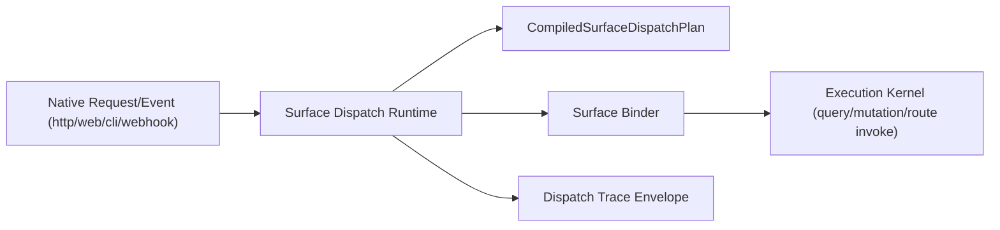
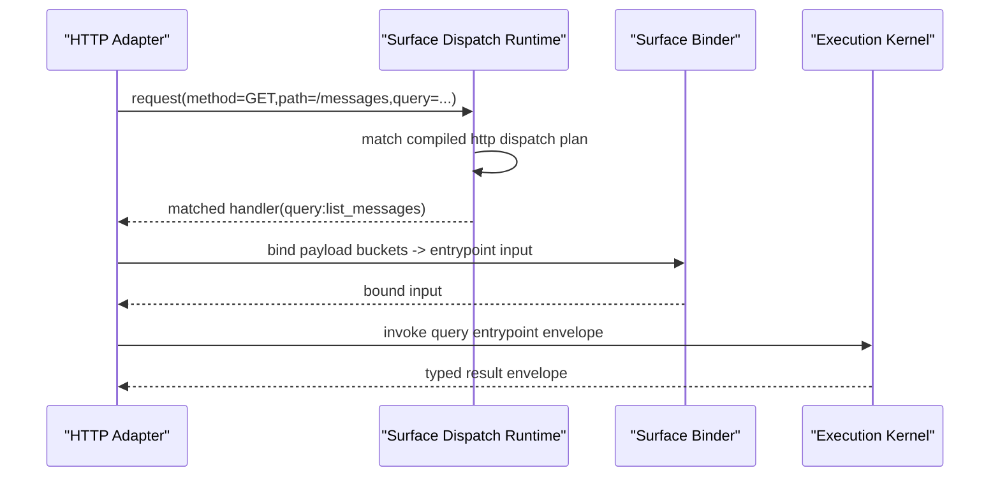
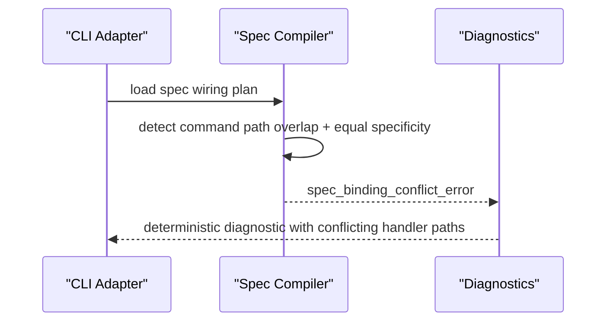

# RFC-0011: Route and Surface Dispatch Contracts (Web, HTTP, CLI, and Webhook)

## Metadata

- RFC: `RFC-0011`
- Title: `Route and Surface Dispatch Contracts (Web, HTTP, CLI, and Webhook)`
- Status: `Draft`
- Owners: `Runtime Platform`, `Product Platform`
- Reviewers: `Developer Experience`, `Quality`, `Security`
- Created: `2026-02-26`
- Updated: `2026-02-26`
- Target release: `Surface Milestone S2`
- Related:
  - North star: [RFC-0007-north-star-platform-shape-and-progressive-dx-api.md](/Users/ngalluzzo/repos/gooi/docs/engineering/rfcs/RFC-0007-north-star-platform-shape-and-progressive-dx-api.md)
  - Full spec model: [RFC-0008-full-app-spec-contract-and-canonical-compiler-model.md](/Users/ngalluzzo/repos/gooi/docs/engineering/rfcs/RFC-0008-full-app-spec-contract-and-canonical-compiler-model.md)
  - Entrypoint runtime: [RFC-0002-entrypoint-execution-pipeline.md](/Users/ngalluzzo/repos/gooi/docs/engineering/rfcs/RFC-0002-entrypoint-execution-pipeline.md)
  - Host boundary hardening: [RFC-0005-host-adapter-contracts-and-runtime-boundary-hardening.md](/Users/ngalluzzo/repos/gooi/docs/engineering/rfcs/RFC-0005-host-adapter-contracts-and-runtime-boundary-hardening.md)
  - Spec source: [demo.yml](/Users/ngalluzzo/repos/gooi/docs/demo.yml)

## Problem and context

Developers want one declarative wiring model that maps native surface requests
to typed entrypoints deterministically. Today, query/mutation binding is present,
but full route and multi-surface dispatch semantics are not fully canonicalized.

Product gap:

1. Route contracts are authored but not fully first-class in execution semantics.
2. Surface-specific dispatch conflicts (path overlap, flag ambiguity, command prefix collisions) need one deterministic model.
3. Webhook ingress is not represented as a first-class dispatch contract.

## Goals

1. Define canonical dispatch contracts for `web`, `http`, `cli`, and `webhook`.
2. Treat routes as first-class entrypoints alongside queries/mutations.
3. Define deterministic match/precedence/conflict resolution rules per surface.
4. Keep transport mapping separate from policy and domain behavior.
5. Provide typed dispatch envelopes for observability and conformance.
6. Emit canonical surface/host context required by downstream capability reachability logic.

## Non-goals

1. View render semantics and UI node execution (RFC-0012).
2. Domain action/projection semantics (RFC-0009, RFC-0010).
3. Provider/runtime activation policies.
4. API gateway and infra-specific deployment topology.
5. Capability reachability/delegation decisions (owned by kernel/provider runtime).

## Product outcomes and success metrics

Outcomes:

1. Teams define one wiring block and get consistent dispatch behavior across environments.
2. Route navigation and command/http dispatch are predictable and conflict-safe.
3. Webhook ingress becomes a secure, typed first-class surface.

Metrics:

- Product metric(s):
  - `100%` wired surfaces compile into typed `CompiledSurfaceDispatchPlan`.
  - `100%` route entrypoints callable through dispatch contracts where declared.
- Reliability metric(s):
  - `0` ambiguous dispatches accepted at compile time.
  - `100%` runtime dispatch emits typed match trace metadata.
- Developer experience metric(s):
  - dispatch conflict diagnostics stable and parity across CLI/LSP.
  - route binding authoring feedback latency p95 `< 150ms`.
- Explicit latency/availability target(s) with numeric thresholds:
  - dispatch match overhead p95 `< 5ms` per request/command event.

## Proposal

Introduce `surface-dispatch-runtime` and compiled dispatch plans for all
supported surfaces.

### Architecture interface diagram

### Surface contract model

1. `http`:
   - method + path pattern + bind map.
2. `web`:
   - route path/query mapping + interaction dispatch metadata.
3. `cli`:
   - command path + optional flag predicates + bind map.
4. `webhook`:
   - source id + signature policy + endpoint path/method + bind map.

### Match and precedence rules

1. Surface is selected by adapter context first.
2. Candidate handlers are filtered by transport match:
   - HTTP: method+path.
   - CLI: command path + `when.flags` predicate.
   - Webhook: endpoint + source validation.
3. If multiple candidates remain:
   - deterministic specificity rank is applied.
4. If tie remains:
   - compile-time conflict error.

### Success sequence diagram (HTTP route dispatch)

### Failure sequence diagram (CLI ambiguity)

### Deterministic runtime behavior rules

- Input normalization order:
  - surface match -> bind extraction -> default application -> entrypoint validation.
- Default precedence:
  - bound value > entrypoint default > validation failure.
- Unknown/null handling:
  - unknown bound keys rejected.
  - `null` preserved as explicit input.
- Stable ordering requirements:
  - match candidate ranking deterministic by explicit precedence algorithm.
  - dispatch traces include ordered decision steps.
- Context propagation requirements:
  - dispatch result includes `surfaceId` and `invocationHost` for downstream reachability checks.
- Idempotency/replay behavior (for write paths):
  - handled by kernel runtime and replay stores after dispatch.

### Authoring impact

Authoring intelligence requirements introduced by this RFC:

1. LSP diagnostics must detect dispatch ambiguities and surface-specific binding conflicts with precise conflicting matcher references.
2. Completion must be surface-aware:
   - suggest valid matcher fields per surface (`http`, `web`, `cli`, `webhook`).
   - suggest valid binding buckets (`path`, `query`, `body`, `args`, `flags`, `headers`) by context.
3. Rename/navigation must treat route ids and dispatch handler ids as first-class symbols with cross-surface references.
4. Authoring conformance must include fixture matrices for no-match, ambiguous-match, and webhook verification contract errors.

## Ubiquitous language

1. `Dispatch plan`: compiled surface match contracts.
2. `Match trace`: ordered record of dispatch decision steps.
3. `Specificity rank`: deterministic precedence score for candidate handlers.
4. `Ingress contract`: typed contract for inbound surface payloads.
5. `Binding bucket`: transport-native payload group (`path/query/body/args/flags/headers`).
6. `Surface identity`: canonical id of ingress surface used for diagnostics and policy context.

## Boundaries and ownership

- Surface adapters:
  - own transport I/O and call dispatch runtime.
- Dispatch runtime:
  - owns matching and dispatch decision semantics.
- Entrypoint runtime:
  - owns policy and execution after dispatch.
- Host/platform adapters:
  - own webhook verification primitives and secrets access.

Must-not-cross constraints:

1. Surface adapters must not bypass dispatch/runtime policy gates.
2. Dispatch runtime must not evaluate business domain logic.
3. Webhook signature verification must complete before dispatch invoke.
4. Entrypoint runtime must not depend on transport libraries.
5. Dispatch runtime must not select capability providers or delegation routes.

## Contracts and typing

- Boundary schema authority:
  - Zod for dispatch plans and envelopes.
- Authoring format:
  - `wiring.surfaces.*` and `routes` compiled into dispatch plans.
- Generated runtime artifact format:
  - `CompiledSurfaceDispatchPlanSet@1.0.0`.
- Canonical compiled artifact schema (required):
  - `CompiledDispatchHandler`
  - `CompiledDispatchMatcher`
  - `CompiledDispatchBinding`
  - `CompiledRouteEntrypoint`
- Artifact version field and hash policy:
  - dispatch section hash and per-surface hash.
- Deterministic serialization rules:
  - matcher ordering stable and deterministic.
- Allowed/disallowed schema features:
  - ambiguous matchers are compile errors.
  - unsupported matcher fields fail compile.
- Public contract shape:
  - `dispatch(input) -> DispatchResult`
  - `traceDispatch(input) -> DispatchTraceEnvelope`
- Invocation/result/error/signal/diagnostics envelope schemas:
  - adds:
    - `DispatchTraceEnvelope@1.0.0`
    - `DispatchErrorEnvelope@1.0.0`
- Envelope versioning strategy:
  - semver literal `1.0.0`.
- Principal/auth context schema:
  - dispatch may populate raw principal payload only; validation remains runtime-host concern.
- Surface/host context schema:
  - dispatch output includes `surfaceId` and `invocationHost` fields with stable enum contracts.
- Access evaluation order:
  - unchanged; post-dispatch policy gate in kernel runtime.
- Error taxonomy:
  - `dispatch_not_found_error`
  - `dispatch_ambiguous_error`
  - `dispatch_binding_error`
  - `webhook_verification_error`
- Compatibility policy:
  - breaking matcher shape changes require major.
- Deprecation policy:
  - matcher field deprecations include replacements and diagnostics.

## API and module plan

Feature-oriented module layout:

1. `products/runtime/surface-dispatch-runtime`
   - `src/match/http-match.ts`
   - `src/match/cli-match.ts`
   - `src/match/web-match.ts`
   - `src/match/webhook-match.ts`
   - `src/dispatch/dispatch.ts`
   - `src/trace/dispatch-trace.ts`
2. `products/contracts/surface-contracts`
   - add dispatch feature modules for plans, matchers, traces, and errors.

Public APIs via `package.json` exports:

1. `@gooi/surface-dispatch-runtime`
2. `@gooi/surface-contracts/{dispatch-plans,dispatch-traces,dispatch-errors}`

No barrel files:

1. explicit subpath exports only.

Single entry per feature:

1. one dispatch runtime entrypoint for all surfaces.

## Package boundary classification

- Proposed location(s):
  - `products/runtime/surface-dispatch-runtime`
  - `products/contracts/surface-contracts` (dispatch feature)
- Lane (if `products/*`):
  - `runtime`
- Why this boundary is correct:
  - dispatch behavior is runtime lane logic; contracts are reusable and tool-consumable.
- Primary consumers (internal/external):
  - adapters, execution-kernel integration, conformance tooling.
- Coupling expectations:
  - depends on compiled plan contracts and surface contracts.
  - no dependency on domain runtime or marketplace implementation internals.
- Why this is not a better fit in another boundary:
  - embedding in adapter apps would fragment semantics.
- Promotion/demotion plan:
  - surface-specific helper matchers may be split if module growth exceeds boundary clarity.

## Delivery plan and rollout

Phase 1: dispatch contracts + compiler emission

- Entry criteria:
  - RFC approved.
- Exit criteria:
  - compiled dispatch plans include routes + all supported surface matchers.
- Deliverables:
  - contract schemas and compile diagnostics.

Phase 2: runtime matcher engine

- Entry criteria:
  - Phase 1 complete.
- Exit criteria:
  - deterministic dispatch runtime for HTTP/web/CLI/webhook.
- Deliverables:
  - matcher implementation + trace envelopes.

Phase 3: integration and conformance

- Entry criteria:
  - Phase 2 complete.
- Exit criteria:
  - adapters integrated and conformance suite passes conflict/failure cases.
- Deliverables:
  - adapter integrations + conformance expansion.

## Test strategy and acceptance criteria

1. Unit:
   - matcher specificity, precedence, tie-breaker logic, and binding extraction.
2. Integration:
   - adapter -> dispatch -> entrypoint path for each surface.
3. Golden:
   - deterministic dispatch traces for fixture inputs.
4. Conformance:
   - compile-time conflict detection and runtime not-found behavior.
5. Security tests:
   - webhook verification failures and replay protection semantics.

Definition of done:

1. routes are first-class dispatch targets in compiled/runtime contracts.
2. all configured surfaces dispatch deterministically.
3. compile/runtime conflict handling deterministic and tested.

## Operational readiness

1. Observability:
   - dispatch match time, no-match rate, ambiguity diagnostics, webhook verify failures.
2. Failure handling:
   - typed dispatch errors mapped consistently by surface.
3. Security requirements:
   - signed webhook verification contract and timestamp tolerance enforcement.
4. Runbooks:
   - dispatch ambiguity incidents, webhook auth failures, adapter mismatch regressions.
5. Alert thresholds:
   - dispatch not-found rate > `1%` by surface.
   - webhook verification failures > baseline + `3σ`.

## Risks and mitigations

1. Risk: precedence rules become hard to reason about.
   - Mitigation: explicit specificity algorithm and trace output.
2. Risk: webhook security gaps due to adapter variance.
   - Mitigation: shared verification contract and conformance tests.
3. Risk: breaking CLI command ergonomics with strict ambiguity checks.
   - Mitigation: deterministic diagnostics with precise conflict hints.

## Alternatives considered

1. Keep per-surface dispatch behavior independent in adapters.
   - Rejected: inconsistent behavior and weak portability.
2. Treat routes as purely UI concern.
   - Rejected: breaks runtime-agnostic navigation contract.
3. Model webhook as custom HTTP handlers only.
   - Rejected: loses typed ingress/security contract semantics.

## Open questions

None.

## Decision log

- `2026-02-26` - Established routes and multi-surface dispatch as first-class compiled/runtime contracts.
- `2026-02-26` - Resolved webhook replay policy: dispatch contracts must declare explicit replay-window behavior in `1.0.0` (host defaults may seed values but do not replace explicit policy).
- `2026-02-26` - Resolved CLI alias handling: localized aliases are adapter-time concerns, not compile-time contract concerns.
- `2026-02-26` - Resolved dispatch/runtime boundary for host portability: dispatch emits surface/host context but does not select capability providers or delegation routes.
- `2026-02-27` - Resolved contract packaging model for this RFC: dispatch contracts are a feature within `@gooi/surface-contracts` under `products/contracts/surface-contracts`; do not introduce `@gooi/surface-dispatch-contracts`.
