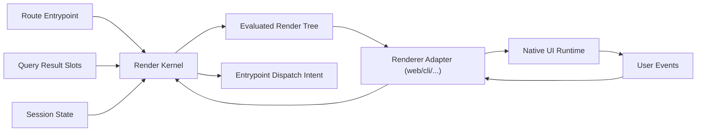
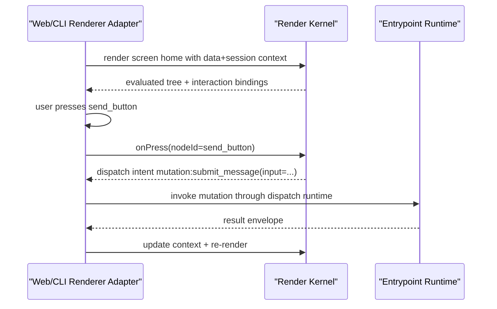
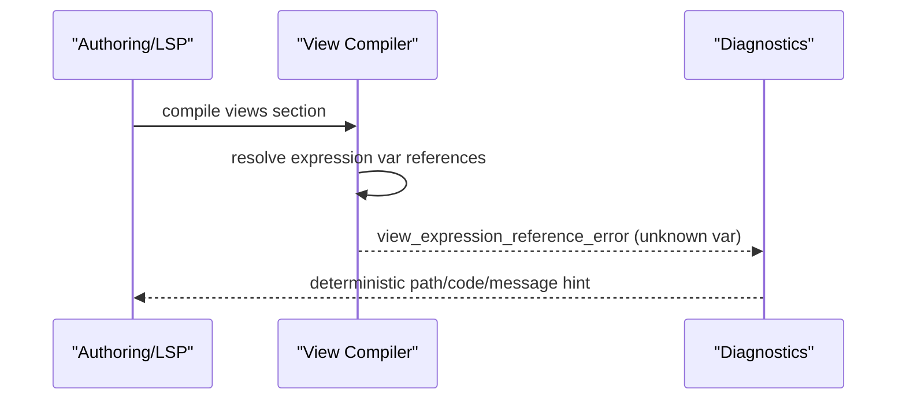

# RFC-0012: View Render IR and Renderer Adapter Contract

## Metadata

- RFC: `RFC-0012`
- Title: `View Render IR and Renderer Adapter Contract`
- Status: `Draft`
- Owners: `Product Platform`, `Runtime Platform`
- Reviewers: `Developer Experience`, `Quality`, `Marketplace`
- Created: `2026-02-26`
- Updated: `2026-02-26`
- Target release: `Surface Milestone S3`
- Related:
  - North star: [RFC-0007-north-star-platform-shape-and-progressive-dx-api.md](/Users/ngalluzzo/repos/gooi/docs/engineering/rfcs/RFC-0007-north-star-platform-shape-and-progressive-dx-api.md)
  - Full spec model: [RFC-0008-full-app-spec-contract-and-canonical-compiler-model.md](/Users/ngalluzzo/repos/gooi/docs/engineering/rfcs/RFC-0008-full-app-spec-contract-and-canonical-compiler-model.md)
  - Surface dispatch: [RFC-0011-route-and-surface-dispatch-contracts-web-http-cli-and-webhook.md](/Users/ngalluzzo/repos/gooi/docs/engineering/rfcs/RFC-0011-route-and-surface-dispatch-contracts-web-http-cli-and-webhook.md)
  - Authoring intelligence: [RFC-0003-product-authoring-intelligence-lsp-and-capability-index.md](/Users/ngalluzzo/repos/gooi/docs/engineering/rfcs/RFC-0003-product-authoring-intelligence-lsp-and-capability-index.md)
  - Spec source: [demo.yml](/Users/ngalluzzo/repos/gooi/docs/demo.yml)

## Problem and context

The product promise is runtime-agnostic views: one logical view model rendered
by different surfaces (web, CLI, future voice/native). Today, node/screen authoring
exists but the compiled render IR and renderer adapter contract are not fully
defined as a cross-surface runtime boundary.

Product gap:

1. View semantics can be interpreted differently per adapter.
2. Interaction dispatch (`onPress`, `onRowAction`, etc.) needs one canonical behavior model.
3. Data-binding and refresh behavior in screens needs explicit runtime contracts.

## Goals

1. Define `CompiledViewRenderIR@1.0.0` as canonical runtime render model.
2. Define renderer adapter contracts that map IR nodes to native UI runtime APIs.
3. Define deterministic evaluation of node props, expressions, and visibility.
4. Define canonical interaction dispatch contract from node events to entrypoints.
5. Keep render semantics independent from any specific UI framework.

## Non-goals

1. Defining transport dispatch semantics (RFC-0011).
2. Defining domain/projection semantics (RFC-0009, RFC-0010).
3. Defining concrete design system/theme components.
4. Replacing adapter-specific UX customization needs.

## Product outcomes and success metrics

Outcomes:

1. Developers author one view tree and reuse it across surfaces.
2. Interaction semantics remain consistent across adapters.
3. UI invalidation stays signal-driven and deterministic.

Metrics:

- Product metric(s):
  - `100%` `views.nodes` and `views.screens` compile into render IR.
  - `100%` supported interaction types compile to typed dispatch intents.
- Reliability metric(s):
  - `0` adapter-specific divergence for canonical IR behavior in conformance fixtures.
  - `100%` deterministic node evaluation for identical inputs/state.
- Developer experience metric(s):
  - Render IR diagnostics latency p95 `< 180ms` during authoring.
  - Cross-surface preview parity on fixture app `>= 99%`.
- Explicit latency/availability target(s) with numeric thresholds:
  - render IR evaluation overhead p95 `< 20ms` per screen render tick (excluding framework paint).

## Proposal

Introduce a two-layer render architecture:

1. `render-kernel`:
   - evaluates compiled view IR and interaction intents.
2. `renderer-adapter`:
   - maps render kernel outputs to native platform UI/runtime APIs.

### Architecture interface diagram

### Render semantics model

1. Screen selection:
   - route resolves target screen id.
2. Data slots:
   - screen `data` blocks populate render context.
3. Node evaluation:
   - expressions evaluate against typed context (`data`, `session`, `principal`, `ctx`).
4. Visibility and structure:
   - hidden nodes remain in logical tree metadata but not in rendered output.
5. Interactions:
   - interaction handlers emit typed dispatch intents, not direct side effects.

### Success sequence diagram (button interaction)

### Failure sequence diagram (invalid node expression)

### Deterministic runtime behavior rules

- Input normalization order:
  - screen selection -> data slot context merge -> node expression evaluation -> interaction binding emission.
- Default precedence:
  - node prop explicit values > section defaults > renderer adapter defaults.
- Unknown/null handling:
  - unknown node props fail compile for strict node contracts.
  - nullable expression results allowed only where prop schema permits.
- Stable ordering requirements:
  - child node order follows authored order.
  - interaction list order deterministic by authored order.
  - node evaluation order deterministic pre-order traversal.
- Idempotency/replay behavior (for write paths):
  - interaction intents rely on entrypoint runtime replay semantics, not renderer-local retries.

### Authoring impact

Authoring intelligence requirements introduced by this RFC:

1. LSP diagnostics must validate node-contract conformance and expression-reference correctness for render context variables.
2. Completion must be node-contract aware:
   - node type completion from available provider node catalogs.
   - prop completion constrained by selected node type and prop schemas.
   - interaction intent completion constrained by legal entrypoint kinds and fields.
3. Rename/navigation must include node ids, screen ids, and interaction symbols in symbol graph references.
4. Authoring conformance must include cross-adapter preview parity fixtures and interaction intent validity fixtures.

## Ubiquitous language

1. `Render IR`: compiled view representation consumed by render kernel.
2. `Render kernel`: deterministic evaluator for screen+node semantics.
3. `Renderer adapter`: platform-specific projection of evaluated tree.
4. `Interaction intent`: typed instruction to invoke query/mutation/route entrypoint.
5. `Render context`: merged data/session/principal/context values for expression evaluation.

## Boundaries and ownership

- Surface adapters:
  - own native UI API integration and event plumbing only.
- Render kernel:
  - owns evaluation semantics and interaction intent emission.
- Entrypoint runtime:
  - owns invocation policy/execution for intents.
- Host/platform adapters:
  - own native lifecycle, rendering resources, and local storage integration.

Must-not-cross constraints:

1. Renderer adapters must not embed business/domain logic.
2. Render kernel must not depend on UI framework internals.
3. Interaction handlers must not bypass dispatch/entrypoint runtime.
4. Node/provider selection must be artifact-driven, not runtime ad hoc lookup.

## Contracts and typing

- Boundary schema authority:
  - Zod for render IR and renderer adapter interface contracts.
- Authoring format:
  - `views.nodes` and `views.screens` in spec.
- Generated runtime artifact format:
  - `CompiledViewRenderIR@1.0.0`.
- Canonical compiled artifact schema (required):
  - `CompiledScreen`
  - `CompiledNode`
  - `CompiledNodePropPlan`
  - `CompiledInteractionIntentPlan`
- Artifact version field and hash policy:
  - section hash in manifest + per-screen hash map.
- Deterministic serialization rules:
  - stable node map ordering by id; child order preserved.
- Allowed/disallowed schema features:
  - unsupported node types/props fail compile with typed diagnostics.
- Public contract shape:
  - `evaluateScreen(input) -> EvaluatedRenderTree`
  - `handleInteraction(input) -> InteractionDispatchIntent`
- Invocation/result/error/signal/diagnostics envelope schemas:
  - adds:
    - `RenderEvaluationEnvelope@1.0.0`
    - `InteractionIntentEnvelope@1.0.0`
    - `RenderDiagnosticEnvelope@1.0.0`
- Envelope versioning strategy:
  - semver literal `1.0.0`.
- Principal/auth context schema:
  - render context includes principal as read-only scoped data.
- Access evaluation order:
  - route/entrypoint access remains upstream of render-triggered invocation.
- Error taxonomy:
  - `view_node_contract_error`
  - `view_expression_reference_error`
  - `interaction_dispatch_contract_error`
  - `render_adapter_capability_error`
- Compatibility policy:
  - breaking render IR shape changes require major.
- Deprecation policy:
  - node type and prop deprecations require replacement metadata.

## API and module plan

Feature-oriented module layout:

1. `products/runtime/render-kernel`
   - `src/evaluate/evaluate-screen.ts`
   - `src/evaluate/evaluate-node.ts`
   - `src/interaction/handle-interaction.ts`
   - `src/contracts/render-kernel-contracts.ts`
2. `products/contracts/render-contracts`
   - render IR types, node contracts, interaction envelopes.
3. `marketplace/ui-*`:
   - concrete renderer adapters and node implementations.

Public APIs via `package.json` exports:

1. `@gooi/render-kernel`
2. `@gooi/render-contracts/{ir,envelopes,nodes}`
3. marketplace renderer adapter entrypoints per provider.

No barrel files:

1. explicit export maps per feature.

Single entry per feature:

1. one screen evaluation entrypoint.
2. one interaction handler entrypoint.

## Package boundary classification

- Proposed location(s):
  - `products/runtime/render-kernel`
  - `products/contracts/render-contracts`
  - `products/marketplace/*` renderer adapters
- Lane (if `products/*`):
  - `runtime`
- Why this boundary is correct:
  - evaluation semantics are runtime behavior; contracts are reusable primitives; adapter implementations belong to marketplace.
- Primary consumers (internal/external):
  - web/cli surfaces, extension previews, future native/voice adapters.
- Coupling expectations:
  - render kernel depends on contracts only.
  - adapters depend on contracts and native runtime APIs.
- Why this is not a better fit in another boundary:
  - collapsing into surface adapters would fragment semantics.
- Promotion/demotion plan:
  - mature common node contracts can be promoted within `products/contracts/render-contracts`.

## Delivery plan and rollout

Phase 1: render contracts and IR compiler outputs

- Entry criteria:
  - RFC approved.
- Exit criteria:
  - view sections compile into `CompiledViewRenderIR`.
- Deliverables:
  - contracts + compile diagnostics.

Phase 2: render kernel

- Entry criteria:
  - Phase 1 complete.
- Exit criteria:
  - deterministic screen evaluation and interaction intents.
- Deliverables:
  - runtime evaluation engine + envelopes.

Phase 3: adapter integration and parity

- Entry criteria:
  - Phase 2 complete.
- Exit criteria:
  - web and CLI adapters pass parity conformance fixtures.
- Deliverables:
  - adapter integrations + conformance suite.

## Test strategy and acceptance criteria

1. Unit:
   - node prop evaluation, expression resolution, visibility, interaction intent generation.
2. Integration:
   - route -> render -> interaction -> entrypoint dispatch.
3. Golden:
   - stable evaluated tree outputs for fixture contexts.
4. Conformance:
   - cross-adapter parity for same render IR fixture.
5. Fault tests:
   - unsupported node type, invalid prop types, missing data slots, stale refresh contexts.

Definition of done:

1. full `views` section in `demo.yml` runs through canonical render kernel path.
2. interaction semantics are deterministic and entrypoint-driven.
3. cross-adapter parity gates pass.

## Operational readiness

1. Observability:
   - render eval timings, node counts, interaction intent rates, adapter capability misses.
2. Failure handling:
   - typed render diagnostics and fallback-screen policy.
3. Security requirements:
   - expression evaluation sandboxed with no arbitrary code execution.
4. Runbooks:
   - render drift incidents, adapter mismatch incidents, interaction dispatch failures.
5. Alert thresholds:
   - render evaluation failures > `1%`.
   - interaction dispatch contract errors > `0.2%`.

## Risks and mitigations

1. Risk: node contract explosion hurts maintainability.
   - Mitigation: strict node taxonomy governance and provider conformance.
2. Risk: adapter-specific behavior leaks into kernel.
   - Mitigation: strict boundary tests and contract-only kernel dependencies.
3. Risk: expression complexity impacts render latency.
   - Mitigation: compile-time allowlist and eval budget limits.

## Alternatives considered

1. Keep view rendering surface-specific with no common IR.
   - Rejected: portability and parity break.
2. Compile directly to framework-specific components.
   - Rejected: locks product to one UI stack.
3. Treat interactions as adapter-local callbacks.
   - Rejected: bypasses policy and deterministic runtime behavior.

## Open questions

None.

## Decision log

- `2026-02-26` - Established compiled render IR and renderer adapter contracts as canonical cross-surface UI boundary.
- `2026-02-26` - Resolved evaluation granularity for `1.0.0`: render kernel uses full-screen evaluation only; partial subtree re-evaluation is deferred.
- `2026-02-26` - Resolved node versioning model: node contract versions are per-node-type, not global.
- `2026-02-27` - Resolved contract packaging model for this RFC: shared render contracts live under `products/contracts/render-contracts` (package name remains `@gooi/render-contracts`).
