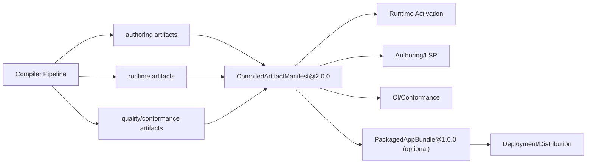
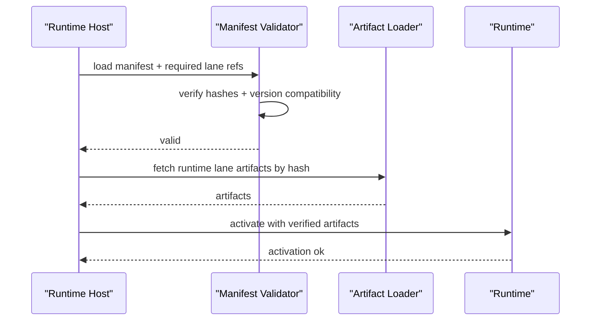
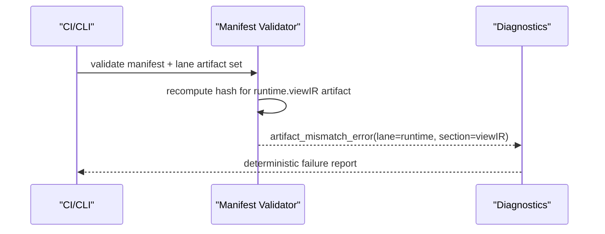

# RFC-0013: Artifact Model V2 (Lane Artifacts, Manifest, and Packaged Bundle)

## Metadata

- RFC: `RFC-0013`
- Title: `Artifact Model V2 (Lane Artifacts, Manifest, and Packaged Bundle)`
- Status: `Draft`
- Owners: `Runtime Platform`, `Developer Experience`
- Reviewers: `Product Platform`, `Quality`, `Marketplace`
- Created: `2026-02-26`
- Updated: `2026-02-26`
- Target release: `Artifact Milestone A1`
- Related:
  - North star: [RFC-0007-north-star-platform-shape-and-progressive-dx-api.md](/Users/ngalluzzo/repos/gooi/docs/engineering/rfcs/RFC-0007-north-star-platform-shape-and-progressive-dx-api.md)
  - Full spec model: [RFC-0008-full-app-spec-contract-and-canonical-compiler-model.md](/Users/ngalluzzo/repos/gooi/docs/engineering/rfcs/RFC-0008-full-app-spec-contract-and-canonical-compiler-model.md)
  - Authoring lockfile concepts: [RFC-0003-product-authoring-intelligence-lsp-and-capability-index.md](/Users/ngalluzzo/repos/gooi/docs/engineering/rfcs/RFC-0003-product-authoring-intelligence-lsp-and-capability-index.md)
  - Host alignment: [RFC-0005-host-adapter-contracts-and-runtime-boundary-hardening.md](/Users/ngalluzzo/repos/gooi/docs/engineering/rfcs/RFC-0005-host-adapter-contracts-and-runtime-boundary-hardening.md)
  - Marketplace trust: [RFC-0018-marketplace-trust-certification-and-supply-chain-security.md](/Users/ngalluzzo/repos/gooi/docs/engineering/rfcs/RFC-0018-marketplace-trust-certification-and-supply-chain-security.md)

## Problem and context

The platform now spans multiple lanes (authoring/runtime/quality/marketplace).
A single artifact is not enough for progressive adoption, while ad hoc artifact
sets create drift and compatibility confusion.

Product gap:

1. No canonical multi-artifact model that supports partial adoption cleanly.
2. No first-class manifest that binds lane artifacts and compatibility metadata.
3. No standard packaged bundle format for deployment ergonomics.

## Goals

1. Define canonical lane artifacts as primary outputs.
2. Define `CompiledArtifactManifest@2.0.0` as authoritative artifact index and compatibility source.
3. Define optional `PackagedAppBundle@1.0.0` for distribution/deployment convenience.
4. Preserve deterministic hashing and integrity verification at every layer.
5. Support progressive adoption (`L0-L3`) without forcing unused artifacts.

## Non-goals

1. Defining provider registry resolution policy details.
2. Defining CI environment-specific storage backends for artifacts.
3. Replacing lockfile semantics with bundle-only semantics.
4. Runtime execution semantics for domain/projection/render.

## Product outcomes and success metrics

Outcomes:

1. Teams can consume only needed lane artifacts with guaranteed compatibility checks.
2. Deployment systems can use one packaged bundle without losing lane-level traceability.
3. Artifact drift is detectable and actionable through manifest integrity checks.

Metrics:

- Product metric(s):
  - `100%` lane artifacts referenced by manifest with stable hashes.
  - `100%` runtime activations verify required manifest dependencies.
- Reliability metric(s):
  - `0` accepted artifact hash mismatches.
  - `100%` reproducible bundle hash for identical source+compiler inputs.
- Developer experience metric(s):
  - artifact inspection command p95 `< 100ms`.
  - mismatch diagnostics with actionable section/lane pointers `100%`.
- Explicit latency/availability target(s) with numeric thresholds:
  - manifest validation p95 `< 20ms`.
  - packaged bundle verification p95 `< 80ms`.

## Proposal

Adopt a three-level artifact architecture:

1. `Lane artifacts` (canonical primary units).
2. `Manifest` (canonical index and compatibility contract).
3. `Packaged bundle` (optional distribution format).

### Architecture interface diagram

### Canonical artifact set

1. Authoring lane:
   - capability index, symbol graph, authoring lockfile metadata references.
2. Runtime lane:
   - compiled entrypoints, domain plans, projection plans, render IR, dispatch plans.
3. Quality lane:
   - conformance fixture descriptors and expected envelope snapshots.

### Success sequence diagram (runtime activation)

### Failure sequence diagram (hash mismatch)

### Deterministic behavior rules

- Input normalization order:
  - normalize artifact payload -> stable serialize -> compute hash -> emit manifest.
- Default precedence:
  - manifest-level defaults only for optional metadata fields, never for hashes/versions.
- Unknown/null handling:
  - unknown manifest keys rejected unless in extension namespace.
  - null forbidden for required hash/version fields.
- Stable ordering requirements:
  - lane artifact references sorted by lane id then artifact id.
  - manifest sections deterministically ordered.
- Idempotency/replay behavior (for write paths):
  - artifact generation is pure and idempotent for identical inputs.

### Authoring impact

Authoring intelligence requirements introduced by this RFC:

1. LSP diagnostics must surface artifact-manifest alignment issues with lane/section-level precision.
2. Completion must guide manifest authoring/inspection workflows:
   - valid lane ids, artifact ref fields, and compatibility metadata keys.
3. Rename/navigation must include artifact identifiers and manifest refs in symbol graph references where applicable.
4. Authoring conformance must include lockfile/manifest mismatch fixtures and stale-artifact degraded-mode fixtures.

## Ubiquitous language

1. `Lane artifact`: canonical compiled output for one platform lane.
2. `Manifest`: authoritative map of artifacts, hashes, compatibility, and provenance.
3. `Packaged bundle`: transport container bundling manifest + selected artifacts.
4. `Aggregate hash`: deterministic hash representing manifest+artifact graph.
5. `Compatibility matrix`: declared runtime/authoring version constraints.

## Boundaries and ownership

- Compiler:
  - emits lane artifacts and manifest references.
- Runtime:
  - consumes required runtime lane artifacts through manifest verification.
- Authoring:
  - consumes authoring lane artifacts through manifest verification.
- Quality:
  - validates cross-lane integrity and compatibility expectations.
- Deployment tooling:
  - may use packaged bundle but must preserve canonical manifest semantics.

Must-not-cross constraints:

1. Consumers must not bypass manifest validation for required artifacts.
2. Bundle format must not redefine lane artifact semantics.
3. Lane artifacts must remain directly consumable without bundle extraction dependency.

## Contracts and typing

- Boundary schema authority:
  - Zod for lane artifacts, manifest, and packaged bundle schemas.
- Authoring format:
  - unchanged; compiler emits artifacts.
- Generated runtime artifact format:
  - lane artifacts + manifest.
- Canonical compiled artifact schema (required):
  - `CompiledArtifactManifest@2.0.0`
  - `LaneArtifactRef@1.0.0`
  - `PackagedAppBundle@1.0.0`
- Artifact version field and hash policy:
  - each artifact has `artifactVersion`, `artifactHash`.
  - manifest has `aggregateHash` across referenced artifacts.
- Deterministic serialization rules:
  - stable key sorting and lexicographic reference ordering.
- Allowed/disallowed schema features:
  - no implicit hash algorithms; explicit hash algo field required.
- Public contract shape:
  - `buildArtifactManifest(input) -> CompiledArtifactManifest`
  - `validateArtifactManifest(input) -> ValidationResult`
  - `buildPackagedBundle(input) -> PackagedAppBundle`
  - `unpackPackagedBundle(input) -> { manifest, artifacts }`
- Invocation/result/error/signal/diagnostics envelope schemas:
  - manifest validation diagnostics envelope:
    - `ArtifactValidationEnvelope@1.0.0`.
- Envelope versioning strategy:
  - independent from runtime invocation envelopes.
- Principal/auth context schema:
  - not applicable for offline artifact build/verify.
- Access evaluation order:
  - not applicable at artifact layer; enforced at runtime.
- Error taxonomy:
  - `artifact_missing_error`
  - `artifact_mismatch_error`
  - `manifest_schema_error`
  - `manifest_compatibility_error`
  - `bundle_unpack_error`
- Compatibility policy:
  - manifest major defines compatibility with lane artifact major families.
  - signatures remain optional schema fields in `2.0.0`; trust policy may require signatures for certified or production resolver paths.
- Deprecation policy:
  - artifact fields deprecate via manifest compatibility metadata.

## API and module plan

Feature-oriented module layout:

1. `packages/artifact-model`
   - `src/manifest/manifest.ts`
   - `src/manifest/validate-manifest.ts`
   - `src/bundle/build-bundle.ts`
   - `src/bundle/unpack-bundle.ts`
2. `products/authoring/spec-compiler`
   - emit lane artifacts + manifest.
3. `products/runtime/*`
   - manifest consumers for activation paths.

Public APIs via `package.json` exports:

1. `@gooi/artifact-model/{manifest,bundle,validation}`

No barrel files:

1. explicit subpaths only.

Single entry per feature:

1. one manifest build path.
2. one manifest validate path.
3. one bundle build/unpack path each.

## Package boundary classification

- Proposed location(s):
  - `packages/artifact-model`
- Lane (if `products/*`):
  - not lane-specific; shared primitive.
- Why this boundary is correct:
  - artifact graph model is cross-lane infrastructure primitive.
- Primary consumers (internal/external):
  - compiler, runtime activation, CI tooling, deployment tooling.
- Coupling expectations:
  - should not depend on runtime internals or adapter libraries.
- Why this is not a better fit in another boundary:
  - placing in one lane would couple all other lanes to product internals.
- Promotion/demotion plan:
  - keep in shared package; split bundle module later only if it grows independently.

## Delivery plan and rollout

Phase 1: manifest v2 contracts

- Entry criteria:
  - RFC approved.
- Exit criteria:
  - manifest schema + validation contract published.
- Deliverables:
  - contract and validation APIs.

Phase 2: lane artifact emission integration

- Entry criteria:
  - Phase 1 complete.
- Exit criteria:
  - compiler emits lane refs and aggregate manifest.
- Deliverables:
  - compiler integration and diagnostics.

Phase 3: packaged bundle support

- Entry criteria:
  - Phase 2 complete.
- Exit criteria:
  - bundle build/unpack + verification in deploy toolchain.
- Deliverables:
  - bundle APIs and verification pipeline.

## Test strategy and acceptance criteria

1. Unit:
   - hash generation, manifest validation, compatibility checks.
2. Integration:
   - compile outputs -> manifest verify -> runtime activation path.
3. Golden:
   - stable manifest and bundle hashes for fixture inputs.
4. Conformance:
   - cross-lane consumer compatibility and mismatch diagnostics.
5. Fault tests:
   - missing artifacts, corrupted hashes, incompatible versions, partial bundles.

Definition of done:

1. canonical manifest v2 emitted and consumed by all required lanes.
2. bundle workflow optional but fully deterministic when used.
3. mismatch diagnostics are deterministic and actionable.

## Operational readiness

1. Observability:
   - manifest verify timings, mismatch error rates, bundle unpack failures.
2. Failure handling:
   - fail-fast on required artifact mismatch.
3. Security requirements:
   - integrity verification required before activation.
4. Runbooks:
   - hash mismatch recovery, stale cache invalidation, bundle corruption response.
5. Alert thresholds:
   - artifact mismatch rate > `0.1%`.
   - bundle unpack failures > `0.2%`.

## Risks and mitigations

1. Risk: Artifact explosion increases complexity.
   - Mitigation: manifest indexing and lane-scoped consumption.
2. Risk: Bundle becomes required in practice.
   - Mitigation: preserve lane artifact first-class APIs and docs.
3. Risk: Hash algorithm migration complexity.
   - Mitigation: algorithm field + compatibility windows.

## Alternatives considered

1. Single monolithic artifact only.
   - Rejected: blocks progressive adoption and cache efficiency.
2. Bundle-only model with no lane artifacts.
   - Rejected: removes composability and lane-level diagnostics.
3. Per-lane manifests with no global manifest.
   - Rejected: weak cross-lane compatibility guarantees.

## Open questions

None.

## Decision log

- `2026-02-26` - Adopted lane artifacts + canonical manifest as primary model, with packaged bundle as optional distribution format.
- `2026-02-26` - Resolved packaged bundle compression for `1.0.0`: compression algorithm is fixed to `zstd`.
- `2026-02-26` - Resolved manifest signature support for `2.0.0`: manifest includes optional artifact signatures in `2.0.0`; marketplace trust policy can require signatures for certified or production resolution paths.
