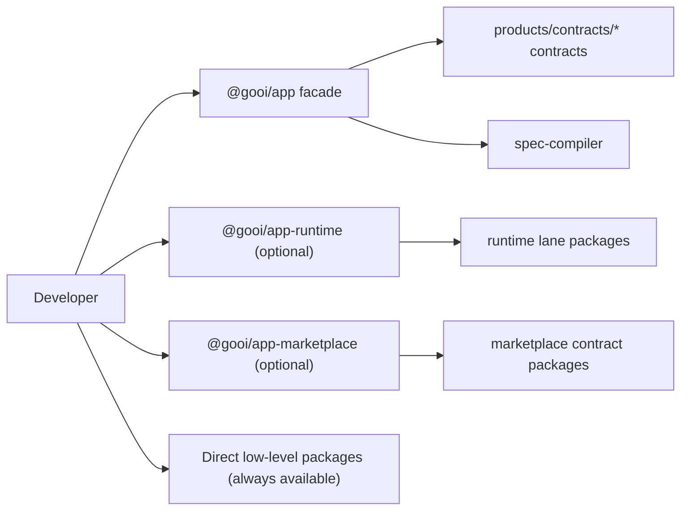
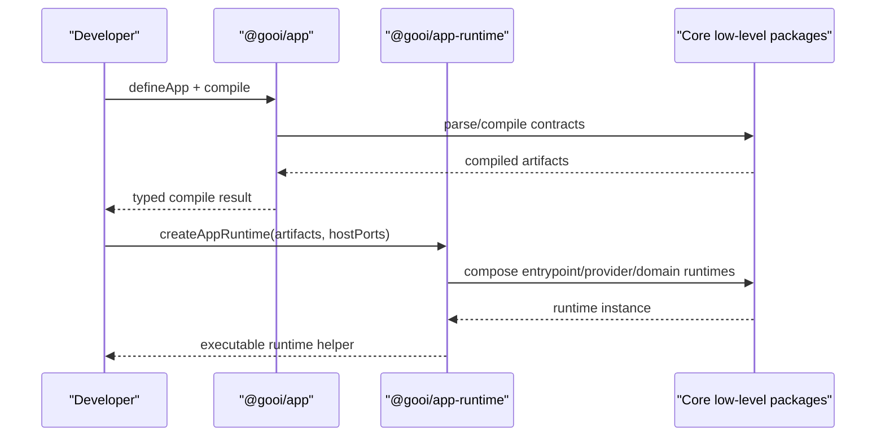
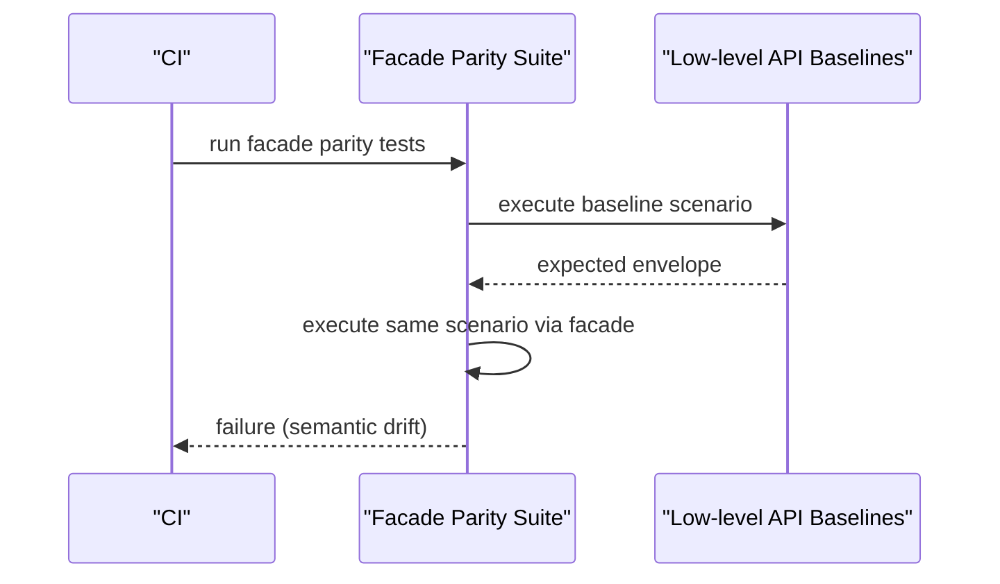

# RFC-0014: Progressive DX Facade APIs and Compatibility Guarantees

## Metadata

- RFC: `RFC-0014`
- Title: `Progressive DX Facade APIs and Compatibility Guarantees`
- Status: `Draft`
- Owners: `Developer Experience`, `Product Platform`
- Reviewers: `Runtime Platform`, `Quality`, `Marketplace`
- Created: `2026-02-26`
- Updated: `2026-02-26`
- Target release: `DX Milestone D1`
- Related:
  - North star: [RFC-0007-north-star-platform-shape-and-progressive-dx-api.md](/Users/ngalluzzo/repos/gooi/docs/engineering/rfcs/RFC-0007-north-star-platform-shape-and-progressive-dx-api.md)
  - Artifact model v2: [RFC-0013-artifact-model-v2-lane-artifacts-manifest-and-packaged-bundle.md](/Users/ngalluzzo/repos/gooi/docs/engineering/rfcs/RFC-0013-artifact-model-v2-lane-artifacts-manifest-and-packaged-bundle.md)
  - Full spec model: [RFC-0008-full-app-spec-contract-and-canonical-compiler-model.md](/Users/ngalluzzo/repos/gooi/docs/engineering/rfcs/RFC-0008-full-app-spec-contract-and-canonical-compiler-model.md)
  - Marketplace architecture: [RFC-0016-marketplace-product-architecture-control-plane-and-consumer-experience.md](/Users/ngalluzzo/repos/gooi/docs/engineering/rfcs/RFC-0016-marketplace-product-architecture-control-plane-and-consumer-experience.md)
  - Marketplace resolution: [RFC-0017-marketplace-resolution-and-ranking-engine-at-10k-plus-scale.md](/Users/ngalluzzo/repos/gooi/docs/engineering/rfcs/RFC-0017-marketplace-resolution-and-ranking-engine-at-10k-plus-scale.md)
  - Marketplace trust: [RFC-0018-marketplace-trust-certification-and-supply-chain-security.md](/Users/ngalluzzo/repos/gooi/docs/engineering/rfcs/RFC-0018-marketplace-trust-certification-and-supply-chain-security.md)
  - Standards: [commit-and-tsdoc-standards.md](/Users/ngalluzzo/repos/gooi/docs/engineering/commit-and-tsdoc-standards.md)

## Problem and context

We have strong low-level packages, but developers need an intentional top-level
API that scales from tiny adoption to full platform use. Without that, adoption
either feels overwhelming or becomes inconsistent wrapper sprawl.

Product gap:

1. No single opinionated facade path for progressive adoption.
2. No explicit compatibility guarantees for facade APIs vs underlying primitives.
3. Risk of “magic” APIs hiding important runtime behavior.

## Goals

1. Define progressive facade API model from `L0` through `L3`.
2. Define `@gooi/app` as declarative-first facade.
3. Define separate execution-helper boundary (`@gooi/app-runtime`).
4. Guarantee facade semantic parity with underlying stable APIs.
5. Provide migration-safe compatibility guarantees and tooling expectations.
6. Provide optional marketplace-aware facades for provider discovery, eligibility, and trust-aware resolution.

## Non-goals

1. Replacing low-level packages with facade-only APIs.
2. Creating a monolithic “do everything” SDK.
3. Defining implementation details for every framework integration.
4. Defining runtime semantics already covered by runtime RFCs.
5. Implementing marketplace control-plane services inside facade packages.

## Product outcomes and success metrics

Outcomes:

1. Teams adopt Gooi in progressively deeper modes without rewrites.
2. Facade API improves discoverability without obscuring behavior.
3. Advanced users can always drop to low-level packages safely.

Metrics:

- Product metric(s):
  - `>= 80%` new projects start on `L0`/`L1` path successfully.
  - `>= 90%` `L1` users can migrate to `L2/L3` without API-breaking rewrites.
- Reliability metric(s):
  - `100%` facade operations map to deterministic underlying APIs.
  - `0` undocumented semantic divergence between facade and primitives.
- Developer experience metric(s):
  - time-to-first-valid-app-definition with `@gooi/app` `<= 10 minutes`.
  - migration guide coverage for every facade deprecation `100%`.
- Explicit latency/availability target(s) with numeric thresholds:
  - facade orchestration overhead p95 `< 10ms` beyond underlying calls.

## Proposal

Define progressive facade families with strict parity rules.

### Facade product model

1. `@gooi/app` (declarative-first):
   - app builder, spec validation, compile ergonomics.
2. `@gooi/app-runtime` (execution helpers):
   - local dev run helpers, embedded runtime composition.
3. `@gooi/app-testing` (optional):
   - scenario runner and fixture ergonomics over conformance primitives.
4. `@gooi/app-marketplace` (optional):
   - provider discovery, eligibility checks, and trust-aware resolution helpers over marketplace contracts.

Facade APIs compose existing packages and must remain thin.

### Architecture interface diagram

### Progressive API ladder

1. `L0` Contract-first:
   - direct contracts (`capability-contracts`, `host-contracts`, `surface-contracts`).
2. `L1` Compile-first:
   - `@gooi/app` compile/validate path.
3. `L2` Embedded runtime:
   - `@gooi/app-runtime` composition helpers.
4. `L3` Full platform:
   - full app model + deployment artifacts + optional bundle workflow.

Optional cross-cutting layer:

1. `Marketplace-aware composition`:
   - `@gooi/app-marketplace` may be used alongside `L0-L3` to discover providers, explain eligibility, and resolve trusted provider sets.

### Success sequence diagram (L1 to L2 migration)

### Failure sequence diagram (facade parity regression)

### Deterministic runtime behavior rules

- Input normalization order:
  - facade-level argument validation -> delegation to underlying API.
- Default precedence:
  - underlying API defaults are authoritative; facade defaults must mirror.
- Unknown/null handling:
  - facade must not coerce values differently than underlying contracts.
- Stable ordering requirements:
  - facade output ordering follows underlying artifact/envelope ordering.
- Idempotency/replay behavior (for write paths):
  - facade may expose convenience options but cannot alter underlying replay semantics.

## Ubiquitous language

1. `Facade parity`: semantic equivalence between facade and low-level APIs.
2. `Progressive mode`: adoption depth `L0-L3`.
3. `Declarative-first`: API focused on contract composition before execution.
4. `Execution helper`: runtime composition convenience package.
5. `Escape hatch`: explicit ability to switch to low-level APIs.

## Boundaries and ownership

- Facade packages:
  - own ergonomic composition and guardrails.
- Core packages:
  - own canonical behavior and contracts.
- Runtime lane:
  - owns execution semantics.
- Quality lane:
  - owns parity conformance gates.

Must-not-cross constraints:

1. Facades must not introduce hidden side effects.
2. Facades must not block direct core package usage.
3. Facades must not redefine runtime semantics.
4. Facades must not become mandatory for any mode.

## Contracts and typing

- Boundary schema authority:
  - facade input/output contracts in Zod where validation is required.
- Authoring format:
  - unchanged; facades compose existing formats.
- Generated runtime artifact format:
  - unchanged; facades expose typed wrappers over canonical artifacts.
- Canonical compiled artifact schema (required):
  - facade references canonical artifact contracts; no facade-specific artifact dialect.
- Artifact version field and hash policy:
  - delegated from artifact model v2 contracts.
- Deterministic serialization rules:
  - same as underlying APIs.
- Allowed/disallowed schema features:
  - no opaque “any” envelopes in public facade APIs.
- Public contract shape:
  - `defineApp(input) -> AppDefinition`
  - `compileApp(definition) -> CompileResult`
  - `createAppRuntime(input) -> AppRuntime` (in `@gooi/app-runtime`)
  - `discoverProviders(input) -> ProviderCatalogView` (in `@gooi/app-marketplace`)
  - `explainProviderEligibility(input) -> EligibilityReport` (in `@gooi/app-marketplace`)
  - `resolveTrustedProviders(input) -> ResolutionResult` (in `@gooi/app-marketplace`)
- Invocation/result/error/signal/diagnostics envelope schemas:
  - facades return canonical envelopes unchanged.
- Envelope versioning strategy:
  - follows underlying envelope versions.
- Principal/auth context schema:
  - unchanged; passed-through typed contexts.
- Access evaluation order:
  - unchanged; enforced by runtime.
- Error taxonomy:
  - adds facade wrapper codes only for facade argument misuse:
    - `facade_input_error`
    - `facade_configuration_error`
  - all runtime/compiler errors pass through canonical typed codes.
- Compatibility policy:
  - facade major must be compatible with referenced core major ranges.
- Deprecation policy:
  - one minor-cycle notice minimum + migration guide + codemod path for major facade changes.

## API and module plan

Feature-oriented module layout:

1. `packages/app`
   - `src/define/define-app.ts`
   - `src/compile/compile-app.ts`
   - `src/contracts/app-facade-contracts.ts`
2. `packages/app-runtime`
   - `src/create/create-app-runtime.ts`
   - `src/run/run-app.ts`
3. `packages/app-testing` (optional)
   - scenario helpers and fixture composition wrappers.
4. `packages/app-marketplace` (optional)
   - `src/discovery/discover-providers.ts`
   - `src/eligibility/explain-provider-eligibility.ts`
   - `src/resolution/resolve-trusted-providers.ts`

Public APIs via `package.json` exports:

1. `@gooi/app/{define,compile}`
2. `@gooi/app-runtime/{create,run}`
3. `@gooi/app-testing/{fixtures,scenario-runner}`
4. `@gooi/app-marketplace/{discover,eligibility,resolve}`

No barrel files:

1. explicit subpath exports only.

Single entry per feature:

1. one define entrypoint, one compile entrypoint, one runtime-create entrypoint.
2. one marketplace discovery entrypoint, one eligibility entrypoint, one resolution entrypoint.

## Package boundary classification

- Proposed location(s):
  - `packages/app`
  - `packages/app-runtime`
  - `packages/app-testing`
  - `packages/app-marketplace`
- Lane (if `products/*`):
  - not lane-specific; shared developer-facing APIs.
- Why this boundary is correct:
  - facades are cross-lane composition primitives for developer ergonomics.
- Primary consumers (internal/external):
  - app teams adopting Gooi progressively.
- Coupling expectations:
  - facades depend on stable core package entrypoints only.
  - facades must not depend on app-specific adapters.
- Why this is not a better fit in another boundary:
  - placing in one lane would bias API semantics and reduce reuse.
- Promotion/demotion plan:
  - facade modules can split if one mode outgrows shared packaging.

## Delivery plan and rollout

Phase 1: declarative facade

- Entry criteria:
  - RFC approved.
- Exit criteria:
  - `@gooi/app` define+compile path with parity tests.
- Deliverables:
  - package, docs, examples.

Phase 2: runtime helper facade

- Entry criteria:
  - Phase 1 complete.
- Exit criteria:
  - `@gooi/app-runtime` composes runtime lane packages with parity coverage.
- Deliverables:
  - runtime helper package and migration docs.

Phase 3: marketplace facade

- Entry criteria:
  - Phase 2 complete.
- Exit criteria:
  - `@gooi/app-marketplace` facade ships with parity coverage against marketplace contracts.
- Deliverables:
  - marketplace facade package and examples.

Phase 4: compatibility and migration tooling

- Entry criteria:
  - Phase 3 complete.
- Exit criteria:
  - deprecation/migration contracts and codemod scaffolding published.
- Deliverables:
  - compatibility matrix and migration toolkit.

## Test strategy and acceptance criteria

1. Unit:
   - facade argument validation and thin delegation correctness.
2. Integration:
   - end-to-end flows via facade and via low-level APIs produce equivalent envelopes/artifacts.
3. Golden:
   - facade outputs match low-level baseline fixtures.
4. Conformance:
   - facade parity suite mandatory in CI.
5. Migration tests:
   - deprecated facade APIs emit deterministic guidance and map cleanly.
6. Marketplace facade parity:
   - discovery/eligibility/resolution facade flows remain semantically equivalent to marketplace contract primitives.

Definition of done:

1. facade APIs provide ergonomic progressive entry without semantic drift.
2. parity gates prevent divergence from low-level behavior.
3. migration guarantees documented and test-backed.
4. marketplace facade parity remains contract-equivalent with marketplace primitives.

## Operational readiness

1. Observability:
   - facade adoption mode telemetry (opt-in), error-code rates, migration usage.
2. Failure handling:
   - typed pass-through errors and explicit facade input errors.
3. Security requirements:
   - no hidden credentials/runtime side-effects in facade defaults.
4. Runbooks:
   - parity regression response and migration incident response.
5. Alert thresholds:
   - facade parity failures block release by policy.

## Risks and mitigations

1. Risk: facade becomes a monolith.
   - Mitigation: strict thin-wrapper rule and escape-hatch guarantees.
2. Risk: hidden defaults surprise advanced users.
   - Mitigation: documented defaults and config introspection APIs.
3. Risk: compatibility maintenance burden.
   - Mitigation: explicit compatibility policy and automated parity testing.

## Alternatives considered

1. No facade APIs, low-level packages only.
   - Rejected: poor discoverability and steep onboarding.
2. One monolithic SDK combining declarative+runtime+deploy.
   - Rejected: violates progressive adoption and boundary clarity.
3. Facades with custom semantics independent of core.
   - Rejected: long-term drift and reliability risk.

## Open questions

None.

## Decision log

- `2026-02-26` - Confirmed declarative-first `@gooi/app` with separate execution-helper boundary and strict facade parity policy.
- `2026-02-26` - Resolved scaffolding boundary: scaffold generators remain in separate CLI tooling, not `@gooi/app`.
- `2026-02-26` - Resolved migration tooling boundary: compatibility codemods ship in dedicated `@gooi/migrate` package.
