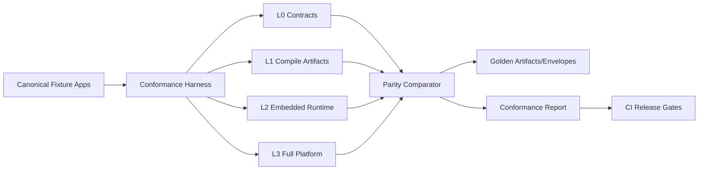
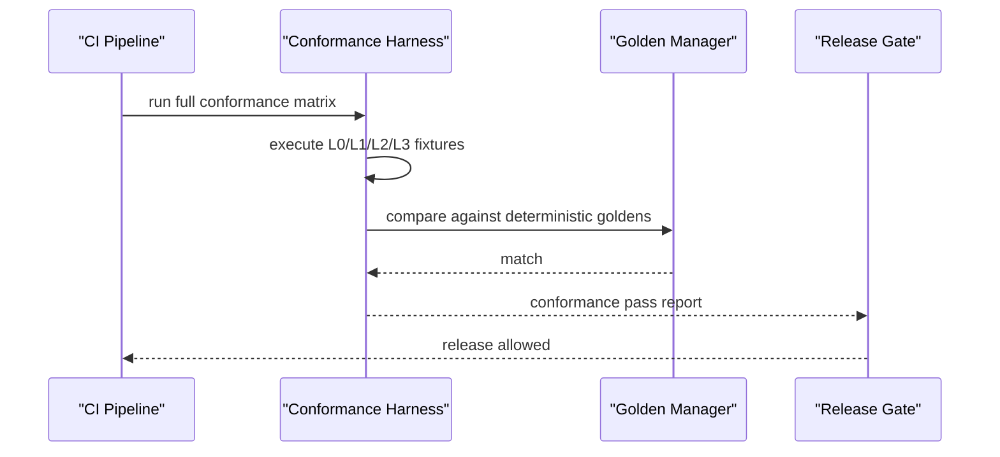
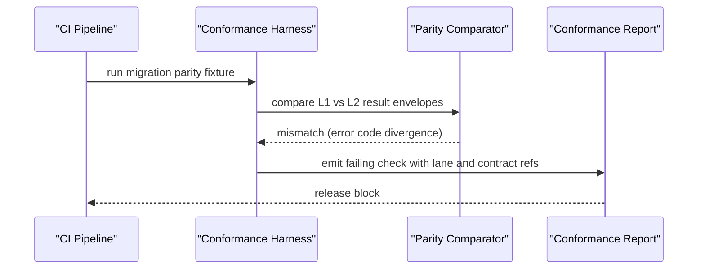

# RFC-0015: Cross-Lane Conformance Expansion (L0-L3 Parity and Determinism Gates)

## Metadata

- RFC: `RFC-0015`
- Title: `Cross-Lane Conformance Expansion (L0-L3 Parity and Determinism Gates)`
- Status: `Draft`
- Owners: `Quality`, `Runtime Platform`
- Reviewers: `Developer Experience`, `Product Platform`, `Marketplace`
- Created: `2026-02-26`
- Updated: `2026-02-26`
- Target release: `Quality Milestone Q1`
- Related:
  - North star: [RFC-0007-north-star-platform-shape-and-progressive-dx-api.md](/Users/ngalluzzo/repos/gooi/docs/engineering/rfcs/RFC-0007-north-star-platform-shape-and-progressive-dx-api.md)
  - Full spec model: [RFC-0008-full-app-spec-contract-and-canonical-compiler-model.md](/Users/ngalluzzo/repos/gooi/docs/engineering/rfcs/RFC-0008-full-app-spec-contract-and-canonical-compiler-model.md)
  - Domain runtime: [RFC-0009-domain-runtime-semantics-actions-capabilities-flows-and-session-outcomes.md](/Users/ngalluzzo/repos/gooi/docs/engineering/rfcs/RFC-0009-domain-runtime-semantics-actions-capabilities-flows-and-session-outcomes.md)
  - Projection runtime: [RFC-0010-projection-runtime-semantics-join-aggregate-timeline-and-history.md](/Users/ngalluzzo/repos/gooi/docs/engineering/rfcs/RFC-0010-projection-runtime-semantics-join-aggregate-timeline-and-history.md)
  - Surface dispatch: [RFC-0011-route-and-surface-dispatch-contracts-web-http-cli-and-webhook.md](/Users/ngalluzzo/repos/gooi/docs/engineering/rfcs/RFC-0011-route-and-surface-dispatch-contracts-web-http-cli-and-webhook.md)
  - Render IR: [RFC-0012-view-render-ir-and-renderer-adapter-contract.md](/Users/ngalluzzo/repos/gooi/docs/engineering/rfcs/RFC-0012-view-render-ir-and-renderer-adapter-contract.md)
  - Artifact model v2: [RFC-0013-artifact-model-v2-lane-artifacts-manifest-and-packaged-bundle.md](/Users/ngalluzzo/repos/gooi/docs/engineering/rfcs/RFC-0013-artifact-model-v2-lane-artifacts-manifest-and-packaged-bundle.md)
  - DX facades: [RFC-0014-progressive-dx-facade-apis-and-compatibility-guarantees.md](/Users/ngalluzzo/repos/gooi/docs/engineering/rfcs/RFC-0014-progressive-dx-facade-apis-and-compatibility-guarantees.md)
  - Marketplace architecture: [RFC-0016-marketplace-product-architecture-control-plane-and-consumer-experience.md](/Users/ngalluzzo/repos/gooi/docs/engineering/rfcs/RFC-0016-marketplace-product-architecture-control-plane-and-consumer-experience.md)
  - Marketplace resolution: [RFC-0017-marketplace-resolution-and-ranking-engine-at-10k-plus-scale.md](/Users/ngalluzzo/repos/gooi/docs/engineering/rfcs/RFC-0017-marketplace-resolution-and-ranking-engine-at-10k-plus-scale.md)
  - Marketplace trust: [RFC-0018-marketplace-trust-certification-and-supply-chain-security.md](/Users/ngalluzzo/repos/gooi/docs/engineering/rfcs/RFC-0018-marketplace-trust-certification-and-supply-chain-security.md)
  - Guard and invariant contracts: [RFC-0019-guard-and-invariant-runtime-contracts.md](/Users/ngalluzzo/repos/gooi/docs/engineering/rfcs/RFC-0019-guard-and-invariant-runtime-contracts.md)
  - Scenario runtime contracts: [RFC-0020-scenario-runtime-and-persona-simulation-contracts.md](/Users/ngalluzzo/repos/gooi/docs/engineering/rfcs/RFC-0020-scenario-runtime-and-persona-simulation-contracts.md)

## Problem and context

Progressive adoption only works if behavior is provably equivalent across modes.
Without cross-lane conformance, each layer can be correct in isolation but still
drift in end-user behavior.

Product gap:

1. Existing conformance is strong but not yet comprehensive across new north-star lanes.
2. No unified parity gate across `L0` contract-first through `L3` full platform.
3. Determinism checks are fragmented by package.

## Goals

1. Define one cross-lane conformance framework spanning authoring/runtime/dispatch/render/artifacts/facades.
2. Define mandatory parity checks across progressive modes `L0-L3`.
3. Define deterministic golden-gate policy for artifacts and envelopes.
4. Define provider/adapter conformance obligations aligned to new contracts.
5. Define release-blocking quality gates tied to product outcomes.
6. Define mixed-host reachability parity gates (`local` vs `delegated` capability execution).

## Non-goals

1. Replacing unit/integration test suites in feature packages.
2. Defining deployment SRE policy for production systems.
3. Defining benchmarks for unrelated non-contract internals.
4. Creating one mega-test harness that ignores feature ownership boundaries.

## Product outcomes and success metrics

Outcomes:

1. Teams trust that adopting deeper modes preserves behavior.
2. Platform releases are blocked on deterministic and parity regressions by policy.
3. Marketplace contributors can validate provider, control-plane, resolution, and trust compliance with clear contracts.

Metrics:

- Product metric(s):
  - `100%` release candidates pass cross-lane conformance gate.
  - `100%` progressive migration fixtures (`L0->L1->L2->L3`) pass parity.
- Reliability metric(s):
  - `0` nondeterministic golden drift accepted without explicit version bumps.
  - `100%` required provider/adapter conformance suites pass for certified listings.
  - `100%` required marketplace control-plane, resolution, and trust suites pass for release-candidate promotion.
- Developer experience metric(s):
  - conformance report generation p95 `< 90s` for full fixture matrix in CI.
  - deterministic failure diagnostics include failing lane/artifact/contract id `100%`.
- Explicit latency/availability target(s) with numeric thresholds:
  - smoke conformance suite p95 `< 10m` in main CI.
  - full nightly matrix p95 `< 45m`.

## Proposal

Expand conformance into a lane-aware matrix with release policy integration.

### Architecture interface diagram

### Conformance domains

1. Contract conformance:
   - schema validity, compatibility, and parse guarantees.
2. Compiler/artifact conformance:
   - deterministic compile outputs and manifest integrity.
3. Runtime conformance:
   - action/projection/dispatch/render behavior parity and error semantics.
   - capability reachability parity across execution hosts.
4. Facade parity conformance:
   - facade vs low-level semantic equivalence.
5. Marketplace conformance:
   - provider and renderer adapter compliance.
   - control-plane and catalog contract compliance.
   - resolution/ranking explainability and deterministic ordering checks.
   - trust, certification, and revocation propagation checks.

### Success sequence diagram (release candidate)

### Failure sequence diagram (mode parity regression)

### Deterministic runtime behavior rules

- Input normalization order:
  - fixtures normalized before execution.
- Default precedence:
  - fixture-declared expectations override inherited defaults explicitly only.
- Unknown/null handling:
  - unknown expectation keys fail harness validation.
- Stable ordering requirements:
  - report ordering by severity -> lane -> check id.
  - deterministic fixture execution ordering.
- Idempotency/replay behavior (for write paths):
  - parity checks include replay paths and conflict paths.

## Ubiquitous language

1. `Parity fixture`: one scenario executed across multiple progressive modes.
2. `Golden artifact`: deterministic expected output committed under version control.
3. `Release gate`: policy that blocks merge/release on conformance failures.
4. `Certification suite`: required conformance checks for marketplace providers/adapters plus control-plane, resolution, and trust contracts.
5. `Determinism drift`: output changes without explicit contract/version change intent.
6. `Reachability parity`: equivalence of typed outcomes between local and delegated capability execution paths.

## Boundaries and ownership

- Quality lane:
  - owns conformance harness and release gate definitions.
- Feature lanes:
  - own implementation and fixture contributions for their contracts.
- Marketplace contributors:
  - own certification suite compliance for published providers/adapters and required control-plane/resolution/trust contract fixtures.

Must-not-cross constraints:

1. Feature teams cannot weaken global conformance gates unilaterally.
2. Golden updates require explicit justification and contract/version linkage.
3. Marketplace certification cannot depend on private runtime internals.

## Contracts and typing

- Boundary schema authority:
  - Zod contracts for conformance inputs, checks, and reports.
- Authoring format:
  - fixture spec references canonical app spec and artifact contracts.
- Generated runtime artifact format:
  - conformance reports and golden snapshots.
- Canonical compiled artifact schema (required):
  - `ConformanceFixture@1.0.0`
  - `ConformanceCheckResult@1.0.0`
  - `ConformanceReport@1.0.0`
  - `ParityDiffReport@1.0.0`
- Artifact version field and hash policy:
  - conformance goldens include hash of source fixture and contract versions.
- Deterministic serialization rules:
  - stable check ordering and canonical diff formatting.
- Allowed/disallowed schema features:
  - no free-form “stringly typed” check payloads in public report contracts.
- Public contract shape:
  - `runConformanceSuite(input) -> ConformanceReport`
  - `runParitySuite(input) -> ParityDiffReport`
  - `runReachabilityParitySuite(input) -> ParityDiffReport`
  - `runMarketplaceCertification(input) -> CertificationReport`
  - `runMarketplaceControlPlaneConformance(input) -> CertificationReport`
  - `runMarketplaceResolutionConformance(input) -> CertificationReport`
  - `runMarketplaceTrustConformance(input) -> CertificationReport`
- Invocation/result/error/signal/diagnostics envelope schemas:
  - adds:
    - `ConformanceDiagnosticsEnvelope@1.0.0`.
- Envelope versioning strategy:
  - semver literal `1.0.0`.
- Principal/auth context schema:
  - parity fixtures include principal variations where behavior depends on access policy.
- Access evaluation order:
  - validated implicitly through runtime conformance checks.
- Error taxonomy:
  - `conformance_fixture_error`
  - `conformance_parity_error`
  - `conformance_reachability_parity_error`
  - `conformance_determinism_error`
  - `certification_requirement_error`
  - `marketplace_resolution_explainability_error`
  - `marketplace_revocation_propagation_error`
- Compatibility policy:
  - report/check schema major bumps require harness and CI gate updates.
- Deprecation policy:
  - check ids deprecate via alias window and migration map.

## API and module plan

Feature-oriented module layout:

1. `products/quality/conformance`
   - `src/cross-lane/*`
   - `src/parity/*`
   - `src/determinism/*`
   - `src/certification/*`
   - `src/marketplace-control-plane/*`
   - `src/marketplace-resolution/*`
   - `src/marketplace-trust/*`
2. `packages/conformance-contracts`
   - fixture/report/check schemas.

Public APIs via `package.json` exports:

1. `@gooi/conformance/{cross-lane,parity,determinism,certification,marketplace-control-plane,marketplace-resolution,marketplace-trust}`
2. `@gooi/conformance-contracts/{fixtures,reports,checks}`

No barrel files:

1. explicit feature exports only.

Single entry per feature:

1. one run entrypoint per conformance domain.

## Package boundary classification

- Proposed location(s):
  - `products/quality/conformance`
  - `packages/conformance-contracts`
- Lane (if `products/*`):
  - `quality`
- Why this boundary is correct:
  - quality gate orchestration belongs to quality lane; contracts are shared primitives.
- Primary consumers (internal/external):
  - CI pipelines, platform maintainers, marketplace contributors.
- Coupling expectations:
  - quality harness depends on published contracts and public APIs only.
- Why this is not a better fit in another boundary:
  - embedding in runtime or authoring would compromise neutral gate ownership.
- Promotion/demotion plan:
  - shared report contracts stay in `packages/*`; harness logic remains in `products/quality/*`.

## Delivery plan and rollout

Phase 1: contract and fixture model expansion

- Entry criteria:
  - RFC approved.
- Exit criteria:
  - cross-lane fixture/report contracts published.
- Deliverables:
  - contracts and base fixture library.

Phase 2: parity and determinism gates

- Entry criteria:
  - Phase 1 complete.
- Exit criteria:
  - CI gates enforce L0-L3 parity and determinism checks.
- Deliverables:
  - parity comparator + golden manager integration.

Phase 3: marketplace certification expansion

- Entry criteria:
  - Phase 2 complete.
- Exit criteria:
  - provider/adapter and marketplace control-plane/resolution/trust certification suites integrated into publication and promotion workflows.
- Deliverables:
  - certification reports, promotion policy docs, and revocation propagation fixtures.

## Test strategy and acceptance criteria

1. Unit:
   - check evaluators, diff formatters, deterministic sorters.
2. Integration:
   - full fixture runs across lanes with report generation.
3. Golden:
   - report/golden determinism with pinned fixture hashes.
4. Conformance:
   - meta-conformance for harness itself (self-check suite).
5. Fault tests:
   - stale goldens, flaky ordering injections, partial lane artifact availability.

Definition of done:

1. full cross-lane matrix and parity suite running in CI.
2. release policy blocks on determinism/parity regressions.
3. marketplace provider plus control-plane/resolution/trust certification checks integrated with clear pass/fail criteria.

## Operational readiness

1. Observability:
   - suite durations, flaky-check counters, failure categories by lane.
2. Failure handling:
   - retry policy for infra failures separated from deterministic failure results.
3. Security requirements:
   - certification fixtures for ingress verification, principal policy checks, and revocation propagation fail-closed behavior.
4. Runbooks:
   - flaky conformance triage, golden update process, false positive response.
5. Alert thresholds:
   - conformance flaky rate > `0.5%`.
   - nightly matrix failure rate > `2%`.

## Risks and mitigations

1. Risk: conformance runtime cost slows delivery.
   - Mitigation: tiered suites (smoke, full, nightly) with strict required gate policy.
2. Risk: overfitting to fixtures misses real-world edge cases.
   - Mitigation: rotating production-derived anonymized fixture corpus.
3. Risk: teams bypass quality gates under pressure.
   - Mitigation: central release policy and audit log for override decisions.

## Alternatives considered

1. Keep lane-specific conformance only.
   - Rejected: progressive mode parity remains unproven.
2. Rely on integration tests without deterministic goldens.
   - Rejected: drift detection too weak.
3. Marketplace certification as optional docs-only guidance.
   - Rejected: weak ecosystem trust guarantees.

## Open questions

None.

## Decision log

- `2026-02-26` - Established cross-lane conformance, progressive mode parity, and determinism as release-blocking quality gates.
- `2026-02-26` - Resolved smoke-suite scope: smoke coverage uses one representative fixture per lane; full strategy/surface matrix runs in expanded suites.
- `2026-02-26` - Resolved golden-governance policy: golden updates require CODEOWNERS approval from both feature and quality owners.
- `2026-02-26` - Resolved reachability quality gate: release candidates must prove parity between local and delegated capability execution paths for mixed-host fixtures.
