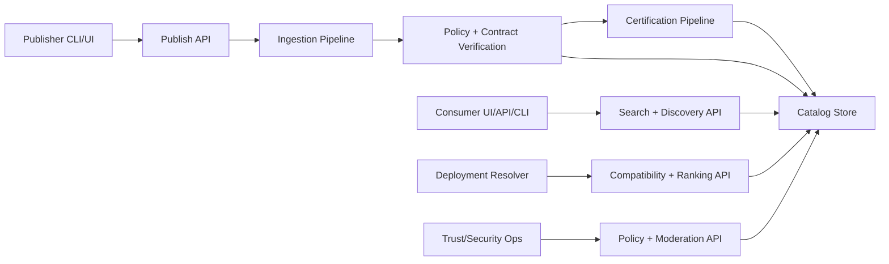
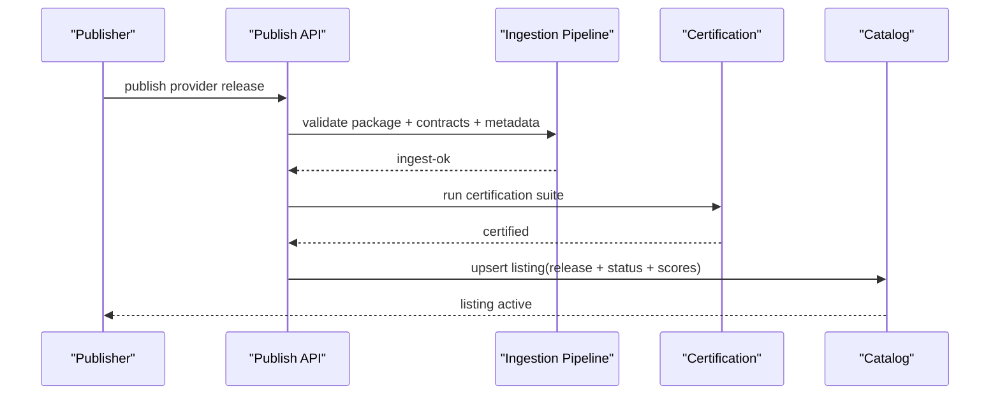
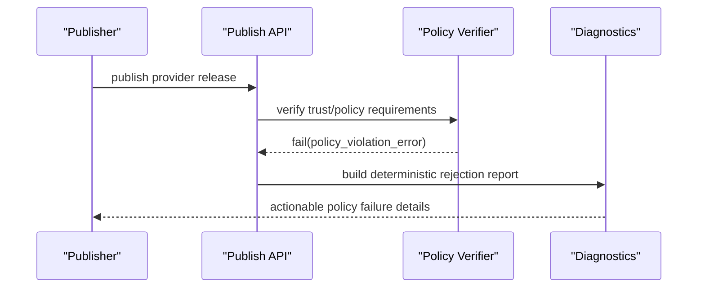

# RFC-0016: Marketplace Product Architecture (Control Plane and Consumer Experience)

## Metadata

- RFC: `RFC-0016`
- Title: `Marketplace Product Architecture (Control Plane and Consumer Experience)`
- Status: `Draft`
- Owners: `Marketplace`, `Platform`
- Reviewers: `Runtime Platform`, `Developer Experience`, `Security`, `Quality`
- Created: `2026-02-26`
- Updated: `2026-02-26`
- Target release: `Marketplace Milestone M7`
- Related:
  - North star: [RFC-0007-north-star-platform-shape-and-progressive-dx-api.md](/Users/ngalluzzo/repos/gooi/docs/engineering/rfcs/RFC-0007-north-star-platform-shape-and-progressive-dx-api.md)
  - Host provider model: [RFC-0006-marketplace-host-adapter-provider-model-and-memory-reference.md](/Users/ngalluzzo/repos/gooi/docs/engineering/rfcs/RFC-0006-marketplace-host-adapter-provider-model-and-memory-reference.md)
  - Artifact model: [RFC-0013-artifact-model-v2-lane-artifacts-manifest-and-packaged-bundle.md](/Users/ngalluzzo/repos/gooi/docs/engineering/rfcs/RFC-0013-artifact-model-v2-lane-artifacts-manifest-and-packaged-bundle.md)
  - Conformance: [RFC-0015-cross-lane-conformance-expansion-l0-l3-parity-and-determinism-gates.md](/Users/ngalluzzo/repos/gooi/docs/engineering/rfcs/RFC-0015-cross-lane-conformance-expansion-l0-l3-parity-and-determinism-gates.md)
  - Resolution engine: [RFC-0017-marketplace-resolution-and-ranking-engine-at-10k-plus-scale.md](/Users/ngalluzzo/repos/gooi/docs/engineering/rfcs/RFC-0017-marketplace-resolution-and-ranking-engine-at-10k-plus-scale.md)
  - Trust plane: [RFC-0018-marketplace-trust-certification-and-supply-chain-security.md](/Users/ngalluzzo/repos/gooi/docs/engineering/rfcs/RFC-0018-marketplace-trust-certification-and-supply-chain-security.md)

## Problem and context

Marketplace is currently treated as a provider package source. At projected scale
(`10k+` providers), that model is insufficient for product outcomes.

We need a true marketplace product with:

1. Publisher lifecycle workflows.
2. Consumer discovery and selection UX.
3. Certification/trust governance.
4. Resolver-ready compatibility and ranking data.
5. Operational controls and abuse protections.

Without this, provider scale creates:

1. unreliable provider selection,
2. weak trust guarantees,
3. poor discoverability,
4. high integration/support costs.

## Goals

1. Define marketplace as a first-class product with control-plane APIs and UX surfaces.
2. Support provider lifecycle management at `10k+` provider scale.
3. Provide deterministic, policy-aware metadata for deployment resolution.
4. Make certification and trust status first-class selection inputs.
5. Keep runtime consumption decoupled from marketplace internals.

## Non-goals

1. Defining final search/ranking algorithms in detail (covered in RFC-0017).
2. Defining full supply-chain cryptographic protocol details (covered in RFC-0018).
3. Building a provider execution runtime in marketplace services.
4. Replacing local/private registries used by enterprise deployments.

## Product outcomes and success metrics

Outcomes:

1. Publisher onboarding and release lifecycle are self-serve and auditable.
2. Consumers can reliably discover compatible, certified providers.
3. Runtime resolution consumes stable marketplace metadata contracts.

Metrics:

- Product metric(s):
  - active certified providers supported: `>= 10,000`.
  - publish-to-listing median time: `< 5 minutes` for compliant releases.
  - provider discovery success rate: `>= 95%` for targeted capability queries.
- Reliability metric(s):
  - listing metadata correctness SLA: `99.99%`.
  - catalog API availability: `99.95%`.
  - stale/inconsistent listing incidents: `0` P1 per quarter.
- Developer experience metric(s):
  - time-to-first-published-provider: `<= 30 minutes`.
  - resolver decision explainability coverage: `100%` (machine + human-readable reasons).
- Explicit latency/availability target(s) with numeric thresholds:
  - provider search API p95 `< 150ms`.
  - compatibility lookup API p95 `< 80ms`.
  - listing publish API p95 `< 300ms` (excluding external CI run time).

## Proposal

Create a marketplace product composed of:

1. `Publisher Control Plane`.
2. `Consumer Catalog Plane`.
3. `Certification and Governance Plane`.
4. `Resolver Metadata Plane`.

### Architecture interface diagram

### Product surfaces

1. Publisher experience:
   - register provider namespace
   - publish releases
   - view certification and policy status
   - deprecate, yank, retire releases
2. Consumer experience:
   - capability-first discovery
   - provider detail pages (compatibility, certification, quality signals)
   - deterministic selection metadata export
3. Resolver experience:
   - deterministic API for compatible provider candidates
   - explicit rejection reasons by policy and compatibility dimension
   - explicit reachability mode metadata (`local` vs `delegated`) and delegated route descriptors

### Success sequence diagram (publish and certify)

### Failure sequence diagram (policy rejection)

### Deterministic runtime behavior rules

- Input normalization order:
  - parse listing payload -> schema validate -> policy validate -> compatibility indexing -> persistence.
- Default precedence:
  - explicit publisher metadata > marketplace defaults (for optional fields only).
- Unknown/null handling:
  - unknown listing fields rejected unless extension namespace (`x-*`).
  - null disallowed for required identity/version/capability refs.
- Stable ordering requirements:
  - search and candidate APIs define deterministic tie-break ordering.
  - resolver candidate output is stable for identical inputs and catalog snapshot.
- Idempotency/replay behavior (for write paths):
  - publish operations are idempotent by `(providerId, releaseVersion, contentHash)`.
  - replays return existing listing state with replay metadata.

## Ubiquitous language

1. `Listing`: discoverable marketplace record for one provider release.
2. `Release`: immutable published provider version artifact.
3. `Certification status`: quality/trust state (`pending`, `certified`, `rejected`, `revoked`).
4. `Catalog snapshot`: deterministic point-in-time view of marketplace metadata.
5. `Resolver candidate`: provider release returned as eligible for a deployment need.
6. `Reachability metadata`: host-compatibility and delegation-route data used by deployment resolver.

## Boundaries and ownership

- Marketplace control plane:
  - owns listing lifecycle and publisher workflows.
- Marketplace catalog plane:
  - owns searchable and resolvable metadata APIs.
- Marketplace governance plane:
  - owns policy enforcement, moderation, and incident actions.
- Runtime/deployment resolver:
  - consumes marketplace metadata; does not own marketplace state mutation.

Must-not-cross constraints:

1. Runtime services must not mutate marketplace listing state.
2. Marketplace must not execute provider business logic in control plane.
3. Certification and policy outcomes must be auditable and reproducible.
4. Consumer ranking presentation must not bypass policy filters.

## Contracts and typing

- Boundary schema authority:
  - Zod for listing APIs, certification reports, and resolver-candidate responses.
- Authoring format:
  - provider manifests and marketplace metadata payloads.
- Generated runtime artifact format:
  - catalog snapshots and certification reports.
- Canonical compiled artifact schema (required):
  - `MarketplaceListing@1.0.0`
  - `MarketplaceCatalogSnapshot@1.0.0`
  - `MarketplaceCertificationReport@1.0.0`
  - `MarketplaceResolverCandidates@1.0.0`
  - `MarketplaceDelegationRouteDescriptor@1.0.0`
- Artifact version field and hash policy:
  - snapshots include deterministic `snapshotHash` and provenance metadata.
- Deterministic serialization rules:
  - stable key ordering and deterministic candidate ordering in resolver responses.
- Allowed/disallowed schema features:
  - no opaque untyped metadata in core listing schema.
  - extension metadata allowed only under `x-*`.
- Public contract shape:
  - `publishListing(input) -> PublishListingResult`
  - `searchListings(input) -> ListingSearchResult`
  - `getResolverCandidates(input) -> ResolverCandidatesResult`
  - `updateListingLifecycle(input) -> ListingLifecycleResult`
- Invocation/result/error/signal/diagnostics envelope schemas:
  - `MarketplaceResultEnvelope@1.0.0`
  - `MarketplaceErrorEnvelope@1.0.0`
  - `MarketplaceDiagnosticsEnvelope@1.0.0`
- Envelope versioning strategy:
  - semver literal `1.0.0`; additive fields only in minors.
- Principal/auth context schema:
  - publisher/admin auth context required for mutating control-plane operations.
- Access evaluation order:
  - authn -> authz -> policy checks -> schema checks -> state mutation.
- Error taxonomy:
  - `listing_schema_error`
  - `listing_policy_error`
  - `listing_conflict_error`
  - `certification_rejected_error`
  - `catalog_snapshot_mismatch_error`
  - `resolver_candidates_unavailable_error`
- Compatibility policy:
  - listing schema and candidate API major versions are independently versioned.
- Deprecation policy:
  - listing field deprecations require migration window and compatibility shims where possible.

## API and module plan

Feature-oriented module layout:

1. `products/marketplace/control-plane`
   - publish, lifecycle, moderation, policy APIs.
2. `products/marketplace/catalog-plane`
   - search, details, snapshot APIs.
3. `products/marketplace/certification`
   - conformance ingestion, certification decisioning, report APIs.
4. `products/marketplace/resolution-engine`
   - resolver candidate APIs, explainability, and snapshot exports.
5. `packages/marketplace-contracts`
   - listing/certification/catalog/resolver typed contracts.

Public APIs via `package.json` exports:

1. `@gooi/marketplace-contracts/{listing,catalog,certification,resolver}`
2. service-internal APIs remain product-private under `products/marketplace/*`.

No barrel files:

1. explicit subpath exports per contract family.

Single entry per feature:

1. one canonical publish endpoint contract.
2. one canonical resolver-candidate endpoint contract.

## Package boundary classification

- Proposed location(s):
  - `products/marketplace/*`
  - `packages/marketplace-contracts`
- Lane (if `products/*`):
  - `marketplace` (new first-class lane).
- Why this boundary is correct:
  - marketplace is a standalone product and control plane, not a support module.
- Primary consumers (internal/external):
  - provider publishers, deployment resolvers, runtime/control-plane teams.
- Coupling expectations:
  - marketplace contracts reusable by runtime/deployment tooling.
  - marketplace product modules independent from runtime execution internals.
- Why this is not a better fit in another boundary:
  - placing marketplace in runtime lane would collapse product boundaries and ownership.
- Promotion/demotion plan:
  - stable shared types promoted to `packages/marketplace-contracts`; service logic remains in `products/marketplace`.

## Delivery plan and rollout

Phase 1: control-plane contracts and minimal listing lifecycle

- Entry criteria:
  - RFC approved.
- Exit criteria:
  - publish/listing lifecycle APIs and schemas stable for pilot providers.
- Deliverables:
  - listing contracts, publish API, lifecycle API.

Phase 2: certification and resolution APIs

- Entry criteria:
  - Phase 1 complete.
- Exit criteria:
  - certification states and resolution candidate endpoints live with deterministic outputs.
- Deliverables:
  - certification pipeline contracts and resolution APIs.

Phase 3: scale hardening for `10k+` providers

- Entry criteria:
  - Phase 2 complete.
- Exit criteria:
  - SLOs met under `10k+` listing scale in load tests.
- Deliverables:
  - indexing, caching, governance tooling, operational runbooks.

## Test strategy and acceptance criteria

1. Unit:
   - listing validation, lifecycle transitions, policy checks, deterministic ranking tie-break behavior.
2. Integration:
   - publish -> certify -> list -> resolve candidate flow.
3. Conformance:
   - certification suite integration and status propagation.
4. Golden:
   - deterministic resolver candidate outputs for fixed catalog snapshots.
5. Scale tests:
   - search/lookup/resolver API latency under `10k+` providers.

Definition of done:

1. marketplace can onboard, certify, and serve provider listings as a first-class product.
2. resolution APIs are deterministic and contract-stable.
3. operational SLOs and governance controls are validated.

## Operational readiness

1. Observability:
   - publish success/failure rates, certification queue depth, search latency, candidate API latency.
2. Failure handling and retries:
   - idempotent publish retries, deterministic conflict errors, dead-letter handling for failed certification jobs.
3. Security requirements:
   - authenticated publish actions, auditable lifecycle mutations, abuse detection and throttling.
4. Runbooks and incident readiness:
   - catalog corruption response, certification backlog response, policy incident response.
5. Alert thresholds tied to service-level targets:
   - catalog API p95 > `150ms` for 15m.
   - publish failure rate > `1%` over 15m.
   - certification queue delay p95 > `10m`.

## Risks and mitigations

1. Risk: Catalog relevance degrades at scale.
   - Mitigation: ranking/resolution RFC (0017) with deterministic explainability and continuous evaluation.
2. Risk: Certification backlog stalls provider onboarding.
   - Mitigation: queue SLOs, prioritization policy, and staged certification modes.
3. Risk: Policy enforcement inconsistency creates trust issues.
   - Mitigation: centralized policy engine and immutable audit logs.
4. Risk: Marketplace/runtime coupling grows over time.
   - Mitigation: strict contract boundary and lane ownership policy.

## Alternatives considered

1. Keep marketplace as package registry metadata only.
   - Rejected: insufficient trust/discovery/governance at scale.
2. Embed marketplace functions into runtime services.
   - Rejected: wrong ownership and weak product boundaries.
3. Fully decentralized marketplace with no control plane.
   - Rejected: poor governance, certification, and operational guarantees.

## Open questions

None.

## Decision log

- `2026-02-26` - Established marketplace as a first-class product lane with control-plane, catalog, certification, and resolution responsibilities.
- `2026-02-26` - Resolved onboarding policy for `1.0.0`: require namespace approval workflow before full self-serve publish.
- `2026-02-26` - Resolved mirror/export policy for `1.0.0`: catalog snapshot export is mandatory for enterprise/private mirror parity.
- `2026-02-26` - Resolved resolver metadata scope: candidate payloads include host reachability and delegation-route descriptors for mixed-host deployments.
