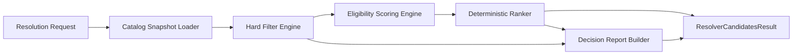
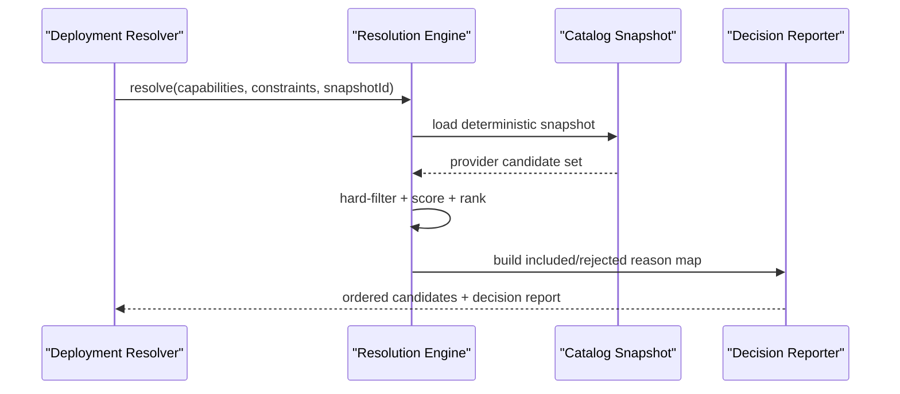
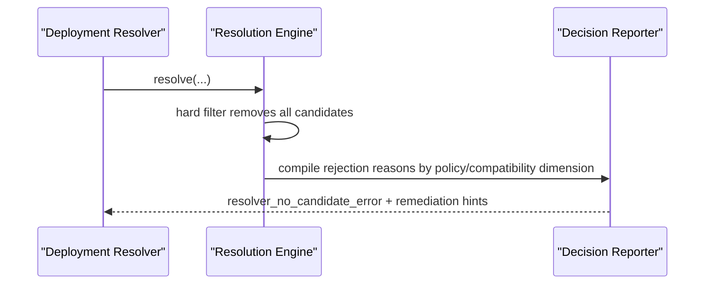

# RFC-0017: Marketplace Resolution and Ranking Engine at 10k+ Provider Scale

## Metadata

- RFC: `RFC-0017`
- Title: `Marketplace Resolution and Ranking Engine at 10k+ Provider Scale`
- Status: `Draft`
- Owners: `Marketplace`, `Runtime Platform`
- Reviewers: `Developer Experience`, `Security`, `Quality`
- Created: `2026-02-26`
- Updated: `2026-02-26`
- Target release: `Marketplace Milestone M8`
- Related:
  - Marketplace product architecture: [RFC-0016-marketplace-product-architecture-control-plane-and-consumer-experience.md](/Users/ngalluzzo/repos/gooi/docs/engineering/rfcs/RFC-0016-marketplace-product-architecture-control-plane-and-consumer-experience.md)
  - Artifact model: [RFC-0013-artifact-model-v2-lane-artifacts-manifest-and-packaged-bundle.md](/Users/ngalluzzo/repos/gooi/docs/engineering/rfcs/RFC-0013-artifact-model-v2-lane-artifacts-manifest-and-packaged-bundle.md)
  - Conformance gates: [RFC-0015-cross-lane-conformance-expansion-l0-l3-parity-and-determinism-gates.md](/Users/ngalluzzo/repos/gooi/docs/engineering/rfcs/RFC-0015-cross-lane-conformance-expansion-l0-l3-parity-and-determinism-gates.md)
  - Host/provider contracts: [RFC-0006-marketplace-host-adapter-provider-model-and-memory-reference.md](/Users/ngalluzzo/repos/gooi/docs/engineering/rfcs/RFC-0006-marketplace-host-adapter-provider-model-and-memory-reference.md)

## Problem and context

At `10k+` providers, naive candidate filtering is too slow, too noisy, and too
hard to trust. Resolver behavior must be deterministic, explainable, and policy-aware.

Current gap:

1. Candidate selection logic is not formalized as a dedicated product engine.
2. Ranking criteria and tie-break rules are not centralized.
3. Rejection reasons are not guaranteed to be complete and stable.
4. Snapshot-based determinism requirements are not explicitly defined.

Without this RFC:

1. deploy-time selection becomes unpredictable,
2. support/debug costs scale poorly,
3. ecosystem trust degrades as provider count grows.

## Goals

1. Define a dedicated resolution engine for capability-provider selection at 10k+ scale.
2. Define deterministic ranking and tie-break semantics.
3. Define machine-readable and human-readable explainability outputs for every candidate decision.
4. Define snapshot-based determinism so identical inputs yield identical outputs.
5. Define policy and certification integration as first-class resolution dimensions.
6. Define deterministic capability reachability resolution across mixed execution hosts (`local` vs `delegated`).

## Non-goals

1. Defining cryptographic trust primitives in detail (RFC-0018).
2. Defining publisher onboarding UX (RFC-0016).
3. Replacing deployment lockfile/binding-plan semantics.
4. Implementing recommendation/personalization systems for marketplace browsing.

## Product outcomes and success metrics

Outcomes:

1. Resolver produces stable, high-quality candidate sets with transparent decisions.
2. Platform can resolve provider selections quickly at high catalog cardinality.
3. Operations teams can diagnose resolution failures from deterministic reports.

Metrics:

- Product metric(s):
  - deterministic resolution parity: `100%` for same snapshot + same request.
  - explainability coverage: `100%` of included and excluded candidates.
  - first-candidate suitability success rate `>= 95%` in production retrospectives.
- Reliability metric(s):
  - resolver API availability: `99.95%`.
  - stale snapshot incident rate: `0` P1 per quarter.
  - unresolved-request rate for satisfiable constraints: `< 0.5%`.
- Developer experience metric(s):
  - resolution debug report generation p95 `< 120ms`.
  - policy rejection messages with actionable codes `100%`.
- Explicit latency/availability target(s) with numeric thresholds:
  - candidate filter+rank API p95 `< 120ms` at 10k providers.
  - lockfile-ready selection API p95 `< 180ms`.

## Proposal

Introduce `marketplace-resolution-engine` with four deterministic stages:

1. `Hard filter` (compatibility + policy constraints).
2. `Eligibility scoring` (quality/certification/operational signals).
3. `Deterministic ranking` (stable sort + tie-break rules).
4. `Decision report emission` (included + rejected reasons).

### Architecture interface diagram

### Resolution input model

1. Required capability refs:
   - port id/version and contract hash constraints.
2. Environment constraints:
   - host API version, runtime compatibility policy, region/tenant constraints.
   - invocation host and allowed target hosts for delegation.
3. Governance constraints:
   - certification status, allowed publishers, deny/allow policies.
4. Operational preferences:
   - latency class, stability preference, deprecation tolerance.

### Ranking dimensions

Hard requirements (must pass):

1. Capability compatibility.
2. Host API compatibility.
3. Policy compliance.
4. Certification threshold.
5. Reachability feasibility (`local` or explicit `delegated` route).

Soft scoring (for ranking among eligible):

1. Certification level and freshness.
2. Reliability signal score.
3. Security/trust signal score.
4. Version stability score.
5. Optional user/org preference score (bounded and explainable).
6. Locality preference score (`local` preferred over `delegated` when equivalent).

### Deterministic tie-break rules

When total score is equal, apply in order:

1. Higher certification level.
2. Higher reliability score.
3. Lower deprecation risk.
4. Semver preference policy.
5. Lexicographic provider id + version tie-break.
6. Reachability mode preference (`local` before `delegated`).

### Success sequence diagram (resolution request)

### Failure sequence diagram (no eligible providers)

### Deterministic behavior rules

- Input normalization order:
  - validate request -> normalize constraints -> load snapshot -> filter -> score -> rank.
- Default precedence:
  - explicit request constraints > org policy defaults > global marketplace defaults.
- Unknown/null handling:
  - unknown constraint keys rejected.
  - null accepted only for explicitly nullable optional preferences.
- Stable ordering requirements:
  - candidate list ordering deterministic by score+tiebreak rules.
  - rejection reason ordering deterministic by stage then reason code.
  - delegated candidates include deterministic route ordering by policy then route id.
- Idempotency/replay behavior (for write paths):
  - resolution is read-only and idempotent for a fixed snapshot.

## Ubiquitous language

1. `Resolution request`: typed input defining capabilities and constraints.
2. `Hard filter`: non-negotiable eligibility rules.
3. `Eligibility score`: weighted score among already-eligible candidates.
4. `Decision report`: full included/rejected reason payload.
5. `Snapshot determinism`: guarantee that fixed snapshot + request yields identical output.
6. `Reachability mode`: resolved invocation mode for a capability (`local` or `delegated`).

## Boundaries and ownership

- Resolution engine:
  - owns filtering, scoring, ranking, and explainability semantics.
- Catalog plane:
  - owns snapshot creation/storage and retrieval.
- Policy/governance plane:
  - owns policy definitions consumed by engine.
- Deployment resolver:
  - consumes candidates and decision report; does not redefine ranking rules.

Must-not-cross constraints:

1. Deployment resolver must not reorder candidates outside declared tie-break policies.
2. Resolution engine must not read mutable live listing state when snapshot id is provided.
3. Ranking logic must not use hidden/non-explainable scoring dimensions.
4. Policy engine outputs must be typed and versioned.
5. Resolver outputs must include delegation route metadata when mode is `delegated`.

## Contracts and typing

- Boundary schema authority:
  - Zod for resolution requests/results, decision reports, and scoring policy contracts.
- Authoring format:
  - resolver inputs are machine-generated from binding requirements and deployment context.
- Generated runtime artifact format:
  - `ResolverCandidatesResult` and `ResolverDecisionReport`.
- Canonical compiled artifact schema (required):
  - `ResolutionRequest@1.0.0`
  - `CapabilityReachabilityRequirement@1.0.0`
  - `ResolverCandidate@1.0.0`
  - `ResolverDelegationRoute@1.0.0`
  - `ResolverCandidatesResult@1.0.0`
  - `ResolverDecisionReport@1.0.0`
  - `ResolutionPolicyProfile@1.0.0`
- Artifact version field and hash policy:
  - decision report includes snapshot hash and policy profile hash.
- Deterministic serialization rules:
  - stable ordering for candidates and reason lists.
- Allowed/disallowed schema features:
  - no opaque scoring blobs; all scoring dimensions typed and enumerated.
- Public contract shape:
  - `resolveCandidates(input) -> ResolverCandidatesResult`
  - `explainResolution(input) -> ResolverDecisionReport`
  - `validateResolutionPolicy(input) -> ValidationResult`
- Invocation/result/error/signal/diagnostics envelope schemas:
  - `ResolverResultEnvelope@1.0.0`
  - `ResolverErrorEnvelope@1.0.0`
  - `ResolverDiagnosticsEnvelope@1.0.0`
- Envelope versioning strategy:
  - semver literals with additive-minor compatibility.
- Principal/auth context schema:
  - resolver requests include subject/tenant policy context where required.
- Access evaluation order:
  - authn/authz precede resolver execution for protected APIs.
- Error taxonomy:
  - `resolver_request_schema_error`
  - `resolver_snapshot_not_found_error`
  - `resolver_policy_rejection_error`
  - `resolver_no_candidate_error`
  - `resolver_delegation_unavailable_error`
  - `resolver_scoring_profile_error`
- Compatibility policy:
  - ranking/scoring profile changes that affect output ordering require explicit versioned policy profile bumps.
- Deprecation policy:
  - scoring dimensions deprecated via profile versioning and compatibility windows.

## API and module plan

Feature-oriented module layout:

1. `products/marketplace/resolution-engine`
   - `src/filter/hard-filter.ts`
   - `src/score/eligibility-score.ts`
   - `src/rank/deterministic-ranker.ts`
   - `src/report/decision-report.ts`
   - `src/contracts/resolution-contracts.ts`
2. `packages/marketplace-resolution-contracts`
   - request/result/report/profile schemas.

Public APIs via `package.json` exports:

1. `@gooi/marketplace-resolution-contracts/{request,result,report,policy}`
2. resolution engine runtime APIs remain product-private under `products/marketplace/*`.

No barrel files:

1. explicit subpath exports only.

Single entry per feature:

1. one resolve API contract.
2. one explain API contract.

## Package boundary classification

- Proposed location(s):
  - `products/marketplace/resolution-engine`
  - `packages/marketplace-resolution-contracts`
- Lane (if `products/*`):
  - `marketplace`
- Why this boundary is correct:
  - resolution/ranking is a core marketplace control-plane product function.
- Primary consumers (internal/external):
  - deployment resolver services, marketplace UIs, policy/governance tooling.
- Coupling expectations:
  - depends on catalog snapshots and policy profiles.
  - no dependency on runtime execution internals.
- Why this is not a better fit in another boundary:
  - embedding ranking into runtime/deployment services causes drift and weak governance.
- Promotion/demotion plan:
  - stable contracts remain in `packages/*`, engine behavior remains in `products/marketplace/*`.

## Delivery plan and rollout

Phase 1: contracts and deterministic baseline

- Entry criteria:
  - RFC approved.
- Exit criteria:
  - baseline filter/rank/report contracts published with deterministic tests.
- Deliverables:
  - core schemas, deterministic tie-break rules, explainability report format.

Phase 2: policy and scoring profile integration

- Entry criteria:
  - Phase 1 complete.
- Exit criteria:
  - profile-driven scoring and policy filters integrated into resolver APIs.
- Deliverables:
  - scoring profile contracts and policy integration.

Phase 3: scale and hardening at 10k+ provider load

- Entry criteria:
  - Phase 2 complete.
- Exit criteria:
  - p95 latency and determinism targets met under load tests.
- Deliverables:
  - indexing/caching strategy, performance tuning, operational runbooks.

## Test strategy and acceptance criteria

1. Unit:
   - hard-filter stage logic, score calculations, tie-break rules, reason-code mapping.
2. Integration:
   - snapshot load -> resolve -> explain path with policy profiles.
3. Golden:
   - deterministic candidate ordering and rejection reports for fixed snapshots.
4. Conformance:
   - cross-version policy profile compatibility and explainability coverage.
5. Scale tests:
   - resolver p95 under 10k+ candidate universe and multi-tenant request patterns.

Definition of done:

1. resolver outputs are deterministic and fully explainable.
2. no-candidate and rejection cases provide actionable reason codes.
3. performance SLOs met under target scale.

## Operational readiness

1. Observability:
   - stage-level latency (filter/score/rank/report), no-candidate rates, top rejection codes.
2. Failure handling and retries:
   - snapshot load retries with bounded backoff; typed failures when snapshot unavailable.
3. Security requirements:
   - policy context integrity and tamper-resistant snapshot references.
4. Runbooks and incident readiness:
   - stale snapshot incidents, scoring profile rollout regressions, latency degradations.
5. Alert thresholds tied to service-level targets:
   - resolution API p95 > `120ms` for 15m.
   - no-candidate spike > baseline + `2x` in 30m.
   - explainability coverage < `100%` for any production response.

## Risks and mitigations

1. Risk: Ranking becomes opaque to users.
   - Mitigation: mandatory decision reports and scoring profile version transparency.
2. Risk: Policy changes unexpectedly reorder outcomes.
   - Mitigation: versioned policy profiles and staged rollout with conformance checks.
3. Risk: Scale hotspots for common capability queries.
   - Mitigation: precomputed indices and snapshot-aware caches.
4. Risk: Cross-tenant leakage through shared ranking metadata.
   - Mitigation: tenant-scoped policy context and strict isolation checks.

## Alternatives considered

1. Keep simple compatibility-only filtering with no scoring.
   - Rejected: poor result quality at high provider counts.
2. Non-deterministic ranking with real-time heuristics.
   - Rejected: weak reproducibility and debugging.
3. Client-side ranking in deployment resolver only.
   - Rejected: fragmented semantics and governance drift.

## Open questions

None.

## Decision log

- `2026-02-26` - Established marketplace resolution/ranking as a dedicated deterministic engine with explicit explainability contracts.
- `2026-02-26` - Resolved scoring profile policy for `1.0.0`: scoring weights are fixed to global profiles; tenant-specific weight customization is deferred.
- `2026-02-26` - Resolved explainability default for `1.0.0`: full per-candidate score decomposition is available in diagnostics mode, with summarized explainability in default mode.
- `2026-02-26` - Resolved reachability semantics: resolver outputs must explicitly classify candidates as `local` or `delegated` and include route metadata for delegated paths.
