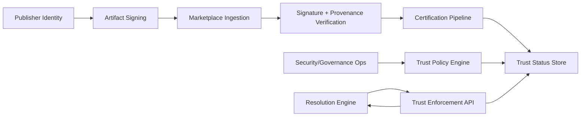
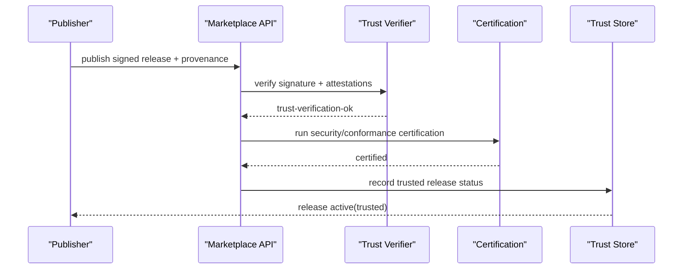
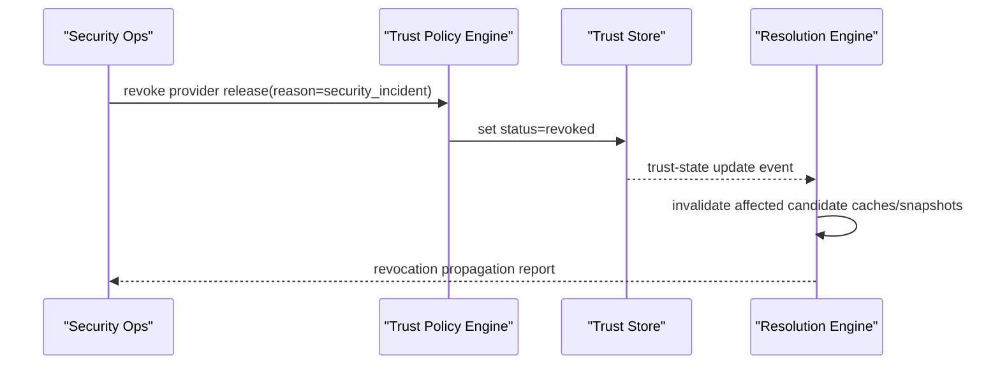

# RFC-0018: Marketplace Trust, Certification, and Supply-Chain Security

## Metadata

- RFC: `RFC-0018`
- Title: `Marketplace Trust, Certification, and Supply-Chain Security`
- Status: `Draft`
- Owners: `Security`, `Marketplace`
- Reviewers: `Runtime Platform`, `Developer Experience`, `Quality`
- Created: `2026-02-26`
- Updated: `2026-02-26`
- Target release: `Marketplace Milestone M9`
- Related:
  - Marketplace architecture: [RFC-0016-marketplace-product-architecture-control-plane-and-consumer-experience.md](/Users/ngalluzzo/repos/gooi/docs/engineering/rfcs/RFC-0016-marketplace-product-architecture-control-plane-and-consumer-experience.md)
  - Resolution engine: [RFC-0017-marketplace-resolution-and-ranking-engine-at-10k-plus-scale.md](/Users/ngalluzzo/repos/gooi/docs/engineering/rfcs/RFC-0017-marketplace-resolution-and-ranking-engine-at-10k-plus-scale.md)
  - Host/provider model: [RFC-0006-marketplace-host-adapter-provider-model-and-memory-reference.md](/Users/ngalluzzo/repos/gooi/docs/engineering/rfcs/RFC-0006-marketplace-host-adapter-provider-model-and-memory-reference.md)
  - Conformance expansion: [RFC-0015-cross-lane-conformance-expansion-l0-l3-parity-and-determinism-gates.md](/Users/ngalluzzo/repos/gooi/docs/engineering/rfcs/RFC-0015-cross-lane-conformance-expansion-l0-l3-parity-and-determinism-gates.md)

## Problem and context

A 10k+ provider marketplace requires trust and supply-chain controls as core product features,
not operational afterthoughts.

Primary risk domains:

1. publisher identity spoofing,
2. tampered artifacts,
3. malicious or policy-violating providers,
4. stale or revoked certification state in resolution flows,
5. weak auditability for incident response.

Without explicit trust contracts:

1. enterprise adoption stalls,
2. resolver quality degrades under adversarial behavior,
3. security incidents become expensive to triage and contain.

## Goals

1. Define end-to-end trust chain from publisher identity to deployed provider selection.
2. Define certification lifecycle contracts and revocation semantics.
3. Define supply-chain integrity requirements (signing, provenance, verification).
4. Define resolver-time trust policy integration with deterministic enforcement.
5. Define auditable security and governance controls suitable for large-scale ecosystem operation.

## Non-goals

1. Defining legal/compliance policy text for every jurisdiction.
2. Designing a custom cryptographic primitive set.
3. Replacing enterprise internal security controls.
4. Defining non-marketplace runtime sandboxing internals.

## Product outcomes and success metrics

Outcomes:

1. Consumers can verify provider authenticity, integrity, and certification state before selection.
2. Marketplace can revoke unsafe providers quickly and deterministically.
3. Security investigations have complete, immutable audit trails.

Metrics:

- Product metric(s):
  - trust-verifiable listings coverage: `100%` for active certified releases.
  - revocation propagation to resolver snapshots p95 `< 5 minutes`.
  - certified-provider adoption rate `>= 90%` of production selections.
- Reliability metric(s):
  - trust verification API availability `99.95%`.
  - failed signature/provenance checks correctly rejected `100%`.
  - audit event integrity incidents: `0`.
- Developer experience metric(s):
  - publisher trust-onboarding flow completion p95 `< 20 minutes`.
  - trust rejection diagnostics with actionable cause codes `100%`.
- Explicit latency/availability target(s) with numeric thresholds:
  - artifact signature verification p95 `< 50ms`.
  - trust policy evaluation p95 `< 40ms`.

## Proposal

Establish a trust architecture with four layers:

1. `Publisher identity and namespace trust`.
2. `Artifact integrity and provenance`.
3. `Certification lifecycle and policy status`.
4. `Resolver-time trust enforcement and revocation`.

### Architecture interface diagram

### Trust lifecycle model

1. `Onboard`:
   - publisher identity proof and namespace assignment.
2. `Publish`:
   - signed artifact submission with provenance attestations.
3. `Verify`:
   - signature/provenance validation and policy checks.
4. `Certify`:
   - conformance + security policy outcomes.
5. `Serve`:
   - trusted releases available to search/resolution.
6. `Revoke`:
   - emergency or policy-driven status revocation and propagation.

### Success sequence diagram (trusted publish path)

### Failure sequence diagram (revocation)

### Deterministic behavior rules

- Input normalization order:
  - identity validation -> signature/provenance validation -> policy checks -> certification status transition.
- Default precedence:
  - explicit trust policy overrides > org defaults > global defaults.
- Unknown/null handling:
  - unknown trust metadata keys rejected unless `x-*`.
  - null disallowed for required signature/provenance fields.
- Stable ordering requirements:
  - trust policy evaluation order is deterministic and versioned.
  - revocation events ordered by monotonic event sequence id.
- Idempotency/replay behavior (for write paths):
  - trust-state updates are idempotent by `(subjectId, releaseId, policyVersion, eventId)`.

## Ubiquitous language

1. `Trust subject`: entity whose trust state is evaluated (publisher, release, namespace).
2. `Provenance attestation`: signed metadata describing build/source lineage.
3. `Certification state`: security/compliance/conformance status for a release.
4. `Revocation`: explicit trust-state transition rendering a release ineligible.
5. `Trust profile`: versioned policy bundle applied during verification and resolution.

## Boundaries and ownership

- Marketplace trust plane:
  - owns trust state transitions and trust verification APIs.
- Certification pipeline:
  - owns issuance/update of certification evidence and status.
- Resolver integration:
  - consumes trust eligibility; does not mutate trust state.
- Security operations:
  - owns revocation and incident policy workflows.

Must-not-cross constraints:

1. Resolver must not treat uncertified/revoked releases as eligible when policy forbids it.
2. Marketplace listing state must not override trust-state truth.
3. Trust audit logs must be append-only and tamper-evident.
4. Certification status changes must be traceable to explicit policy or evidence.

## Contracts and typing

- Boundary schema authority:
  - Zod for trust subjects, signatures, attestations, certification, revocation events.
- Authoring format:
  - publisher metadata plus signed trust artifacts.
- Generated runtime artifact format:
  - trust snapshots and revocation feeds.
- Canonical compiled artifact schema (required):
  - `TrustSubject@1.0.0`
  - `ArtifactSignature@1.0.0`
  - `ProvenanceAttestation@1.0.0`
  - `CertificationState@1.0.0`
  - `TrustPolicyProfile@1.0.0`
  - `TrustDecisionReport@1.0.0`
  - `RevocationEvent@1.0.0`
- Artifact version field and hash policy:
  - trust reports include policy profile hash and verification artifact hashes.
- Deterministic serialization rules:
  - stable key ordering and deterministic reason-code ordering.
- Allowed/disallowed schema features:
  - unsigned attestation payloads are disallowed for trust-required releases.
- Public contract shape:
  - `verifyReleaseTrust(input) -> TrustDecisionReport`
  - `updateCertificationState(input) -> CertificationUpdateResult`
  - `revokeRelease(input) -> RevocationResult`
  - `getTrustEligibility(input) -> TrustEligibilityResult`
- Invocation/result/error/signal/diagnostics envelope schemas:
  - `TrustResultEnvelope@1.0.0`
  - `TrustErrorEnvelope@1.0.0`
  - `TrustDiagnosticsEnvelope@1.0.0`
- Envelope versioning strategy:
  - semver literal `1.0.0`.
- Principal/auth context schema:
  - all trust mutations require authenticated/authorized operator context.
- Access evaluation order:
  - authn -> authz -> policy profile selection -> trust-state mutation.
- Error taxonomy:
  - `trust_identity_error`
  - `trust_signature_invalid_error`
  - `trust_provenance_invalid_error`
  - `trust_policy_violation_error`
  - `trust_certification_missing_error`
  - `trust_revoked_error`
- Compatibility policy:
  - trust policy profiles are versioned and backward-compatible per declared windows.
- Deprecation policy:
  - trust schema deprecations require migration tooling and overlap windows.

## API and module plan

Feature-oriented module layout:

1. `products/marketplace/trust-plane`
   - `src/identity/*`
   - `src/verification/*`
   - `src/policy/*`
   - `src/revocation/*`
   - `src/audit/*`
2. `products/marketplace/certification`
   - trust-integrated certification state workflows.
3. `packages/marketplace-trust-contracts`
   - trust subject, policy, report, and event contracts.

Public APIs via `package.json` exports:

1. `@gooi/marketplace-trust-contracts/{subjects,policy,reports,events}`
2. product service APIs remain under `products/marketplace/*`.

No barrel files:

1. explicit subpath exports only.

Single entry per feature:

1. one trust verification contract entrypoint.
2. one revocation mutation contract entrypoint.

## Package boundary classification

- Proposed location(s):
  - `products/marketplace/trust-plane`
  - `packages/marketplace-trust-contracts`
- Lane (if `products/*`):
  - `marketplace`
- Why this boundary is correct:
  - trust is a marketplace control-plane product responsibility with shared cross-lane contract consumers.
- Primary consumers (internal/external):
  - marketplace services, resolution engine, enterprise governance tooling.
- Coupling expectations:
  - trust contracts are shared; trust implementation does not depend on runtime execution internals.
- Why this is not a better fit in another boundary:
  - embedding trust logic in runtime/resolver would fragment security ownership.
- Promotion/demotion plan:
  - stable trust contract primitives remain in `packages/*`; operations workflows remain product-private.

## Delivery plan and rollout

Phase 1: trust contract and verification baseline

- Entry criteria:
  - RFC approved.
- Exit criteria:
  - trust subject/signature/provenance contracts + verification API baseline live.
- Deliverables:
  - trust contract package and verification API.

Phase 2: certification and revocation integration

- Entry criteria:
  - Phase 1 complete.
- Exit criteria:
  - certification state and revocation events integrated with resolver eligibility.
- Deliverables:
  - certification-trust integration and revocation feeds.

Phase 3: security hardening and audit readiness

- Entry criteria:
  - Phase 2 complete.
- Exit criteria:
  - audit trails, incident runbooks, and revocation SLOs validated.
- Deliverables:
  - audit tooling, controls, and operational readiness artifacts.

## Test strategy and acceptance criteria

1. Unit:
   - signature/provenance verification, policy evaluation, trust-state transitions.
2. Integration:
   - publish -> verify -> certify -> resolve eligibility -> revoke flow.
3. Conformance:
   - trust policy profile compatibility and revocation propagation checks.
4. Golden:
   - deterministic trust decision reports and reason codes.
5. Security tests:
   - tampered artifact, spoofed identity, replayed attestation, stale revocation feed scenarios.

Definition of done:

1. trust verification and certification state are required and enforceable in resolver eligibility.
2. revocation path is operational and meets propagation targets.
3. auditability and deterministic diagnostics are validated.

## Operational readiness

1. Observability:
   - verification pass/fail rates, revocation propagation times, trust-policy rejection rates.
2. Failure handling and retries:
   - bounded retry for verification dependencies; fail-closed policy for trust-required flows.
3. Security requirements:
   - immutable audit logs, strict authz on trust mutations, key-management controls.
4. Runbooks and incident readiness:
   - compromised key response, emergency revocation drills, trust-policy rollback procedures.
5. Alert thresholds tied to service-level targets:
   - trust verification failures > baseline + `3σ`.
   - revocation propagation p95 > `5m`.
   - trust plane availability < `99.95%`.

## Risks and mitigations

1. Risk: Trust controls increase publisher friction.
   - Mitigation: staged trust levels with clear upgrade path and tooling support.
2. Risk: Revocation propagation lag leaves exposure windows.
   - Mitigation: event-driven cache invalidation and strict propagation SLOs.
3. Risk: Policy complexity causes false rejects.
   - Mitigation: versioned profiles, simulation mode, and detailed diagnostics.
4. Risk: Audit systems become bottlenecks.
   - Mitigation: append-only scalable log design and archiving policies.

## Alternatives considered

1. Trust checks only at publish time.
   - Rejected: resolver-time trust drift and stale eligibility risk.
2. Best-effort revocation with eventual visibility only.
   - Rejected: unacceptable risk for high-severity incidents.
3. Optional certification for production selection.
   - Rejected: weak baseline trust and inconsistent governance.

## Open questions

None.

## Decision log

- `2026-02-26` - Established trust, certification, and supply-chain security as a first-class marketplace product plane with resolver-integrated enforcement.
- `2026-02-26` - Resolved trust profile scope for `1.0.0`: use global trust policy profiles only; per-tenant override rules are deferred.
- `2026-02-26` - Resolved revocation delivery model for `1.0.0`: require push+pull hybrid propagation to meet strict freshness targets.
