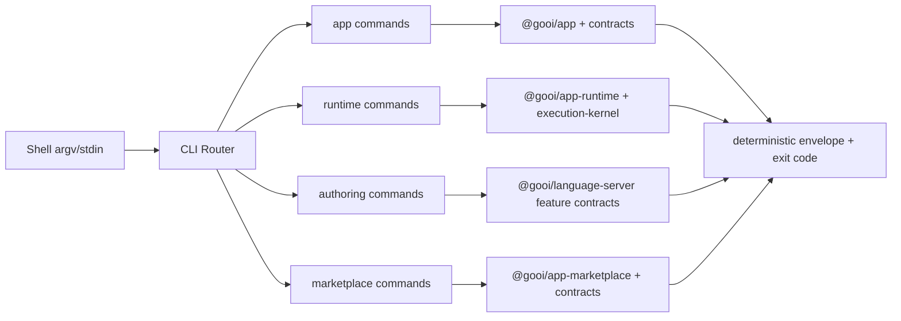

# RFC-0024: Official Gooi CLI Product Surface and Command Contracts

## Metadata

- RFC: `RFC-0024`
- Title: `Official Gooi CLI Product Surface and Command Contracts`
- Status: `Draft`
- Owners: `Developer Experience`, `Runtime Platform`
- Reviewers: `Authoring Platform`, `Marketplace Platform`, `Quality Platform`
- Created: `2026-03-01`
- Updated: `2026-03-01`
- Target release: `Post-Track-08 Productization Window`
- Related:
  - North star: [RFC-0007-north-star-platform-shape-and-progressive-dx-api.md](/Users/ngalluzzo/repos/gooi/docs/engineering/rfcs/RFC-0007-north-star-platform-shape-and-progressive-dx-api.md)
  - App spec compiler model: [RFC-0008-full-app-spec-contract-and-canonical-compiler-model.md](/Users/ngalluzzo/repos/gooi/docs/engineering/rfcs/RFC-0008-full-app-spec-contract-and-canonical-compiler-model.md)
  - Surface dispatch contracts: [RFC-0011-route-and-surface-dispatch-contracts-web-http-cli-and-webhook.md](/Users/ngalluzzo/repos/gooi/docs/engineering/rfcs/RFC-0011-route-and-surface-dispatch-contracts-web-http-cli-and-webhook.md)
  - Progressive DX facades: [RFC-0014-progressive-dx-facade-apis-and-compatibility-guarantees.md](/Users/ngalluzzo/repos/gooi/docs/engineering/rfcs/RFC-0014-progressive-dx-facade-apis-and-compatibility-guarantees.md)
  - Authoring CLI and LSP parity: [RFC-0003-product-authoring-intelligence-lsp-and-capability-index.md](/Users/ngalluzzo/repos/gooi/docs/engineering/rfcs/RFC-0003-product-authoring-intelligence-lsp-and-capability-index.md)
  - Runtime kernel boundary: [RFC-0022-kernel-runtime-core-and-standalone-adoption.md](/Users/ngalluzzo/repos/gooi/docs/engineering/rfcs/RFC-0022-kernel-runtime-core-and-standalone-adoption.md)
  - North-star convergence: [RFC-0023-north-star-authoring-contract-convergence.md](/Users/ngalluzzo/repos/gooi/docs/engineering/rfcs/RFC-0023-north-star-authoring-contract-convergence.md)
  - Spec example: [demo.yml](/Users/ngalluzzo/repos/gooi/docs/demo.yml)
  - Issues/PRs: `TBD`
  - Supersedes/Superseded by: `none`

## Problem and context

Gooi has strong product contracts and runtime boundaries, but no official,
first-party CLI product surface that unifies:

1. progressive DX facade operations (`define`, `compile`, runtime invoke/reachability),
2. authoring automation workflows (diagnostics/completion/rename/index),
3. marketplace control-plane workflows (catalog/discovery/resolution/listing/certification).

Today, users rely on package-level APIs plus ad hoc scripts. That creates avoidable
friction for CI automation, poor discoverability, and inconsistent operational
behavior (flags, output shape, exit-code mapping, and error semantics).

## Goals

1. Ship one official `gooi` CLI with deterministic behavior and stable command contracts.
2. Ensure every CLI command is a thin adapter over existing public contracts/facades; no semantic forks.
3. Define stable JSON output and typed error behavior suitable for CI and automation.
4. Preserve north-star boundaries: CLI remains a surface adapter, kernel remains orchestration owner.
5. Provide a scalable command architecture that supports new surface families without central rewrites.

## Non-goals

1. Replacing LSP/editor workflows for interactive authoring.
2. Introducing new domain/projection/render semantics.
3. Embedding scaffolding semantics into `@gooi/app` (remains separate tooling boundary per RFC-0014).
4. Defining a plugin marketplace in this RFC.

## Product outcomes and success metrics

- Product metric(s):
  - `100%` of core workflows available via one binary: `define`, `compile`, `run`, `reachability`, authoring operations, and marketplace operations.
  - `>= 80%` of internal CI/governance scripts migrate from package-local scripts to official `gooi` commands in one release window.
- Reliability metric(s):
  - `0` silent failures: all failures map to typed error output plus stable exit codes.
  - `100%` deterministic output ordering for diagnostics and operation lists.
- Developer experience metric(s):
  - Time-to-first-success for compile path (`gooi app compile`) under `5 minutes` from clean checkout docs.
  - CLI help coverage `100%` for public commands, flags, and examples.
- Explicit latency/availability target(s) with numeric thresholds:
  - `gooi app compile` p95 `< 1500ms` on `docs/demo.yml` in local baseline fixture runs.
  - Read-only commands (`catalog search`, `discover`, `reachability`) p95 `< 300ms` on fixture-size payloads.
  - Command dispatch overhead p95 `< 10ms` per invocation (excluding called facade/runtime work).

## Proposal

Introduce a first-party CLI product surface as a command adapter layer over
existing public API and contract packages.

Proposed command families:

1. `gooi app *`
   - `define`, `compile`.
2. `gooi runtime *`
   - `run`, `reachability`.
3. `gooi authoring *`
   - `diagnose`, `complete`, `rename`, `index build`.
4. `gooi marketplace *`
   - `catalog search|detail|snapshot`,
   - `discover`,
   - `resolve`,
   - `eligibility explain`,
   - `listing publish|update|deprecate`,
   - `certification start|complete|revoke|verify`.

Command behavior principles:

1. `argv/stdin` parsing and I/O are owned by CLI feature modules only.
2. All semantic execution is delegated to existing facades/contracts/runtime APIs.
3. JSON output is canonical for automation (`--format json` default), with optional human-readable text views.
4. Commands support `--input -` and `--output -` for stream-based automation.

Deterministic runtime behavior rules:

- Input normalization order:
  - parse argv -> parse env -> parse config file -> parse typed payload -> invoke facade/runtime API.
- Default precedence:
  - explicit flag > environment variable > config file > command default.
- Unknown/null handling:
  - unknown flags or unknown payload keys fail fast with usage/configuration diagnostics.
  - `null` is preserved only when underlying contract schema allows it.
- Stable ordering requirements:
  - diagnostics and list outputs are stable-sorted before rendering.
  - JSON object keys are emitted through deterministic serialization helper.
- Idempotency/replay behavior (for write paths):
  - write commands expose explicit `--idempotency-key` pass-through where underlying contracts support it.
  - no CLI-generated idempotency defaults for mutating operations.

## Ubiquitous language

1. `Command adapter`: CLI module that maps transport input (`argv/stdin`) to typed contract input.
2. `Operation contract`: existing domain contract/facade contract consumed by a command.
3. `CLI envelope`: command result envelope containing `ok`, `result|error`, `meta`, and optional diagnostics.
4. `Exit-code map`: stable mapping between error taxonomy and process exit codes.
5. `Progressive command family`: command group aligned to progressive DX modes (`app`, `runtime`, `marketplace`, `authoring`).

## Boundaries and ownership

- Surface adapters:
  - CLI owns command routing, input/output parsing, and shell ergonomics.
- Kernel/domain runtime:
  - owns query/mutation orchestration and policy sequencing after CLI calls runtime APIs.
- Capability adapters:
  - unchanged ownership; CLI must not embed provider-specific execution logic.
- Host/platform adapters:
  - own external transport/auth/time/replay integration used by runtime commands.

Must-not-cross constraints:

1. CLI must not implement domain/projection/render semantics.
2. CLI must not duplicate contract schemas already owned by `products/contracts/*`.
3. CLI commands must not bypass kernel/runtime policy gates for execution paths.
4. CLI command modules must not call private/internal modules across lane boundaries.

## Contracts and typing

- Boundary schema authority:
  - existing schemas in `products/contracts/*`.
- Authoring format (for example, Zod-required):
  - authoring commands consume `@gooi/authoring-contracts/envelopes` request/result/error schemas.
- Generated runtime artifact format (for example, normalized JSON Schema):
  - unchanged; CLI consumes compiler/runtime outputs.
- Canonical compiled artifact schema (required):
  - `CompiledEntrypointBundle` from app-spec contracts remains authoritative.
- Artifact version field and hash policy:
  - unchanged from existing contract packages.
- Deterministic serialization rules:
  - CLI renderer uses stable key ordering for JSON and deterministic list sorting helpers.
- Allowed/disallowed schema features:
  - CLI accepts only typed contract fields; no best-effort unknown passthrough.
- Public contract shape:
  - no new duplicate command contracts when existing facade contracts already model operation inputs/outputs.
- Invocation/result/error/signal/diagnostics envelope schemas:
  - for authoring commands: existing authoring envelopes.
  - for other command families: command-specific result wrapper with typed `result`/`error` payloads from source contracts.
- Envelope versioning strategy:
  - additive fields only for minor updates; breaking output shape changes require major CLI version bump.
- Principal/auth context schema:
  - runtime commands reuse `@gooi/host-contracts/principal`.
- Access evaluation order:
  - unchanged; enforced by runtime/kernel, not CLI.
- Error taxonomy:
  - `usage_error`, `input_validation_error`, `operation_error`, `internal_error`.
- Compatibility policy:
  - one minor version deprecation window for renamed flags/commands.
- Deprecation policy:
  - deprecation warning in one minor; removal in next major.

## API and module plan

Feature-oriented module layout:

1. `apps/gooi-cli/src/features/app/*`
2. `apps/gooi-cli/src/features/runtime/*`
3. `apps/gooi-cli/src/features/authoring/*`
4. `apps/gooi-cli/src/features/marketplace/*`
5. `apps/gooi-cli/src/shared/{io,errors,render,config,timing}.ts`
6. `apps/gooi-cli/src/main.ts`

Public APIs via `package.json` exports:

1. executable binary export (`bin`) for `gooi`.
2. optional narrow programmatic entrypoint for internal testing harnesses only.

No barrel files:

1. feature modules imported directly by command router.

Single entry per feature:

1. one command handler module per public command path.

CLI architecture summary:

## Package boundary classification

- Proposed location(s):
  - `apps/gooi-cli` for the official executable product surface.
  - existing contract/facade packages remain in `products/contracts/*` and `packages/*`.
- Lane (if `products/*`):
  - `contracts`, `runtime`, `authoring`, `marketplace` (consumed, not re-owned by CLI).
- Why this boundary is correct:
  - CLI is an executable product surface, not a reusable contract primitive.
- Primary consumers (internal/external):
  - app developers, CI pipelines, platform operators, marketplace maintainers.
- Coupling expectations (what it should and should not depend on):
  - depends on public exports from facades/contracts/runtime packages only.
  - must not depend on private implementation modules.
- Why this is not a better fit in another boundary:
  - `tools/*` is internal tooling; official user-facing CLI requires product-level ownership.
  - `packages/*` is for reusable libraries, not executable surfaces.
- Promotion/demotion plan (if expected to move boundaries later):
  - shared, non-shell-specific helpers may be promoted to `packages/*` if reused by multiple CLI-style surfaces.

## Delivery plan and rollout

Phase 1: CLI foundation and app command family

- Entry criteria:
  - RFC accepted.
- Exit criteria:
  - `gooi app define` and `gooi app compile` are production-usable with deterministic JSON output.
- Deliverables:
  - command router, exit-code map, typed I/O layer, app command handlers, unit/integration tests.

Phase 2: runtime and authoring command families

- Entry criteria:
  - Phase 1 complete.
- Exit criteria:
  - runtime invocation/reachability and authoring operations exposed through `gooi` with parity coverage.
- Deliverables:
  - runtime handlers, authoring handlers, parity tests against existing API outputs.

Phase 3: marketplace command families and adoption

- Entry criteria:
  - Phase 2 complete.
- Exit criteria:
  - marketplace read/write command families ship with runbooks and CI adoption targets met.
- Deliverables:
  - marketplace handlers, docs examples, governance migration from ad hoc scripts.

Issue slicing plan:

1. CLI foundation (`main`, router, typed io, error/exit mapping).
2. App commands (`define`, `compile`) with deterministic output fixtures.
3. Runtime commands (`run`, `reachability`) with host/principal input contracts.
4. Authoring command extraction from language-server local script path into official CLI surface.
5. Marketplace read commands (`catalog`, `discover`, `resolve`, `eligibility`).
6. Marketplace write commands (`listing`, `certification`) with idempotency pass-through.
7. Conformance and compatibility suite expansion for CLI/API parity.
8. Remove deprecated ad hoc CLI scripts and update docs.

## Test strategy and acceptance criteria

Define:

- Unit, integration, and end-to-end coverage expectations:
  - per-command parser tests, handler tests, and CLI process invocation tests.
- Conformance tests (if contracts are cross-runtime):
  - CLI/API parity fixtures for app/runtime/authoring/marketplace command families.
- Determinism/golden tests for artifacts and envelopes (if applicable):
  - snapshot tests for JSON output, diagnostic ordering, and exit-code behavior.
- Definition of done:
  - official `gooi` binary covers target command matrix, parity tests pass, and docs are updated.

## Operational readiness

Define:

- Observability and tracing:
  - command timing, exit-code counts, and typed error code distribution (opt-in telemetry).
- Failure handling and retries:
  - no implicit retries for mutating commands; explicit retry guidance in command errors.
- Security requirements:
  - no shell-eval on user payloads; strict path handling for file I/O; no secret logging.
- Runbooks and incident readiness:
  - broken command release rollback, CLI/API parity regression response, output compatibility incident playbook.
- Alert thresholds tied to service-level targets:
  - parity test failures block release.
  - compile command p95 regression `> 20%` over baseline blocks release candidate.

## Risks and mitigations

1. Risk: command handlers drift from underlying APIs.
   - Mitigation: mandatory parity tests per command family.
2. Risk: command namespace grows into a monolith.
   - Mitigation: strict feature-scoped modules and one handler per command path.
3. Risk: breaking automation with output shape churn.
   - Mitigation: versioned envelope strategy and major-only breaking output changes.
4. Risk: marketplace write commands used unsafely in CI.
   - Mitigation: explicit confirmation/idempotency options and dry-run support where feasible.

## Alternatives considered

1. Keep package-local scripts only.
   - Rejected: no unified product UX and weak CI ergonomics.
2. Put CLI logic directly into `@gooi/app` and related facades.
   - Rejected: violates RFC-0014 boundary decision and mixes shell concerns into library APIs.
3. Create an independent contract package only for CLI wrappers.
   - Rejected: duplicates existing contract authority and increases drift risk.

## Open questions

1. Should `gooi init/scaffold` ship in initial CLI release or follow in a dedicated scaffolding RFC?
   - Owner: `Developer Experience`
   - Due: `2026-03-15`
2. Should command telemetry default to fully off or local-only persisted diagnostics with explicit opt-in export?
   - Owner: `Developer Experience` + `Security`
   - Due: `2026-03-15`

## Decision log

- `2026-03-01` - Drafted official Gooi CLI as a first-party command surface over existing facades/contracts with no semantic duplication.
