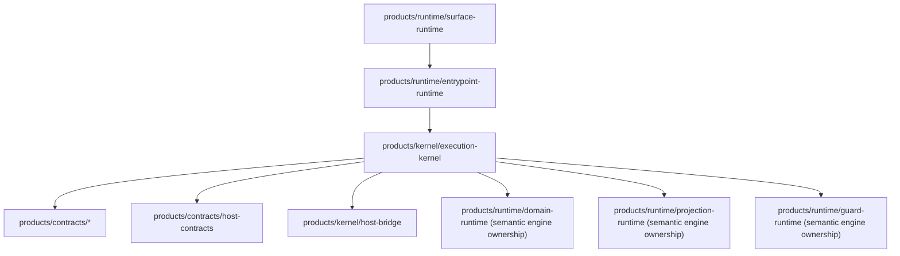

# Runtime Execution Spine Contract and Dependency Map

- Status: `Active`
- Owner: `Kernel Platform`
- Roadmap Story: `Track 03 / Story 6.1`
- Issue: [#166](https://github.com/ngalluzzo/gooi/issues/166)
- Updated: `2026-02-27`

## Canonical execution-spine contract

One contract now defines orchestration stage order for both query and mutation:

- Source: `/Users/ngalluzzo/repos/gooi/products/kernel/execution-kernel/src/execution-spine.ts`
- Export: `@gooi/execution-kernel/execution-spine`
- Contract version: `2026-02-27`

Query order:

1. `host_ports.resolve`
2. `replay_ttl.validate`
3. `host_ports.validate`
4. `invocation_envelope.initialize`
5. `artifact_manifest.validate`
6. `entrypoint.resolve`
7. `surface_input.bind`
8. `schema_profile.validate`
9. `entrypoint_input.validate`
10. `policy_gate.evaluate`
11. `semantic_engine.execute_query`
12. `query_effects.validate`
13. `result_envelope.emit`

Mutation order:

1. `host_ports.resolve`
2. `replay_ttl.validate`
3. `host_ports.validate`
4. `invocation_envelope.initialize`
5. `artifact_manifest.validate`
6. `entrypoint.resolve`
7. `surface_input.bind`
8. `schema_profile.validate`
9. `entrypoint_input.validate`
10. `policy_gate.evaluate`
11. `semantic_engine.execute_mutation`
12. `result_envelope.emit`

Mutation idempotency stages (conditional when idempotency+replay are configured):

1. `idempotency.scope.resolve`
2. `idempotency.replay.lookup`
3. `idempotency.replay.persist`

## Runtime dependency map (ownership split)

Ownership rules:

1. `execution-kernel` owns orchestration sequencing, policy ordering, replay flow, and canonical result-envelope emission.
2. `domain-runtime`, `projection-runtime`, and `guard-runtime` own semantic evaluation only.
3. `entrypoint-runtime` owns transport/input binding only after Track 03 Story 6.2+ cutover is complete.
4. `products/contracts/*` remains the only boundary for shared runtime contracts.

## Legacy orchestration path inventory and deletion owners

The following modules currently live under `entrypoint-runtime` but are slated for kernel ownership and/or deletion:

| Legacy path | Current orchestration concern | Deletion owner |
| --- | --- | --- |
| `products/runtime/entrypoint-runtime/src/execution/run-entrypoint.ts` | Full orchestration pipeline sequencing | `Kernel Platform` via [#167](https://github.com/ngalluzzo/gooi/issues/167) |
| `products/runtime/entrypoint-runtime/src/execution/run-entrypoint-helpers.ts` | Replay TTL + mutation replay scope orchestration helpers | `Kernel Platform` via [#167](https://github.com/ngalluzzo/gooi/issues/167) |
| `products/runtime/entrypoint-runtime/src/execution/entrypoint-tail.ts` | Domain invocation branching + envelope assembly | `Kernel Platform` via [#167](https://github.com/ngalluzzo/gooi/issues/167) |
| `products/runtime/entrypoint-runtime/src/pipeline/entrypoint-resolution.ts` | Invocation envelope bootstrap + entrypoint resolution | `Kernel Platform` via [#167](https://github.com/ngalluzzo/gooi/issues/167) |
| `products/runtime/entrypoint-runtime/src/pipeline/policy-gate.ts` | Principal validation/role derivation/access checks | `Kernel Platform` via [#167](https://github.com/ngalluzzo/gooi/issues/167) |
| `products/runtime/entrypoint-runtime/src/pipeline/schema-profile.ts` | Runtime schema/profile gate checks | `Kernel Platform` via [#167](https://github.com/ngalluzzo/gooi/issues/167) |
| `products/runtime/entrypoint-runtime/src/input-validation/input-validation.ts` | Compiled input contract validation gate | `Kernel Platform` via [#167](https://github.com/ngalluzzo/gooi/issues/167) |
| `products/runtime/entrypoint-runtime/src/artifact-manifest/validate-artifact-manifest.ts` | Artifact activation checks in orchestration path | `Kernel Platform` via [#167](https://github.com/ngalluzzo/gooi/issues/167) |
| `products/runtime/entrypoint-runtime/src/pipeline/fallback-errors.ts` | Pipeline fallback envelope shaping | `Runtime Platform` via [#171](https://github.com/ngalluzzo/gooi/issues/171) |

Final cleanup ownership:

1. Structural extraction to semantic-engine-only packages: [#168](https://github.com/ngalluzzo/gooi/issues/168), [#169](https://github.com/ngalluzzo/gooi/issues/169), [#170](https://github.com/ngalluzzo/gooi/issues/170).
2. Legacy orchestration deletion and boundary hardening: [#171](https://github.com/ngalluzzo/gooi/issues/171).
